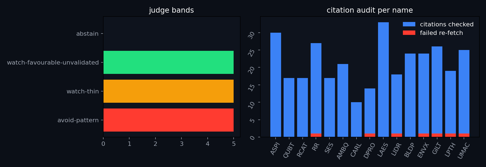

# Bumper Radar: filing-level due diligence on the screen survivors

_2026-09-26 · sixteen names · investigator + devil's advocate per name, one judge, one completeness critic · every agent on Claude Sonnet, filings via SEC EDGAR REST._

**Educational research only, not investment advice.** Bands are the Bumper Radar's own vocabulary: gates remove, they do not rank. `avoid-pattern` = an explicit graveyard gate is cited; `watch-favourable-unvalidated` = binding demand confirmed by delivered units or recognised revenue in a later filing and no gate; `watch-thin` = no gate, demand announced only; `abstain` = filings could not be read.

## Summary

| ticker | judge band | investigator | auditor | citations ok/failed | binding demand | last raise | gates |
|---|---|---|---|---|---|---|---|
| ASPI | **avoid-pattern** | avoid-pattern | avoid-pattern | 30/0 | The flagship isotope/HALEU story is contract-signed but has generated zero enriched-isotope revenue, with shipment targets slipping to H2 2026; the segment that actually drove FY2025 revenue (Skyline, ~46%) was deconsolidated as discontinued operations, and the largest continuing-operations segment (radiopharmacy sales, 78% of H1-2026 revenue) was never checked for its own customer concentration. | A $199.3M net underwritten public offering (Oct 2025) at $12.25, no discount or warrants; shares outstanding grew from 110.8M to 153.3M, partly from merger-consideration shares issued in an acquisition. | An explicit, unremediated material weakness as of Dec 31, 2025; a certified securities class action with a settlement-in-principle pending court approval, plus four 2026 shareholder derivative suits; every reporting insider sold with zero purchases; a newly wholly-owned subsidiary carries its own auditor going-concern paragraph that was never surfaced, and a subsequent-events date conflict between two filings has no corroborating 8-K. |
| QUBT | **avoid-pattern** | avoid-pattern | avoid-pattern | 17/0 | Reported revenue growth is almost entirely acquisition-driven, not organic customer demand -- H1-2026 revenue rose from $100K to $9.2M, but management's own reconciliation shows organic revenue up only $0.6M year over year; the acquired subsidiary's 'established customer base' was bought via a Chapter 11 bankruptcy stalking-horse sale from a bankrupt seller. | A ~$750M private placement (Oct 2025) to unnamed institutional purchasers, no warrants disclosed, part of roughly $1.5B raised across four 2025 private placements; shares outstanding up about 41.6% year over year. | An active securities class action specifically alleging misrepresentation of customers, contracts, and business operations, with four stayed shareholder derivative suits (not two, as reported); an explicit, unremediated material weakness in disclosure controls persisting through the most recent 10-Q. |
| RCAT | **avoid-pattern** | avoid-pattern | avoid-pattern | 17/0 | Real, delivered demand is explicitly tied to scaling U.S. Army SRR deliveries (51-73% of revenue in one customer) plus newly commenced Japan Ground Self-Defense Force deliveries, but is heavily concentrated and sits alongside a serious governance and litigation picture. | A $225M underwritten offering (May 2026) was actually about $258.75M once the fully-exercised underwriters' option is included, following a year-long toxic convertible note with death-spiral pricing mechanics and four other dilutive raises in 13 months. | A current, unremediated material weakness confirmed as of the most recent 10-Q; an active securities class action plus two stayed derivative suits alleging insider trading; a for-cause CRO termination now in litigation; a failed say-on-pay vote at the June 2026 annual meeting. |
| RR | **avoid-pattern** | watch-thin | avoid-pattern | 27/1 | The single strongest 'binding demand' data point — $44.1M in Automotive-MSA payments received — is arithmetically irreconcilable with the same 10-K/A's audited cash-flow statement (FY2025 operating cash flow of negative $8.9M) and $248K of total deferred revenue; a Retailer MSA shows a real new 200-unit SOW, but the JV behind a third named customer (Boyu, ~$4.2M contract) was deregistered/dissolved with no follow-up disclosure. | A $1 billion ATM authorized 2025-09-23 (the third ATM agreement in FY2025 alone) funds continuous market-price dilution; total shares outstanding rose about 15.7% in under a year, sold to ordinary market participants rather than a named strategic buyer. | A full FY2024-2025 financial restatement (Item 4.02) plus a still-unremediated, previously-misreported-as-fixed material weakness is explicit and current; a genuine Nasdaq Listing Rule 5250(c)(1) deficiency notice (2026-05-22, late 10-Q) falls inside the trailing 12 months. |
| SES | **avoid-pattern** | avoid-pattern | avoid-pattern | 17/0 | No named customer exists; FY2025 top-3 customers were 48%/15%/12% of revenue but Q2 2026 shows no significant concentration after a China-based acquisition began contributing product revenue, and roughly 90% of H1-2026 revenue now originates outside the United States. | No cash was actually raised in the trailing 18 months; a $150M ATM (effective 2026-05-05) remains entirely undrawn. | Two explicit, unresolved NYSE listing deficiencies (a minimum-price notice and a warrant-delisting/Form 25-NSE action) plus an active, unresolved federal securities class action filed 2026-04-27; insider Form 4s show zero open-market purchases in the trailing 12 months. |
| AMBQ | **watch-thin** | watch-thin | watch-thin | 21/0 | Revenue is real and recognized but structurally non-binding -- end customers have no minimum or binding purchase obligations and orders may be cancelled or rescheduled without penalty -- and severely concentrated (single customer 35.6% of FY2025 sales; top three about 78-84.6%). | A $156M underwritten follow-on (June 2026) priced at $78.00, a roughly 2.2% discount to the last trade with no warrants; a January 2026 follow-on preceded it; no ATM facility is in place. | No going concern, no listing notice (the company instead added a secondary SGX listing), no departure-driven Item 5.02, and the sole disclosed material weakness was fully remediated as of Dec 31, 2025; every Form 4 in the trailing 12 months was a sale with zero open-market purchases. |
| CARL | **watch-thin** | watch-thin | watch-thin | 10/0 | No named customer or contract exists at all; filings affirmatively state no single customer exceeded 10% of revenue in FY2025 or H1 2026, so growing revenue and cash cannot be validated against any specific counterparty. | A clean IPO (July 2025) priced at the offering price with no discount or warrants to new money; VC insiders (B Capital, USVP) bought in at the same public price; a venture-debt facility with Customers Bank has $17.5M of its $50M capacity gated behind unhit revenue milestones and a $20M minimum-cash covenant. | None triggered: no going concern, no listing notice, no material weakness, no departure-driven Item 5.02, no pending litigation; the only defects found were that cited VC ownership stakes understate the filings' own broader fund-family aggregates. |
| DPRO | **watch-thin** | watch-thin | watch-thin | 14/1 | No named, binding customer contract exists; the AIF discloses no material contracts outside the ordinary course and no customer reached 15% of revenue, so real revenue growth (+17.8% FY2025) is not tied to any disclosed contract. | A ~US$50M underwritten public offering closed 2026-02-27 at US$7.00 with no warrants, on top of ~US$42M of warrant-bearing 2025 unit offerings; shares outstanding grew from 23.3M to 37.1M in under a year; no ATM Sales Agreement found. | The current FY2025 audit opinion carries no going-concern paragraph and no listing/material-weakness/litigation gate was found, but an explicit 'substantial doubt' going-concern statement existed in interim financials 10 months earlier, and at least two >5% institutional 13G holders were entirely omitted from the report. |
| LAES | **watch-thin** | watch-thin | watch-thin | 33/0 | No named customer with a binding contract exists; disclosed concentration (30% of H1-2026 revenue) is to two anonymized entities, and the widely-cited '>$225M active business pipeline through 2029' is explicitly labeled a management estimate subject to conversion/validation risk, not booked orders. | A $125M registered direct offering (March 2026) plus Class E warrants; shares outstanding roughly doubled (104.5M to 222.8M) in 12 months; two SEC filings from the same company give conflicting lead-investor names for the identical transaction. | No going concern (large positive working capital affirmed), no listing notice, one unrelated director departure, no material weakness, no active litigation; every Form 4 in the trailing 12 months is an option-exercise-then-sell with zero open-market purchases. |
| LIDR | **watch-thin** | watch-thin | watch-thin | 18/1 | Revenue is de minimis ($233K FY2025) with zero customer-letter continuity year over year; the one new demand signal (a Lunar Outpost lidar 'contract award,' announced 2026-09-01) discloses no dollar value, delivery date, or minimum-purchase term, and the company's own risk factor hedges that it may not result in revenue at all. | A new $50M ATM opened 2026-09-15, replacing a $125M ATM that was about 56% drawn; shares outstanding grew roughly 17% year over year; no named PIPE or registered-direct investor in the last 18 months. | No going concern, no current listing deficiency, no material weakness, no securities litigation or short-seller report beyond one disputed $3.3M vendor arbitration; one Item 5.02 departure (General Counsel, May 2026) is unrelated to funding. |
| BLDP | **watch-favourable-unvalidated** | watch-favourable-unvalidated | watch-favourable-unvalidated | 24/0 | Multiple named customers (NFI Group, Solaris, CPKC) hold signed long-term supply agreements with firm purchase orders and later filings confirm actual unit deliveries, but the company's own MD&A flags its Order Backlog and 12-month Order Book -- the same named customers -- as subject to cancellation and performance-condition risk. | No cash raise occurred in the trailing 18 months; the only capital event was the GeoPura acquisition (Aug 2026), stock-and-cash M&A consideration to a private seller causing roughly 14-17% share dilution, not a public raise. | No going concern (unqualified audit opinion, no emphasis paragraph), no listing notice, no material weakness, no departure tied to funding, no litigation or short-seller hits. |
| ENVX | **watch-favourable-unvalidated** | watch-favourable-unvalidated | watch-favourable-unvalidated | 24/1 | Real, recognized revenue is extremely concentrated in two unnamed customers (a South Korea defense subcontractor at ~64-65%, a second at ~13-15%); the lead smart-eyewear customer has taken delivery of over 1,000 battery packs under a supply agreement, while higher-value smartphone-OEM relationships remain in pre-commercial qualification/testing. | $360M 4.75% convertible notes (Sept 2025) at a 22.5% conversion premium, no discount or warrants; but the dilution comparison omitted an earlier, larger Q3-2025 warrant-exercise raise (~$232M gross, 26.5M shares, ~13.7% dilution). | No going concern, no listing notice, no current material weakness; a securities class action over 2021-2023 disclosures remains technically open but has been substantially narrowed; two C-suite departures occurred in the window, not the one the report counted. |
| GILT | **watch-favourable-unvalidated** | watch-favourable-unvalidated | watch-favourable-unvalidated | 26/1 | Multiple 2026 orders (Nelco/India, three U.S. Department of War orders, an unnamed satellite operator, an unnamed in-flight connectivity provider, a Peru government agreement) are described as signed orders rather than LOIs, and a 20-F table shows real recognized revenue from anonymized customers, but none of the 2026 orders has yet shown delivery or recognized revenue in a later filing. | $100M convertible notes (Sept 2026) priced at par with a 60% conversion premium to Israeli institutional investors, no discount or warrants; preceded by two 2025 private placements at $9.35 and $11.25; shares outstanding up about 32% year over year. | No going concern, no listing notice, no material weakness, no departure, zero 'short seller' EDGAR hits; a credit facility presented as live was actually fully repaid before the filing date, and one holder citation conflates two different Israeli insurers. |
| LPTH | **watch-favourable-unvalidated** | watch-favourable-unvalidated | watch-favourable-unvalidated | 19/1 | Firm backlog ($110.9M, +197% YoY, $85.6M due within a year) and already-recognized revenue (top customer 24% of FY2026 revenue) exist, but growth is largely acquisition-driven (G5 Infrared, AML) and every named counterparty is undisclosed. | $50M registered-direct/secondary offering (June 2026) at $14.00, no warrants, half primary/half sold by existing holder North Run; preceded by a $60.1M underwritten offering (Dec 2025) at $7.75. | None triggered: no going concern, no listing deficiency, no material weakness, and the sole Item 5.02 filing was a board appointment; a stale 10-months-old going-concern paragraph and two omitted >5% holders were found but do not survive as a current gate. |
| UMAC | **watch-favourable-unvalidated** | watch-favourable-unvalidated | watch-favourable-unvalidated | 25/1 | Real, partly delivered demand: a $2.1M Teal Drones/Red Cat order (related party) was delivered with $2.2M of related-party revenue recognized in H1-2026; PDW ($3.75M) and an unnamed defense order ($2.1M) are firm POs not individually confirmed delivered. | $60M ATM (2026-05-29) at market price with no discount or warrants; a preceding $150M offering (2026-03-20) priced at roughly an 8.6% discount; shares outstanding nearly tripled in 17 months on repeated ATM draws. | None triggered: no going concern, no listing notice, no funding-tied 5.02 departure (all three are compensatory), and a prior material weakness is stated remediated; an undisclosed $52M unaudited-target merger and an auditor change were found but are not disqualifying. |

## Cross-name observations

- Dilution across the cohort is overwhelmingly bought by anonymous market participants (ATM draws, underwritten public offerings) rather than named strategic investors -- UMAC, DPRO, RR, LIDR, AMBQ, QUBT, RCAT and ASPI all raised primarily from unnamed institutional or retail buyers; GILT and LAES stand out as raising from a recognizable, named class (Israeli institutional investors/insurers) instead.
- The most concrete delivered-and-scaling demand in the cohort sits in defense/industrial-hardware names with named end customers and confirmed unit deliveries -- RCAT (U.S. Army SRR), BLDP (NFI, Solaris, CPKC), UMAC (Teal Drones/Red Cat), and LPTH (24% named-by-percentage customer) -- versus names whose demand is still contract-signed-but-undelivered (ASPI's isotope/HALEU story, LIDR's lunar-lidar award) or non-binding despite being recognized (AMBQ's cancellable-without-penalty orders).
- RR most closely resembles the 2021 EV-SPAC cohort pattern: a headline demand number that does not reconcile with the company's own cash-flow statement, a financial restatement, an admittedly-unremediated material weakness, and a $1B ATM overhang; QUBT (serial ~$1.5B of private placements, acquisition-driven revenue, a bankruptcy-sourced acquisition target) and ASPI (serial capital raises, an unbuilt facility, a contract-signed-no-revenue story, and a going-concern subsidiary folded in via stock-for-stock M&A) echo the same pattern to varying degrees.
- A small defense-drone ecosystem cross-trades with itself: UMAC's director is Red Cat/RCAT's CEO, UMAC delivered product to Red Cat's Teal Drones subsidiary, and RCAT separately buys about $2.4M of inventory from UMAC -- the same handful of insiders and entities appear on both sides of multiple 'customer' and 'supplier' relationships across two names in this cohort.
- Quantum/nuclear-adjacent names (QUBT, LAES, ASPI) share a signature: revenue that is tiny or entirely acquisition-driven, share counts that doubled or grew by hundreds of millions of dollars of serial issuance in 12 months, minimal-to-zero organic binding demand, and a going-concern or restructuring history (QUBT's bankrupt acquisition target, ASPI's newly-acquired going-concern subsidiary) that required a second-pass search to surface.
- Every one of the 15 names shows insider Form 4 activity that is entirely or overwhelmingly selling, with zero-to-minimal open-market purchases in the trailing 12 months -- not one name in the cohort shows net insider open-market buying.
- Anonymized customer disclosure (unnamed 'Customer A/B/C' or 'leading global technology customer' language) is the norm rather than the exception -- nine of the fifteen names (UMAC, LPTH, RR, SES, LIDR, AMBQ, ENVX, GILT, LAES) rely on at least one materially concentrated but legally unnamed customer.
- Foreign private issuers in the cohort (DPRO, BLDP, GILT, LAES) file under 20-F/40-F/6-K rather than 10-K, and two of them (DPRO, BLDP) have zero SEC Form 4 filings at all -- their insider trading signal is structurally absent, not merely undisclosed.
- Where the investigator and devil's-advocate auditor disagreed most sharply (RR), the fault line was a headline 'cash received' figure lifted from a narrative Business-section sentence without cross-checking it against the same filing's own audited cash-flow statement -- the single most consequential verification failure found across the cohort.

## Per name

### ASPI · avoid-pattern

**Judge's three reasons**
1. An explicit, unremediated material weakness in disclosure controls and internal controls is disclosed for FY2025, alongside a certified securities class action (settlement-in-principle pending court approval) and four 2026 shareholder derivative suits, while every reporting insider sold stock and none bought in the trailing 12 months (10-K, 2026-04-10; 10-Q, 2026-08-14).
2. The company has not generated any revenue from enriched-isotope sales and shipment targets have slipped to the second half of 2026, while the segment that actually drove about 46% of FY2025 revenue was deconsolidated as discontinued operations on March 29, 2026 (10-Q, 2026-08-14).
3. A subsidiary acquired in early 2026 and now the source of the one continuing-operations customer cited in the report carries its own auditor-disclosed going-concern paragraph that never appears in the report, and a deconsolidation-date conflict between two filings has no corroborating 8-K (S-3ASR, 2026-07-16; 8-K/A Ex 99.2, 2026-03-24).

**Related parties:** TerraPower is simultaneously the company's prospective HALEU customer and its $20-22M lender for the very facility that would supply it; the Executive Chairman personally co-invested alongside the company in the same acquisition targets.

**Binding demand (contract_no_delivery_yet):** concentration: FY2025 consolidated revenue was concentrated in the now-divested Skyline (Hong Kong construction) segment: two customers were 32.2% ($7.7M) and 13.7% ($3.3M) of FY2025 consolidated revenue (10-K, Item 8 notes). For the six months ended June 30, 2026 (continuing operations, post-Skyline-deconsolidation), one customer in the Helium/LNG (Renergen) segment was 15% ($1.2M) of consolidated revenue (10-Q, Note 2) -- the counterparty is not named. The core 'isotope enrichment' story (C-14, Si-28, HALEU) has zero named-customer revenue concentration because it has zero revenue.
- TerraPower, LLC: Two definitive HALEU supply agreements (initial core-fuel supply for TerraPower's Natrium reactor; 10-year supply of up to 150 metric tons HALEU, 2028-2037), executed May 2025, plus a separate R&D/design agreement and a $20-22M construction loan to ASPI · binding: Executed definitive supply agreements (not MOU/LOI), but the underlying uranium-enrichment facility is unbuilt/unlicensed; TerraPower is simultaneously ASPI's lender for that facility · delivered/recognised: No -- 10-Q states enriched-isotope commercial shipments are still 'targeted' for H2 2026 and the HALEU supply doesn't commence until 2028; only $0.6M/$0.8M of R&D collaboration revenue (not supply revenue) was recognized in Q2/H1 2026 · 10-Q, filed 2026-08-14, Note 13: 'the Company and TerraPower have entered into two supply agreements for the HALEU expected to be produced at the Company's uranium enrichment facility... a 10-year supply agreement of up to a total of 150 metric tons of HALEU, commencing in 2028'
- Unnamed Canadian customer: June 2023 tolling agreement for the entire capacity of ASPI's C-14 production facility · binding: Tolling agreement (executed), not disclosed as LOI · delivered/recognised: No named revenue disclosed against it; company states no revenue yet from enriched-isotope sales as of June 30, 2026 · 10-K, filed 2026-04-10: 'In June 2023, we entered into a tolling agreement with a Canadian customer for the entire capacity of our C-14 production facility.'
- US semiconductor company / global industrial gas company / large US buyer: Three separate purchase agreements (April/June 2024) for highly enriched Si-28 · binding: Purchase agreements/purchase orders (executed), terms of cancellation/minimum-purchase not disclosed in detail · delivered/recognised: No -- initial commercial Si-28 shipments still 'targeted' for the second half of 2026 per the 10-Q; no revenue recognized · 10-K, filed 2026-04-10: 'We have entered into three purchase agreements for highly enriched Si-28. The first is with a U.S. semiconductor company. The second is with a global industrial gas company. The third is with a large U.S. buyer.'
- Two unnamed Hong Kong government/construction customers (via Skyline): Public civil-engineering contracts (roads/drainage) in Hong Kong · binding: Delivered, revenue-recognizing contracts · delivered/recognised: Yes -- 32.2% and 13.7% of FY2025 consolidated revenue -- but this business (Skyline) was deconsolidated on March 29, 2026 and is now reported as discontinued operations, so it no longer contributes to ASPI's continuing revenue · 10-K, filed 2026-04-10, Item 8 notes: 'There were two customers in the construction services segment representing $7.7 million and $3.3 million, or 32.2% and 13.7%, respectively, of the Company's consolidated revenues for the year ended December 31, 2025.'; 10-Q, filed 2026-08-14, Note 21: 'Effective as of March 29, 2026, the Company entered into the Exchange Agreement and completed the deconsolidation of Skyline.'
- Unnamed customer, Helium and LNG segment (Renergen/Tetra4): Purchases of helium/LNG from the Virginia Gas Project · binding: Delivered, revenue-recognizing · delivered/recognised: Yes -- $1.2M, 15% of consolidated revenue for H1 2026 -- but counterparty not named in the filing · 10-Q, filed 2026-08-14, Note 2: 'There was one customer in the Helium and LNG segment representing $1.2 million, or 15%, of the Company's condensed consolidated revenues for the six months ended June 30, 2026.'

**Last raise:** 2025-10-16 (offering priced 2025-10-15) 8-K / 424B5 (underwritten public offering off an effective S-3 shelf) · $199.3 million net proceeds (17,167,380 shares at $12.25/share) · Underwritten public offering of common stock (not a discounted PIPE/registered-direct to named investors) · buyers: Public offering via underwriters Cantor Fitzgerald & Co. and Lucid Capital Markets, LLC; no specific buyer names disclosed · No discount to market or warrants disclosed for this offering (contrast: the June 2025 and July 2025 registered-direct offerings at $6.65 and $8.00/share, and the QLE 2025 Notes at 8% interest, also within the last 18 months) · shares 110,840,122 as of November 19, 2025 (10-Q cover page) -- the increase includes ~14.27M shares issued as merger consideration for the Renergen acquisition (Jan 2026), not solely cash raises → 153,309,380 as of August 14, 2026 (10-Q cover page) · ATM/ELN: No at-the-market (ATM) sales agreement or equity line is disclosed in the 10-K or 10-Q; capital has been raised via discrete underwritten/registered-direct offerings and an S-3 shelf (filed 2025-04-30) · 8-K, filed 2025-10-16: 'On October 15, 2025, ASP Isotopes Inc. entered into an underwriting agreement with Cantor Fitzgerald & Co. and Lucid Capital Markets, LLC, relating to the issuance and sale of 17,167,380 shares'; 10-K, filed 2026-04-10: 'net proceeds of approximately $199.3 million'; 10-Q cover pages, filed 2026-08-14 and 2025-11-19

**Gates:** going-concern: None found. Targeted full-text search of the FY2025 10-K (filed 2026-04-10) and the Q2 2026 10-Q (filed 2026-08-14) for 'going concern' and 'substantial doubt' returned zero matches in either document. · listing notice: None for ASP Isotopes Inc. itself. A June 2026 8-K references 'Nasdaq listing standards' but only in the context of a possible reverse stock split at ENDRA Life Sciences, Inc. (the separate public shell into which ASPI's QLE subsidiary/Noble plans to merge) -- not a deficiency notice to ASPI. · 5.02: Three Item 5.02 8-Ks in the last 12 months, none tied to a funding shortfall: (1) 2025-10-03, CEO Paul Mann took a temporary medical leave, Executive Chairman title retained, COO Robert Ainscow named Interim CEO; (2) 2025-12-08, Mann resumed the CEO role effective 2026-01-19; (3) 2026-01-12, Renergen's CEO/COO were added as new ASPI officers upon closing the Renergen acquisition (additions, not departures). · material weakness: Yes, explicit for FY2025. 'our Chief Executive Officer and Chief Financial Officer concluded that, as a result of material weaknesses identified in our internal control over financial reporting, our disclosure controls and procedures were not effective as of December 31, 2025,' citing lack of formal control documentation, insufficient qualified accounting personnel, and IT logical-security/privileged-access weaknesses. · short/litigation: Yes, explicit and material. (1) Corredor v. ASP Isotopes Inc., et al., No. 1:24-cv-09253 (S.D.N.Y.) -- a securities class action (Section 10(b)/20(a)) filed 2024-12-04 alleging materially misleading statements; class certified and motion to dismiss denied in part on 2025-12-04; parties reached a settlement-in-principle on 2026-04-03, subject to court approval. (2) Four separate shareholder derivative suits against the board were filed in 2026 alleging breach of fiduciary duty and proxy-related violations: Jenis Action (N.D. Tex., filed 2026-01-30), Stewart Action (S.D.N.Y., filed 2026-03-02), Albers Action (N.D. Tex., filed 2026-06-10), and Manrique v. Mann (S.D.N.Y., filed 2026-07-01). · 10-K, filed 2026-04-10, Item 9A: '...our disclosure controls and procedures were not effective as of December 31, 2025...'; 10-K, filed 2026-04-10, Item 3/Note: 'a purported stockholder of the Company filed a putative securities class action... (Corredor v. ASP Isotopes Inc., et al., Case No. 1:24-cv-09253 (S.D.N.Y.))'; 10-Q, filed 2026-08-14, Note 11: 'On January 30, 2026, a purported stockholder of the Company filed a derivative action... (the "Jenis Action")... On March 2, 2026... (the "Stewart Action")... On June 10, 2026... (the "Albers Action")... On July 1, 2026... (Manrique v. Mann...)'

**Insiders/holders:** Form 4 net 12m: 35 Form 4 filings from 2025-09-26 through 2026-09-26, covering CEO Paul Mann, Interim-CEO/COO Robert Ainscow, directors Todd Wider, Michael Gorley, Duncan Moore, Donald George Ainscow, and officer Heather Kiessling. Of these, 31 non-derivative transactions were open-market/plan sales (transaction code 'S') totaling approximately 1,740,284 shares (~$11.0 million at reported prices); ZERO transactions were coded 'P' (open-market purchase). The remainder were stock-award grants (code 'A') and one option exercise/tax-withholding pair. Net direction: entirely selling, no buying, by every reporting insider in the period. Multiple sales are under disclosed Rule 10b5-1 trading plans. · 13D/13G: Only one Schedule 13 filer of record: AWM Investment Company, Inc., Schedule 13G filed 2024-11-14 (event date 2024-09-30), reporting 3,659,586 shares / 5.1% of class, sole voting and dispositive power. No Schedule 13D or 13G/A has been filed since November 2024, despite shares outstanding roughly doubling (110.8M in Nov 2025 to 153.3M in Aug 2026) -- so current >5% holders cannot be confirmed from EDGAR filings; this is a data gap, not evidence of no strategic holder. · strategics: No corporate/strategic 5%+ holder is currently disclosed via 13D/13G. TerraPower, LLC's relationship (lender + prospective customer) is not disclosed as an equity stake in ASPI. Skyline Builders Group Holding Ltd (Nasdaq: SKBL) is a ~8.6%-owned equity investment of ASPI post-deconsolidation, i.e., ASPI is a minority holder of Skyline, not the reverse. · Form 4 filings 2025-09-26 to 2026-09-26 (e.g., accession 0001477932-26-005430, filed 2026-09-04, Paul Mann, code 'S'); SC 13G, filed 2024-11-14: 'Aggregate Amount Beneficially Owned by Each Reporting Person: 3,659,586... Percent of Class Represented by Amount in Row (9): 5.1%'

**Capital-web edges:** TerraPower, LLC → ASP Isotopes Inc. (lender); TerraPower, LLC → ASP Isotopes Inc. (customer); Quantum Leap Energy LLC (ASPI subsidiary) → Skyline Builders Group Holding Ltd (Nasdaq: SKBL) (acquired); ASP Isotopes Inc. → Skyline Builders Group Holding Ltd (equity); Paul Mann (Executive Chairman/CEO) → Skyline Builders Group Holding Ltd (equity); ASP Isotopes Inc. → Renergen Limited / Tetra4 (acquired); Quantum Leap Energy LLC / Noble Africa LLC → ENDRA Life Sciences Inc. (partner); Unnamed Canadian customer → ASP Isotopes Inc. (customer)

**Auditor:** 30 citations checked, 0 failed · confidence high · Every citation I re-pulled (30 checked across the 10-K, both 10-Qs, five 8-Ks, the DEF 14A, the SC 13G, and a sampled Form 4) reproduces verbatim or near-verbatim in the actual filing text -- no fabricated citations found (one, the Oct-2025 underwriting 8-K quote, elides parenthetical definitions like '(the \"Company\")' without an ellipsis, which is sloppy citation hygiene but not a factual error). None of the favourable claims I tried to refute (binding vs. non-binding characterization of the TerraPower/Canadian/Si-28 agreements, the $12.25/$11.65/$199.3M offering math, the $20-22M/10%-OID/10%-interest TerraPower loan terms, the settlement-in-principle status) turned out to be wrong -- the investigator's own hedges were, if anything, appropriately cautious. But a broader full-text search the investigator's own methodology called for (Task C) surfaces a going-concern/material-uncertainty qualification on the now-wholly-owned Renergen subsidiary that never appears in the report, plus a specific, checkable inconsistency between the 10-K's subsequent-events cutoff (April 9, 2026, 'no other events noted') and the 10-Q's claim that the material Skyline deconsolidation was effective March 29, 2026 -- with no corroborating 8-K found anywhere in between. Both of these compound the graveyard gates the investigator did correctly identify (explicit ICFR material weakness, an active certified securities class action plus four 2026 derivative suits, 31-for-31 insider sales with zero purchases) and reinforce rather than undercut the avoid-pattern call. Separately, the largest continuing-operations revenue segment (radiopharmacy sales via PET Labs/Numed/ECNP, 78% of H1-2026 revenue) was never checked for its own customer concentration, so the binding_demand analysis is narrower than it presents itself as being.
- missed disqualifier: going_concern_explicit — investigator said 'None found' based on searching only the parent 10-K and Q2 10-Q text · ASP Isotopes' own S-3ASR (filed 2026-07-16) discloses that Renergen's auditor BDO South Africa issued 'a material uncertainty explanatory paragraph regarding Renergen's ability to continue as a going concern.' Renergen's own pre-acquisition interim financials (Exhibit 99.2 to ASPI's 8-K/A, filed 2026-03-24, Note 20 'Going concern') disclose the Group was in default of its DFC, IDC and SBSA loan agreements, current liabilities exceeded current assets by R1.3 billion as of 31 Aug 2025, and management flagged 'material uncertainty ... which may cast significant doubt about the Group's ability to ... continue as a going concern.' Renergen is now a wholly-owned ASPI subsidiary and is the source of the one continuing-operations customer concentration (15%/$1.2M) the investigator did cite -- the going-concern history behind that same segment was missed because the search was scoped to only two documents instead of a full-text search as Task C instructed. · https://www.sec.gov/Archives/edgar/data/1921865/000147793226004362/aspi_s3asr.htm (S-3ASR, 2026-07-16); https://www.sec.gov/Archives/edgar/data/1921865/000147793226001559/aspi_ex992.htm (Ex 99.2 to 8-K/A, 2026-03-24, Note 20)
- missed disqualifier: material weakness / disclosure timeliness -- an inconsistency the investigator did not check for · The 10-K (filed 2026-04-10) states in its own Subsequent Events note: 'The Company has evaluated subsequent events through April 9, 2026 ... and no other events were noted' -- and nowhere in the 10-K (463 mentions of 'Skyline') do the words 'discontinued,' 'deconsolidat[ion],' or '8.6%' appear. Yet the 10-Q (filed 2026-08-14, Note 21) states the Skyline deconsolidation Exchange Agreement was 'Effective as of March 29, 2026' -- eleven days before the 10-K's own subsequent-events cutoff. A full-text EDGAR search for 'Skyline' in ASPI 8-Ks filed March-April 2026 returns zero hits, so no contemporaneous 8-K disclosed this material change (Skyline drove ~46% of FY2025 revenue) either. This is either an omitted subsequent event in the 10-K or a backdated 'effective' date in the 10-Q -- a real disclosure-quality red flag on top of the already-disclosed ICFR material weakness, and the investigator never looked for it. · 10-K, filed 2026-04-10 (Note 21, Subsequent Events); 10-Q, filed 2026-08-14 (Note 21); EDGAR full-text search q="Skyline", forms=8-K, ciks=0001921865, 2026-03-01 to 2026-05-01 -> 0 hits
- missed disqualifier: unanalyzed revenue-concentration segment -- binding_demand section is incomplete · The 10-Q's own segment table (Note 5) shows continuing-operations H1-2026 revenue of $9.303M split: 'Specialist isotopes and related services' (PET Labs/Numed/ECNP radiopharmacy sales) $7.255M (78%), 'Nuclear fuels' (TerraPower collaboration) $0.8M (8.6%), 'Helium and LNG' $1.248M (13.4%). The investigator's binding_demand/customers analysis discusses only the discontinued Skyline segment and the Helium/LNG segment -- it never mentions the 'specialist isotopes and related services' segment at all, even though it is by far the largest continuing-operations revenue source, and never checked whether it carries its own customer concentration. · 10-Q, filed 2026-08-14, Note 5 (Revenue and Segment Information)
- missed disqualifier: non-binding demand not disclosed alongside the binding contracts · The 10-K states 'QLE is a party to several non-binding memorandums of understanding with third parties for uranium enrichment' and 'a non-binding memorandum of understanding [with Necsa] to collaborate on the research, development and commercial production of advanced nuclear fuel,' and names 'Fermi America, QLE's planned joint venture partner in the US' as a partner QLE's future growth depends on. None of these -- the additional non-binding MOUs, the Necsa MOU, or the not-yet-formed Fermi America JV -- appear anywhere in the investigator's customer/demand list, even though they are part of the same nuclear-fuels growth story the report evaluates. · 10-K, filed 2026-04-10 (Risk Factors, 'QLE's future growth depends in large part on the success of QLE's partner and customer relationships')

_Data gaps:_ The counterparty behind the 15%/$1.2M Helium-and-LNG customer for H1 2026 (post-Renergen) is not named in the 10-Q.; No Schedule 13D/13G has been filed since November 2024 (AWM Investment Company, 5.1%), even though shares outstanding roughly doubled since then (110.8M to 153.3M) -- current >5% institutional/strategic holders cannot be confirmed from EDGAR.; Exact cancellation-penalty / minimum-purchase terms of the three Si-28 purchase agreements and the TerraPower HALEU supply agreements are not disclosed in the filings reviewed (only that they are 'purchase agreements' / 'supply agreements'); the underlying contracts were not filed as exhibits I could locate and read in the time available.; The DEF 14A's blanket 'no related-person transactions since 2023' statement appears inconsistent with the Skyline/Noble insider co-investments disclosed in the 10-K/10-Q; I could not locate a subsequent proxy or 8-K reconciling this.; WebSearch was not used per instructions (quota risk) -- no press/analyst commentary was cross-checked; all findings are filings-only.; 20-F/40-F/6-K branch of the instructions was not applicable: ASPI is a Delaware domestic filer using 10-K/10-Q/8-K, confirmed from the submissions.json filing history.

Sources

- 10-K 2026-04-10 · https://www.sec.gov/Archives/edgar/data/1921865/000119312526151294/aspi-20251231.htm · "our Chief Executive Officer and Chief Financial Officer concluded that, as a result of material weaknesses identified in our internal control over financial rep"
- 10-K 2026-04-10 · https://www.sec.gov/Archives/edgar/data/1921865/000119312526151294/aspi-20251231.htm · "a purported stockholder of the Company filed a putative securities class action... against ASP Isotopes Inc. and certain of its executive officers... (Corredor "
- 10-K 2026-04-10 · https://www.sec.gov/Archives/edgar/data/1921865/000119312526151294/aspi-20251231.htm · "There were two customers in the construction services segment representing $7.7 million and $3.3 million, or 32.2% and 13.7%, respectively, of the Company's con"
- 10-K 2026-04-10 · https://www.sec.gov/Archives/edgar/data/1921865/000119312526151294/aspi-20251231.htm · "on August 29, 2025, Paul Mann, Executive Chairman of the Company and Chairman of the Board of Managers of QLE, purchased, as an individual investor... for the a"
- 10-K 2026-04-10 · https://www.sec.gov/Archives/edgar/data/1921865/000119312526151294/aspi-20251231.htm · "we and TerraPower have entered into two supply agreements for the HALEU expected to be produced at our uranium enrichment facility... a 10-year supply agreement"
- 10-Q 2026-08-14 · https://www.sec.gov/Archives/edgar/data/1921865/000119312526352603/aspi-20260630.htm · "we have not generated any revenue from the sale of our enriched isotopes"
- 10-Q 2026-08-14 · https://www.sec.gov/Archives/edgar/data/1921865/000119312526352603/aspi-20260630.htm · "Effective as of March 29, 2026, the Company entered into the Exchange Agreement and completed the deconsolidation of Skyline. The Company retained approximately"
- 10-Q 2026-08-14 · https://www.sec.gov/Archives/edgar/data/1921865/000119312526352603/aspi-20260630.htm · "On January 30, 2026, a purported stockholder of the Company filed a derivative action against certain members of the Company's board of directors... (the "Jenis"
- 10-Q 2026-08-14 · https://www.sec.gov/Archives/edgar/data/1921865/000119312526352603/aspi-20260630.htm · "There was one customer in the Helium and LNG segment representing $1.2 million, or 15%, of the Company's condensed consolidated revenues for the six months ende"
- 10-Q 2026-08-14 · https://www.sec.gov/Archives/edgar/data/1921865/000119312526352603/aspi-20260630.htm · "As of August 14, 2026, the registrant had 153,309,380 shares of common stock, $0.01 par value per share, outstanding"
- 10-Q 2025-11-19 · https://www.sec.gov/Archives/edgar/data/1921865/000119312525288168/aspi-20250930.htm · "As of November 19, 2025, the registrant had 110,840,122 shares of common stock, $0.01 par value per share, outstanding"
- 8-K 2025-10-16 · https://www.sec.gov/Archives/edgar/data/1921865/000147793225007607/aspi_8k.htm · "On October 15, 2025, ASP Isotopes Inc. entered into an underwriting agreement... with Cantor Fitzgerald & Co. and Lucid Capital Markets, LLC... relating to the "

### QUBT · avoid-pattern

**Judge's three reasons**
1. Management's own reconciliation shows organic, non-acquisition revenue increased only $0.6 million year over year in H1 2026, meaning the touted revenue growth is almost entirely from recent acquisitions rather than customer demand for the company's core products (10-Q, 2026-08-10).
2. An active securities class action alleges false or misleading statements specifically about 'the Company's customers, contracts and business operations,' with four shareholder derivative suits stayed pending its outcome, and an explicit, unremediated material weakness in disclosure controls persists as of the most recent 10-Q (10-K, 2026-03-02; 10-Q, 2026-08-10).
3. The acquired subsidiary's 'established customer base,' cited as a demand source, was acquired as the bankruptcy-court stalking-horse bidder in the seller's Chapter 11 sale process, a fact absent from the report despite bearing directly on how durable that customer base is (8-K, 2025-12-15).

**Related parties:** No current customer is a related party; a legacy lender/shareholder relationship at an acquired subsidiary was settled in August 2025.

**Binding demand (no_named_demand):** concentration: No customer-concentration percentage is disclosed anywhere in the FY2025 10-K or the Q1/Q2 2026 10-Qs (revenue is small and apparently spread across multiple unnamed customers, below the standard 10%-customer disclosure threshold). Management's own reconciliation states revenue excluding the LSI/NHanced/NuCrypt acquisitions rose only $0.6 million year-over-year for H1 2026, i.e. the touted revenue growth is acquisition-driven, not organic customer demand for QCi's core quantum products (10-Q, 2026-08-10).
- Unnamed "multiple commercial and government customers": Hardware products and professional services under multi-month contracts · binding: Not disclosed as binding/penalty-bearing; no named counterparties, no contract values, no LOI/MOU vs firm-order distinction given · delivered/recognised: Revenue recognized but de minimis: $682K FY2025 (Services $368K + Products $314K) vs $373K FY2024 vs $358K FY2023 (organic QCi business, pre-acquisition) · 10-K, 2026-03-02, https://www.sec.gov/Archives/edgar/data/1758009/000121390026022417/ea0278445-10k_quantum.htm
- Luminar Semiconductor Inc. (LSI) 'established customer base' — customers not individually named: Photonic components (laser diodes, semiconductor optical amplifiers, PICs) sold by the acquired LSI subsidiary · binding: Pre-existing LSI commercial contracts referenced only in general terms; not itemized or quantified in QCi's own filings · delivered/recognised: Consolidated into QCi's revenue from Feb 2, 2026 acquisition close: Q2 2026 revenue $5.551M vs $61K in Q2 2025 (three months), driven almost entirely by LSI/NHanced/NuCrypt consolidation, not QCi's own quantum-computing product demand · 10-Q, 2026-08-10, https://www.sec.gov/Archives/edgar/data/1758009/000162828026055218/qubt-20260630.htm

**Last raise:** 2025-10-08 (closing; SPAs signed 2025-10-05) 8-K (2025-10-08) / detailed in 10-K FY2025 (2026-03-02) · approximately $750,000,000 gross proceeds · Private placement of 37,183,937 shares of common stock (Section 4(a)(2)/Regulation D exempt; implied price ~$20.18/share); no warrants disclosed for this tranche · buyers: Unnamed institutional "Purchasers" (not individually named in the filings); Titan Partners Group LLC (a division of American Capital Partners, LLC) acted as exclusive placement agent for a 4% cash fee · No discount percentage or warrant coverage disclosed for the October 2025 Placement (unlike the earlier June/December 2025 tranches, which did carry warrants); Company agreed to a 75-day issuance standstill and directors/officers to a 60-day lock-up · shares 159,883,187 shares as of August 13, 2025 (prior-year 10-Q cover page) — approx. +41.6% dilution YoY → 226,346,861 shares as of August 7, 2026 (10-Q cover page) · ATM/ELN: Yes — the At-the-Market Issuance Sales Agreement with Ascendiant Capital Markets, LLC (in place since December 2022, upsized to $50M in 2023) remains in place but was unused (no shares sold) during the three and six months ended June 30, 2026 or 2025 · 8-K, 2025-10-08, https://www.sec.gov/Archives/edgar/data/1758009/000121390025097502/ea0260592-8k_quantum.htm; 10-K, 2026-03-02, https://www.sec.gov/Archives/edgar/data/1758009/000121390026022417/ea0278445-10k_quantum.htm; 10-Q, 2026-08-10, https://www.sec.gov/Archives/edgar/data/1758009/000162828026055218/qubt-20260630.htm

**Gates:** going-concern: No explicit 'substantial doubt' statement found. Management instead states the Company has adequate liquid assets: cash of $189.2M plus $1.1B in investments and working capital of $969.7M as of June 30, 2026 (10-Q, 2026-08-10), and $737.9M cash plus $790.7M investments as of Dec 31, 2025 (10-K, 2026-03-02). Boilerplate 'going concern basis' language is present but immediately followed by a statement of adequate liquidity, not a doubt disclosure. · listing notice: None found. No Item 3.01 (delisting/listing-standard) 8-K identified among the 14 8-Ks filed 2025-09-26 through 2026-08-10, and an EDGAR full-text search for 'deficiency' within the last 12 months returned only an unrelated indemnification clause in the NHanced Semiconductors stock purchase agreement. · 5.02: Three Item 5.02 events in the last 12 months, none tied to funding distress: (1) Dec 12, 2025 — interim CEO Dr. Yuping Huang made permanent CEO (he remained Chairman/President throughout); (2) June 24, 2026 — stockholder approval of an equity-plan share increase (not a departure); (3) July 17, 2026 — CRO Dr. Pouya Dianat moved laterally to a newly created Chief Product Officer role, replaced as CRO by new hire Susan G. Hunt, described as 'mutually agreed.' · material weakness: Yes, explicit and unremediated. Management concluded disclosure controls and procedures were 'not effective' as of December 31, 2025 (10-K) and again as of June 30, 2026 (10-Q, most recent filing), due to material weaknesses in internal control over financial reporting originally identified for FY2024/2023 and still being remediated. · short/litigation: Yes. A securities class action was filed February 25, 2025 in the U.S. District Court for New Jersey alleging the Company made false/misleading statements about 'the Company's customers, contracts and business operations' for the period March 30, 2020-January 15, 2025 (Section 10(b)/20(a) claims). A second amended complaint was filed February 13, 2026; the Company's motion to dismiss reply was filed May 22, 2026 and remains undecided as of the August 2026 10-Q. Two related derivative actions are stayed pending the outcome. No short-seller report identified in the filings read. · 10-K, 2026-03-02, https://www.sec.gov/Archives/edgar/data/1758009/000121390026022417/ea0278445-10k_quantum.htm; 10-Q, 2026-08-10, https://www.sec.gov/Archives/edgar/data/1758009/000162828026055218/qubt-20260630.htm

**Insiders/holders:** Form 4 net 12m: 11 Form 4 filings between 2025-09-26 and 2026-08-21, overwhelmingly compensation-driven awards (code 'A') to CEO/Chairman Dr. Yuping Huang, CFO Christopher Roberts, other officers (Begliarbekov, Dianat), and all five outside directors (Fagenson, Schwartz, Shabani, Turmelle, Weimer). Only two filings show an open-market-type disposition: CFO Roberts exercised 400,000 options and sold 78,262 shares in aggregate (March 10, 2026, likely tax/cost-related); officer Begliarbekov sold 2,860 shares (Dec 31, 2025). No Form 4 in the window shows a 'P' (open-market cash purchase) code. Net effect: equity-compensation issuance dominates; no evidence of aggressive insider dumping or insider open-market buying. · 13D/13G: None filed in the last 12 months. The most recent Schedule 13D/13G on QUBT's EDGAR filer history is a SC 13D/A from 2022-10-18 — no fresh 5%+ beneficial-ownership filings despite roughly $1.5 billion of new equity issued across the 2025-2026 private placements, implying the placements were spread across purchasers who individually stayed below the 5% disclosure threshold (or have not yet filed). · strategics: None identified. The 2026 definitive proxy (record date April 27, 2026) states the Company does not believe any person other than Dr. Yuping Huang (Chairman/CEO, 10.9% beneficial ownership including a family trust and vested options) beneficially owns 5% or more of common stock. No corporate/strategic investor is named as a holder. · DEF 14A, 2026-04-30, https://www.sec.gov/Archives/edgar/data/1758009/000121390026050296/ea0286926-04.htm; Forms 4, various 2025-2026, https://www.sec.gov/cgi-bin/browse-edgar?action=getcompany&CIK=0001758009&type=4

**Capital-web edges:** Unnamed institutional Purchasers → QUBT (equity); Titan Partners Group LLC → QUBT (partner); Ascendiant Capital Markets, LLC → QUBT (partner); QUBT → Luminar Semiconductor, Inc. (LSI) (acquired); QUBT → NHanced Semiconductors, Inc. (acquired); QUBT → NuCrypt, LLC (acquired); BV Advisory Partners, LLC → QPhoton, Inc. (QUBT subsidiary) (lender)

**Auditor:** 17 citations checked, 0 failed · confidence medium · The core disqualifying facts survive verification unchanged and were confirmed against the primary filings word-for-word: acquisition-driven revenue (organic non-acquisition revenue up only $0.6M YoY in H1 2026 per the 10-Q's own reconciliation), an active securities class action specifically alleging misrepresentation of "customers, contracts and business operations," and an explicit, unremediated material weakness as of the most recent 10-Q. The two verification errors found (the false "no 13D/13G in 12 months" claim, and the derivative-action undercount) do not rescue the bull case — correcting them either is neutral (Vanguard/BlackRock/Citadel are passive index-type 13G holders, not evidence of named binding demand) or makes the litigation overhang look somewhat worse (four stayed derivative suits, not two). The newly-found context that LSI was acquired via a Chapter 11 stalking-horse bid further undercuts, rather than supports, the "established customer base" framing used to justify the acquisition-driven revenue. No fabricated citations were found, and the investigator's negative findings on going-concern language, listing-deficiency notices, and unreported Item 5.02 departures were independently corroborated via EDGAR full-text search.
- refuted: "schedule_13d_13g": "None filed in the last 12 months... the most recent Schedule 13D/13G on QUBT's EDGAR filer history is a SC 13D/A from 2022-10-18" (used to support the inference that placement purchasers individually stayed below the 5% disclosure threshold). · EDGAR shows 7 Schedule 13D/13G filings inside the 2025-09-26 to 2026-09-26 window: Vanguard Group 13G filed 2025-07-29 (6.39%, accession 0000932471-25-000998); Citadel Advisors 13G filed 2025-10-02 (3.1%, 0001104659-25-096233); BlackRock 13G filed 2025-10-17 (5.4%, 0002012383-25-002689); BlackRock 13G/A filed 2026-01-21 (6.7%, 0002012383-26-000708); Vanguard 13G/A filed 2026-01-30 (7.51%, 0000102909-26-000266); Vanguard 13G/A filed 2026-03-27 (0%, exit, 0000102909-26-002112); CEO Yuping Huang's own Schedule 13D/A filed 2026-05-28 (10.33%, 0001213900-26-062378). Verified directly from data.sec.gov/submissions/CIK0001758009.json and the corresponding primary_doc.xml for each accession. · https://data.sec.gov/submissions/CIK0001758009.json; https://www.sec.gov/Archives/edgar/data/1758009/000201238325002689/xslSCHEDULE_13G_X01/primary_doc.xml; https://www.sec.gov/Archives/edgar/data/1758009/000121390026062378/xslSCHEDULE_13D_X02/primary_doc.xml
- refuted: "short_seller_or_litigation": "Two related derivative actions are stayed pending the outcome." · Both the FY2025 10-K and the 2026-08-10 10-Q explicitly name and describe FOUR stayed shareholder derivative actions, not two: "The March 2025 Derivative Action, May 2025 Derivative Action, June 2025 Derivative Action, and September 2025 Derivative Action, have each been stayed pending the resolution of the Company's motion to dismiss the Securities Class Action..." Each action (filed 2025-03-31/30, 2025-05-06, 2025-06-19, 2025-09-25) is separately described in the Legal Proceedings note. · 10-K, 2026-03-02, https://www.sec.gov/Archives/edgar/data/1758009/000121390026022417/ea0278445-10k_quantum.htm; 10-Q, 2026-08-10, https://www.sec.gov/Archives/edgar/data/1758009/000162828026055218/qubt-20260630.htm
- refuted: "officer Begliarbekov sold 2,860 shares (Dec 31, 2025)" — dated the disposition to Dec 31, 2025. · Per the Form 4 filed 2026-01-12 (accession 0001213900-26-003567), the 12/31/2025 transaction is Code A (acquisition) of 13,550 shares at $10.26 (an award, not a sale); the Code S disposition of 2,860 shares occurred on 01/07/2026 at $11.85. The report attached the sale to the wrong date/transaction. Substance (small, compensation-adjacent sale, no aggressive insider dumping) is not materially changed. · Form 4, filed 2026-01-12, https://www.sec.gov/Archives/edgar/data/1758009/000121390026003567/xslF345X05/ownership.xml
- missed disqualifier: binding_demand / undisclosed transaction risk · The LSI acquisition — whose "established customer base" QCi's own 10-Q cites as a demand source — was not an arm's-length deal with a healthy counterparty. The Seller, Luminar Technologies, Inc., filed a voluntary Chapter 11 petition (Southern District of Texas) the same day (2025-12-15) the Stock Purchase Agreement was signed, and QCi acquired LSI as the bankruptcy-court "stalking horse" bidder under an 11 U.S.C. §363 sale process, closing 2026-02-02 for ~$97.5M cash plus $11.0M escrow. None of this appears anywhere in the investigator's report despite it being directly relevant to how durable LSI's "established customer base" actually is (no rep/warranty survives beyond a 12-month indemnification escrow). · 8-K, 2025-12-15, https://www.sec.gov/Archives/edgar/data/1758009/000121390025121746/ea0269686-8k_quantum.htm; 8-K, 2026-02-03, https://www.sec.gov/Archives/edgar/data/1758009/000121390026011452/ea0275383-8k_quantum.htm

_Data gaps:_ No customer-level concentration percentage is disclosed in the 10-K/10-Q notes (revenue is small enough that no single customer appears to trigger the standard 10% disclosure); could not independently verify concentration risk beyond the company's own qualitative description.; The exact discount or premium to the prevailing market price for the October 2025 $750M private placement is not stated in the filings read — only gross proceeds ($750M) and share count (37,183,937) are disclosed, implying ~$20.18/share, which was not cross-checked against the contemporaneous closing price.; Several 2026 8-Ks (2026-01-12, 2026-02-03, 2026-03-02, 2026-05-11, 2026-05-18, 2026-06-23, 2026-08-10) were only keyword-scanned for Item 5.02/3.01/4.02 triggers, not read in full; low probability of missed items but not exhaustively verified.; Per task instructions, WebSearch/press coverage was not used, so no cross-check exists between the SEC filings and any market/analyst narrative about QUBT's customer announcements (e.g., prior press releases touting named partners) that may or may not appear as binding contracts in filings.; Employee headcount from the 10-K (72 FTE as of Dec 31, 2025) predates the February 2026 LSI acquisition and June 2026 NHanced acquisition, both of which added staff; a current combined headcount was not located in the filings read.

Sources

- 10-Q 2026-08-10 · https://www.sec.gov/Archives/edgar/data/1758009/000162828026055218/qubt-20260630.htm · "Revenue for the six months ended June 30, 2026 without the acquisitions increased $0.6 million over the prior year."
- 10-Q 2026-08-10 · https://www.sec.gov/Archives/edgar/data/1758009/000162828026055218/qubt-20260630.htm · "our disclosure controls and procedures were not effective to provide reasonable assurance"
- 10-K 2026-03-02 · https://www.sec.gov/Archives/edgar/data/1758009/000121390026022417/ea0278445-10k_quantum.htm · "management has determined that the Company s internal control over financial reporting was not effective as of December 31, 2025"
- 10-K 2026-03-02 · https://www.sec.gov/Archives/edgar/data/1758009/000121390026022417/ea0278445-10k_quantum.htm · "The complaint alleges that the Company made false and/or misleading statements and/or failed to disclose material information about the Company s customers, con"
- 8-K 2025-10-08 · https://www.sec.gov/Archives/edgar/data/1758009/000121390025097502/ea0260592-8k_quantum.htm · "The Placement resulted in gross proceeds of approximately $750 million before deducting placement agent commissions and other offering expenses."
- 10-Q 2026-08-10 · https://www.sec.gov/Archives/edgar/data/1758009/000162828026055218/qubt-20260630.htm · "As of August 7, 2026, there were 226,346,861 shares of the registrant s common stock outstanding."
- 10-Q 2025-08-14 · https://www.sec.gov/Archives/edgar/data/1758009/000121390025076846/ea0252796-10q_quantum.htm · "As of August 13, 2025, there were 159,883,187 shares of the registrant s common stock outstanding."
- DEF 14A 2026-04-30 · https://www.sec.gov/Archives/edgar/data/1758009/000121390026050296/ea0286926-04.htm · "we do not believe that any person...other than Dr. Huang, is the beneficial owner of 5% or more of the outstanding shares of Common Stock"
- DEF 14A 2026-04-30 · https://www.sec.gov/Archives/edgar/data/1758009/000121390026050296/ea0286926-04.htm · "There have been no transactions involving the Company since the beginning of its last fiscal year...in which the amount involved exceeds $120,000"
- 10-Q 2026-08-10 · https://www.sec.gov/Archives/edgar/data/1758009/000162828026055218/qubt-20260630.htm · "As of June 30, 2026, the Company had cash and cash equivalents on hand of $189.2 million, $1.1 billion of short-term and long-term investments"

### RCAT · avoid-pattern

**Judge's three reasons**
1. A current, unremediated material weakness in internal controls is explicit as of the most recent quarter: management concluded disclosure controls were 'not effective' as of June 30, 2026 due to insufficient resources and segregation of duties (10-Q, 2026-08-06).
2. Active, unresolved securities and derivative litigation -- a shareholder class action with two stayed derivative suits alleging insider trading, plus a for-cause CRO termination that produced its own wrongful-termination suit -- sits alongside a failed say-on-pay vote (58% against) at the June 2026 annual meeting (10-Q, 2026-08-06; 8-K, 2026-06-25).
3. The May 2026 capital raise was understated by about 15% (actual gross proceeds roughly $258.75M once the underwriters' option is included), and it followed a year-long toxic convertible note with death-spiral pricing mechanics never mentioned alongside it (8-K, 2026-05-18; 10-Q, 2026-08-06).

**Related parties:** UMAC is a related-party supplier (not customer) -- RCAT's CEO sits on UMAC's board; about $2.4M of inventory was purchased in H1-2026.

**Binding demand (confirmed_delivered):** concentration: Single customer (the U.S. Army SRR program) = 73% of total FY2025 revenue and 88% of FY2025 year-end accounts receivable (10-K, 2026-03-19); 'Customer A' = 51% of H1-2026 revenue, up from 26% in the H1-2025 comparative period, even after a second named customer (Japan) was added (10-Q, 2026-08-06).
- U.S. Army — Short Range Reconnaissance (SRR) Program of Record: Teal Drones (Black Widow / Teal 2 sUAS) selected as SRR Program of Record winner Nov 2024; drone deliveries scaling through FY2025-2026 · binding: Production program-of-record selection; no specific contract dollar ceiling/IDIQ value disclosed in filings reviewed (data gap), but revenue is being recognized against actual deliveries, not held as an LOI · delivered/recognised: Yes — 10-K MD&A attributes revenue growth to 'the commencement and scaling of drone deliveries to the U.S. Army under the SRR program'; FY2025 10-K discloses one customer = 73% of total FY2025 revenue and 88% of FY2025 year-end A/R; H1-2026 10-Q shows 'Customer A' = 51% of H1-2026 revenue · 10-K, 2026-03-19, https://www.sec.gov/Archives/edgar/data/748268/000162828026019861/rcat-20251231.htm, 'increased revenue associated with the commencement and scaling of drone deliveries to the U.S. Army under the SRR program'
- Japan Ground Self-Defense Force (JGSDF): Drone deliveries commenced in FY2026 (unspecified platform/value) · binding: No contract value or terms disclosed in filings reviewed — data gap · delivered/recognised: Yes — 10-Q MD&A: revenue growth attributed in part to 'the commencement of drone deliveries to the Japan Ground Self-Defense Force' · 10-Q, 2026-08-06, https://www.sec.gov/Archives/edgar/data/748268/000162828026054368/rcat-20260630.htm, 'increased revenue associated with the scaling of drone deliveries to the U.S. Army and the commencement of drone deliveries to the Japan Ground Self-Defense Force'

**Last raise:** 2026-05-12 (agreement) / 2026-05-14 (closing) 8-K (underwriting agreement) off Form S-3ASR shelf + 424B5 prospectus supplements · ~$225,000,000 gross · Underwritten public offering of common stock: 23,936,171 shares at $9.40/share, plus a 30-day underwriters' option for 3,590,425 additional shares · buyers: Public offering underwritten by Evercore Group L.L.C. and BofA Securities, Inc. (as representatives) — a broadly marketed registered offering, not a named PIPE/registered-direct investor group · No warrants disclosed in the 8-K; no discount-to-market percentage stated in the 8-K itself (would require the 424B5 pricing supplement — data gap) · shares 99,764,256 shares as of August 12, 2025 (10-Q cover page, filed 2025-08-14) — roughly +53% y/y → 152,714,362 shares as of August 4, 2026 (10-Q cover page, filed 2026-08-06) · ATM/ELN: Form S-3ASR shelf (File No. 333-295792) automatically effective 2026-05-12 remains in place for further takedowns; a minor legacy ATM facility produced only ~$9 thousand of net proceeds per the FY2025 10-K cash-flow/equity statements — immaterial and not described as an active ongoing program in the narrative text · 8-K, 2026-05-14, https://www.sec.gov/Archives/edgar/data/748268/000110465926061333/tm2614279d7_8k.htm, 'gross proceeds to the Company from the Offering were approximately $225.0 million'

**Gates:** going-concern: Not present in any filing from the trailing 12 months. Explicit 'raise substantial doubt about our ability to continue as a going concern' language exists only in the 10-KT (transition-period report, 8 months ended 12/31/2024), filed 2025-03-31 — more than 12 months before today — and that same filing states management concluded the doubt was subsequently ALLEVIATED by new financings. Direct text search found zero hits for 'going concern' / 'substantial doubt' in the FY2025 10-K (filed 2026-03-19) or either FY2026 10-Q (filed 2026-05-07, 2026-08-06); the FY2025 10-K's own 'Liquidity and Going Concern' section instead reports $212.1M working capital and no doubt. The scanner's flag appears stale, tracing to the 18-months-old 10-KT. · listing notice: None found. A SEC full-text search for Nasdaq listing-deficiency language over the trailing 12 months returned only generic risk-factor boilerplate embedded in the 10-K/10-Qs (dependence on defense budgets, etc.), not a dedicated Nasdaq notice 8-K. · 5.02: Yes. Chief Revenue Officer Geoffrey Hitchcock was terminated 'for Cause' (Board determination July 17, 2026, effective July 23, 2026); he subsequently filed a civil complaint (July 21, 2026) alleging retaliatory termination, breach of contract, and breach of the implied covenant of good faith and fair dealing. Not tied to a funding event — tied to a for-cause dispute now in litigation. · material weakness: Yes, explicit and still unremediated as of the most recent filing. FY2025 10-K (filed 2026-03-19): management concluded disclosure controls and ICFR were 'not effective' as of 12/31/2025 due to 'an insufficient number of resources that resulted in inadequate levels of supervision and review and segregation of duties.' Both FY2026 10-Qs (filed 2026-05-07 and 2026-08-06) repeat the same 'not effective' conclusion as of 3/31/2026 and 6/30/2026 respectively — no remediation completed yet. · short/litigation: Litigation: multiple explicit, ongoing matters. (1) Securities class action Olsen v. Red Cat Holdings, Inc. (D.N.J.) — Section 14(a) Exchange Act claims, amended complaint filed 5/5/2026, motion to dismiss pending. (2) Two derivative suits, Fuchs v. Red Cat Holdings and Henderson v. Red Cat Holdings (D. Nev.) — breach of fiduciary duty, mismanagement, corporate waste, unjust enrichment, insider trading allegations; stayed pending the Olsen ruling. (3) Autonodyne, LLC v. Teal (D. Del.) — breach of contract, in discovery. (4) Hitchcock v. Red Cat Holdings et al. (NY Supreme Court) — wrongful/retaliatory termination. Short-seller report: none located, but SEC EDGAR does not host third-party research and WebSearch was not used per task instructions (quota) — treat 'no short-seller report' as a data gap, not a clean bill. · 10-Q, 2026-08-06, https://www.sec.gov/Archives/edgar/data/748268/000162828026054368/rcat-20260630.htm, Note 16 Legal Proceedings and Item 4 Controls and Procedures; 8-K, 2026-07-22, https://www.sec.gov/Archives/edgar/data/748268/000149315226034190/form8-k.htm

**Insiders/holders:** Form 4 net 12m: Zero open-market purchases (Form 4 transaction code 'P') by any officer/director across all 29 Forms 4/5 filed between 2025-09-26 and 2026-09-26. Multiple open-market SALES (code 'S'): Jeffrey M. Thompson sold 150,000 shares three separate times (7/15/26 @$8.51, 8/17/26 @$10.45, 9/15/26 @$7.74); Paul Funk II sold 165,028 shares (6/11/26 @$11.50); Nicholas Liuzza sold 55,000 shares (8/11/26 @$10.63) and 65,000 shares (8/28/26 @$8.50); Christopher Moe sold 20,000 shares (8/11/26 @$10.51) and 10,000 shares (9/29/25 @$10.91). Net insider activity for the period is entirely one-directional selling — no buying. The remaining Form 4 line items are cashless option exercises with same-day tax-withholding sales (codes M/F) and RSU/option grants (code A), which are compensation mechanics rather than directional bets. · 13D/13G: No Schedule 13D filed in the period (no activist/control stake asserted). Schedule 13G filers crossing or updating >5% ownership in the last 12 months: State Street Corporation (5.5% as of 12/31/2025, rising to 8.2% as of 6/30/2026); The Vanguard Group (5.02% as of 12/31/2025; a 13G/A filed 3/26/2026 reflects an internal Vanguard entity realignment, not a sell-down); BlackRock, Inc. (7.3% as of 12/31/2025, via 13G/A); Hood River Capital Management LLC (7.16% as of 6/30/2026). · strategics: None identified. All >5% holders in the reviewed filings are passive index managers (State Street, Vanguard, BlackRock) or an active small/micro-cap growth manager (Hood River Capital Management) — no defense-industry strategic or corporate holder appears among the 13D/13G filers reviewed. · Forms 4/5, CIK 0000748268, various filed 2025-09-26 through 2026-09-17 (e.g., https://www.sec.gov/Archives/edgar/data/748268/000149315226043191/ownership.xml); Schedule 13G/13G-A filings 2026-01-21, 2026-01-30, 2026-02-09, 2026-03-26, 2026-08-07, 2026-08-14 (e.g., https://www.sec.gov/Archives/edgar/data/748268/000121465926010157/primary_doc.xml)

**Capital-web edges:** U.S. Army → RCAT (customer); Japan Ground Self-Defense Force → RCAT (customer); Unusual Machines, Inc. (UMAC) → RCAT (supplier); RCAT → Quaze Technologies, Inc. (acquired); RCAT → Apium Swarm Robotics, Inc. / Apium Inc. (acquired); Palantir Technologies Inc. → RCAT (partner); Evercore Group L.L.C. / BofA Securities, Inc. → RCAT (partner); State Street Corporation → RCAT (equity)

**Auditor:** 17 citations checked, 0 failed · confidence medium · The investigator's core findings survive scrutiny (all spot-checked quotes are verbatim and correctly sourced, the 13G ownership percentages and several Form 4 sale prints check out exactly, the going-concern/material-weakness/litigation findings are accurate), so avoid-pattern is not undermined -- if anything it is reinforced. The unremediated material weakness, three concurrent pieces of active securities/derivative/employment litigation, and a single-customer revenue concentration of 51-73% are all confirmed. What the devil's-advocate pass adds is that the report meaningfully understates the dilution and insider-cash-out picture: the May 2026 raise was ~$258.75M gross, not ~$225M, once the fully-exercised underwriters' option is included; the CEO monetized ~$23.7M via two variable prepaid forwards that the Form-4 review missed entirely; a year-long toxic convertible note (Lind Global, death-spiral pricing, Nasdaq 5635(d) cap) preceded the clean offerings and wasn't mentioned; and the June 2026 annual meeting delivered a failed say-on-pay vote plus unusually high director-withhold rates that were never surfaced. None of these change the recommended band, but they are all reasons this name clears the avoid-pattern bar with room to spare, not reasons to soften it.
- refuted: last_raise.amount_usd: "~$225,000,000 gross" for the May 2026 offering · The 8-K itself (filed 2026-05-14) states $225.0M is the gross proceeds from the BASE offering (23,936,171 sh x $9.40) only. A separate 8-K filed 2026-05-18 (accession 0001104659-26-063175, not in the investigator's filings_read list) confirms the underwriters exercised their 30-day option IN FULL on 2026-05-14 and purchased an additional 3,590,425 shares on 2026-05-18. Total shares sold in the deal = 27,526,596 (matches the 10-Q's common-stock rollforward: 'Public offerings ... 27,527' thousand shares for the 6 months ended 6/30/2026). Total gross proceeds were therefore ~$258.75M (27,526,596 x $9.40), not ~$225M -- an understatement of ~$33.75M (about 15%) in the reported size of the most recent capital raise. · 8-K, 2026-05-18, https://www.sec.gov/Archives/edgar/data/748268/000110465926063175/tm2614920d1_8k.htm, 'On May 14, 2026, the Underwriters exercised in full their option and on May 18, 2026, the Underwriters purchased an additional 3,590,425 Option Shares.'
- missed disqualifier: insider selling materially understated · CEO/Chairman Jeffrey Thompson executed two variable prepaid forward contracts -- economically a monetized stock sale with upfront cash -- that the investigator's Form 4 review did not surface: (1) a Sept 15, 2025 contract pledging up to 750,000 shares for an upfront cash payment of $6,565,293.75, settled in full on 2026-09-15 (all 750,000 shares delivered to the counterparty, reported on the same Form 4, filed 2026-09-17, that also disclosed a routine 150,000-share sale at $7.74 that the investigator DID catch); and (2) a Jan 14, 2026 contract pledging up to 1,500,000 shares for an upfront cash payment of $17,136,900.00, settlement due 2027-01-25 (still open, cash-settle option retained). Combined upfront cash to the CEO (~$23.7M) is roughly 6x the ~$3.9M of plain open-market 'S' sales the investigator's report totaled for Thompson. The report's insiders_and_holders section characterizes insider activity as 'entirely one-directional selling' via three 150,000-share tranches, which is directionally correct but significantly understates the scale of the CEO's cash monetization. · Form 4, filed 2026-09-17, https://www.sec.gov/Archives/edgar/data/748268/000149315226043191/xslF345X06/ownership.xml, 'the Reporting Person entered into a variable prepaid forward contract ... dated September 15, 2025 ... required the Reporting Person to deliver ... up to 750,000 shares ... In exchange, the Reporting Person received an up-front cash payment of $6,565,293.75 ... On September 15, 2026, the Reporting Person ... transferred to the purchaser all 750,000 of the Pledged Shares'; and 'a variable prepaid forward contract ... dated January 14, 2026 ... up to 1,500,000 shares ... up-front cash payment of $17,136,900.00'
- missed disqualifier: governance red flag: failed say-on-pay + high director-election dissent (not in filings_read list) · At the June 18, 2026 Annual Meeting (8-K filed 2026-06-25, accession 0001628280-26-045393 -- absent from the investigator's filings_read list), the non-binding say-on-pay vote FAILED to receive majority support: 15,194,017 For vs 21,304,013 Against (58% against). Director withhold rates were also unusually high, e.g. Nicholas Liuzza Jr. 14,348,726 For vs 22,910,726 Withheld (61.5% withheld), Gen. Paul E. Funk II 14,585,509 For vs 22,673,943 Withheld (60.9% withheld), even CEO Jeffrey Thompson drew 21,607,419 For vs 15,652,033 Withheld (42% withheld). This occurred in the same window as the securities class action (Olsen) and derivative suits (Fuchs, Henderson) alleging breach of fiduciary duty and insider trading that the investigator did report, and materially strengthens the litigation/governance picture the report already flagged as a reason for caution, but the vote results themselves were never mentioned. · 8-K, 2026-06-25, https://www.sec.gov/Archives/edgar/data/748268/000162828026045393/rcat-20260618.htm, 'Proposal 3 - A non-binding advisory vote to approve the compensation ... For Against Abstentions Broker Non-Votes 15,194,017 21,304,013 761,422 34,173,685 This proposal did not receive the affirmative vote of a majority of the votes cast.'
- missed disqualifier: toxic/death-spiral convertible financing history omitted from capital-structure picture · Beyond the May 2026 underwritten offering, RCAT ran a full year (Feb 2025-Feb 2026) of a Lind Global ("Lind XI") senior convertible note with death-spiral mechanics: conversion price = lower of a fixed price or 90% of the 5 lowest VWAPs in the prior 20 trading days, a price-reset/ratchet clause triggered by any lower-priced new issuance, and a 20% participation right in future offerings. The note was amended repeatedly (note balance raised to $18.2M, conversion/exercise prices cut, a share-issuance cap added to stay under Nasdaq Rule 5635(d)'s 20% shareholder-approval threshold), and Lind converted roughly $1.7M/month into stock from May 2025 through Feb 2026 at declining prices ($4.43 to $9.42/share) before the note was 'paid off in February 2026.' This is a materially dilutive financing history that ran in parallel with -- and is separate from -- the three 'clean' registered-direct/underwritten raises (April 2025 $30M, June 2025 $46.8M, Sept 2025 $172.5M) that also predate and are not mentioned alongside the May 2026 raise in the report's last_raise section, which frames the May 2026 deal as if it were a standalone event rather than the latest in a string of five dilutive financings in 13 months. · 10-Q, 2026-08-06, https://www.sec.gov/Archives/edgar/data/748268/000162828026054368/rcat-20260630.htm, Note 10, 'Each of the drawdowns listed above occurred at a variable conversion rate below the Conversion Price... The Company's convertible notes payable balance was paid off in February 2026.'

_Data gaps:_ No specific dollar contract value or ceiling for the U.S. Army SRR Program of Record or the Japan Ground Self-Defense Force order was disclosed in any filing reviewed — only qualitative deliveries/revenue-attribution language was found.; The exact discount-to-market percentage for the May 2026 $225M underwritten offering was not stated in the 8-K; confirming it would require reading the 424B5 pricing-supplement tables, which were not fetched.; No short-seller report was located, but this reflects that SEC EDGAR does not host third-party research and WebSearch was not used (quota constraint per task instructions) — this is an unchecked gap, not a confirmed absence of short-seller activity.; The DEF 14A (filed 2026-04-30) and full executive-compensation/beneficial-ownership tables were not read; insider identities (e.g., confirming which Form 4 filer is the sitting CEO vs. other named executive officers) were inferred from Form 4 filer names and 8-K signature blocks, not cross-verified against the proxy.; The full text of the S-3ASR and both 424B5 prospectus supplements (2026-05-12, 2026-05-14) was not read beyond the summarizing 8-K.; Whether the Autonodyne v. Teal breach-of-contract suit or the Olsen securities class action carries a quantified damages claim was not determinable from the excerpts reviewed.

Sources

- 10-K 2026-03-19 · https://www.sec.gov/Archives/edgar/data/748268/000162828026019861/rcat-20251231.htm · "the commencement and scaling of drone deliveries to the U.S. Army under the SRR program"
- 10-K 2026-03-19 · https://www.sec.gov/Archives/edgar/data/748268/000162828026019861/rcat-20251231.htm · "For the year ended December 31, 2025, one customer accounted for equal to or greater than 10% of total revenue, totaling 73%"
- 10-K 2026-03-19 · https://www.sec.gov/Archives/edgar/data/748268/000162828026019861/rcat-20251231.htm · "material weaknesses due to an insufficient number of resources that resulted in inadequate levels of supervision and review and segregation of duties"
- 10-KT 2025-03-31 · https://www.sec.gov/Archives/edgar/data/748268/000164117225001892/form10-kt.htm · "raise substantial doubt about our ability to continue as a going concern... Management has concluded that these recent positive developments alleviate any subst"
- 10-Q 2026-08-06 · https://www.sec.gov/Archives/edgar/data/748268/000162828026054368/rcat-20260630.htm · "increased revenue associated with the scaling of drone deliveries to the U.S. Army and the commencement of drone deliveries to the Japan Ground Self-Defense For"
- 10-Q 2026-08-06 · https://www.sec.gov/Archives/edgar/data/748268/000162828026054368/rcat-20260630.htm · "the Company's Chief Executive Officer and the Company's Chief Financial Officer have concluded that... the Company's disclosure controls and procedures were not"
- 10-Q 2026-08-06 · https://www.sec.gov/Archives/edgar/data/748268/000162828026054368/rcat-20260630.htm · "the complaint asserts claims for violations of Section 14(a) of the Securities Exchange Act of 1934... breach of fiduciary duty, mismanagement, corporate waste,"
- 10-Q 2026-08-06 · https://www.sec.gov/Archives/edgar/data/748268/000162828026054368/rcat-20260630.htm · "The Company's Chief Executive Officer serves as a member of the board of directors of UMAC... purchased approximately $2.4 million of inventory from UMAC"
- 8-K 2026-05-14 · https://www.sec.gov/Archives/edgar/data/748268/000110465926061333/tm2614279d7_8k.htm · "gross proceeds to the Company from the Offering were approximately $225.0 million, before deducting the Underwriters' fees"
- 8-K 2026-07-22 · https://www.sec.gov/Archives/edgar/data/748268/000149315226034190/form8-k.htm · "the Board determined that grounds existed for 'Cause'... Mr. Hitchcock filed a civil complaint against the Company alleging, among other things, retaliatory ter"

### RR · avoid-pattern

**Judge's three reasons**
1. The single strongest 'binding demand' evidence -- $44.1M in customer payments received on the Automotive MSA -- cannot be reconciled with the same 10-K/A's own audited cash-flow statement, which shows FY2025 operating cash flow of negative $8.9M and total company-wide deferred revenue of only $248K (10-K/A, 2026-08-07).
2. A full FY2024-2025 financial restatement (Item 4.02) and an admitted, still-unremediated material weakness over 'complex and non-routine transactions' are explicit and current, and Nasdaq issued a Listing Rule 5250(c)(1) deficiency notice on 2026-05-22 for a late 10-Q filing (8-K, 2026-06-12; 8-K, 2026-05-28).
3. The joint-venture entity behind a third named customer relationship (Boyu, ~$4.2M Kaiwu Tongchuang contract) was deregistered/dissolved on 2026-04-03, disclosed only in an explanatory note with no follow-up in the subsequent 10-Q (10-K/A, 2026-08-07).

_Disagreement / caveat:_ Investigator called this watch-thin; judged avoid-pattern instead. The devil's-advocate audit found the investigator's best evidence of binding demand ($44.1M received on the Automotive MSA) is arithmetically impossible given the same filing's audited operating cash flow (-$8.9M) and $248K total deferred revenue -- exactly the kind of unreliable headline number an admittedly unremediated control weakness over 'complex and non-routine transactions' would produce. Combined with a real, confirmed Nasdaq listing deficiency notice inside the window (the investigator overcounted it as 'twice,' but one genuine instance stands) and an undisclosed JV dissolution behind another named customer, this trips both the fabricated/unreliable-orders and listing-notice avoid-pattern gates that the investigator's clean-gate framing missed.

**Related parties:** None disclosed (Item 13 states 'None'); no customer is identified as a financier.

**Binding demand (contract_no_delivery_yet):** concentration: No explicit customer-revenue-concentration percentage is disclosed anywhere in the FY2025 10-K/A (searched for 'concentration', '% of revenue', 'significant customer' — zero hits outside voting-power/ownership concentration). Revenue is fragmented across at least 5 named MSAs (Automotive, Retailer, Hotel, Gaming, plus a China JV sale and a restaurant franchise), so single-customer concentration risk cannot be quantified from filings; flagged as a data gap.
- Unnamed "top 5 U.S. automotive dealership group" (Automotive MSA): MSA signed 2025-04-10; pilot completed and full launch approved 2025-08-27; 9 active SOWs as of the date cited in the filing · binding: Binding — executed MSA + SOWs, not an LOI. Company reports $388.8 million cumulative SOW contract value and $44.1 million in payments already received as of FY2025 (Sept 30, 2025). · delivered/recognised: Yes — $44.1M in cash payments already received per the same filing; SOW count still growing ('9 active SOWs' as of a date the filing itself renders as 'November 14, 2026' — almost certainly a scrivener error for 2025, flagged as a data gap, not laundered into a clean fact). · 10-K/A (FY2025, restated), filed 2026-08-07, accession 0001213900-26-086751: "On April 10, 2025, we entered into an MSA (the ‘Automotive MSA’)... As of fiscal year 2025, the SOWs under the Automotive MSA total $388.8 million in contract value, with $44.1 million in payments received." https://www.sec.gov/Archives/edgar/data/1963685/000121390026086751/ea0298288-10ka1_richtech.htm
- Unnamed "national retailer" / "one of the world's largest retailers" (Retailer MSA): MSA signed 2025-08-21; first SOW deployed 16 robotic units (2025-11-24); new SOW (2026-09-18) for 200 DUST-E autonomous cleaning robots over a 5-year term plus ancillary reporting/support services · binding: Binding — executed MSA + SOWs specifying unit counts and multi-year term, not an LOI/MOU. · delivered/recognised: Partially — 16 units were already deployed per the 10-K/A; the 200-unit SOW is brand new (8-K dated 2026-09-21) and no delivery/revenue against it has yet been reported in any filing. · 8-K filed 2026-09-21, accession 0001213900-26-101655: "the Client agreed to purchase and deploy 200 of the Company's DUST-E autonomous cleaning robots over a five-year period." https://www.sec.gov/Archives/edgar/data/1963685/000121390026101655/ea0306020-8k_richtech.htm ; and 10-K/A: "On November 24, 2025, we began deploying 16 robotic units according to the first SOW executed under this MSA."
- Beijing Kaiwu Tongchuang Technology Development Co., Ltd. (via JV Boyu Artificial Intelligence (Beijing) Technology Co., Ltd.): Product Sales and Technical Services Agreement, 2025-06-24: purchaser to buy ~$4.2M of robotic products/services/software/licensing (one-time ~$1.3M payment within 15 days of delivery + ~$2.9M in annual fees/licenses over 10 years) · binding: Binding contract with delivery/payment terms, executed through a joint-venture subsidiary (ownership % of Boyu not disclosed in the sections reviewed — data gap). · delivered/recognised: Not confirmed in a later filing as of this review; no subsequent 8-K or 10-Q disclosed delivery or recognized revenue against this specific agreement. · 10-K/A, filed 2026-08-07: "Richtech's joint venture company, Boyu Artificial Intelligence (Beijing) Technology Co., Ltd.... entered into a Product Sales and Technical Services Agreement with Beijing Kaiwu Tongchuang Technology Development Co., Ltd." https://www.sec.gov/Archives/edgar/data/1963685/000121390026086751/ea0298288-10ka1_richtech.htm
- Ghost Kitchens America: Binding LOI dated 2024-10-16 for a franchise agreement to operate 20 Walmart-located "One Kitchen" restaurants in AZ, CO, TX via subsidiary AlphaMax Management LLC · binding: Company itself calls it a "binding Letter of Intent," but it is a franchise/operating-rights deal (Richtech becomes a restaurant operator), not a purchase order for Richtech's robots — different in kind from the other entries. · delivered/recognised: Partially executed: 2 of 20 locations opened (Rockford, IL and Peachtree, GA) as of the 10-K/A date. Company separately states it "no longer consider[s] the Restaurant MSA and Gaming MSA to be material to the Company's future performance" as it pivots to RaaS. · 10-K/A, filed 2026-08-07: "On October 16, 2024, Richtech entered into a binding Letter of Intent... As of the date of this Report, two locations have been opened, in Rockford, Illinois and Peachtree, Georgia." https://www.sec.gov/Archives/edgar/data/1963685/000121390026086751/ea0298288-10ka1_richtech.htm

**Last raise:** 2025-09-23 (September ATM Agreement; shelf effective 2025-09-24) — ongoing through the most recent 10-Q period ended 2026-06-30 S-3ASR / 424B5 (ATM prospectus supplements) + 10-Q/10-K disclosure · September ATM authorized up to $1,000,000,000; $26.8M sold under it by 2025-09-30, plus $71.6M more as a disclosed subsequent event; 9-month financing-activities cash inflow through 2026-06-30 was $112,988 thousand ($113.0M), of which $110.3M was 'proceeds from issuance of ordinary shares.' Prior FY2025 ATM programs (May + August 2025 agreements) raised a combined ~$198.4M gross before the September ATM even started. · At-The-Market (ATM) equity offering program (Rule 415(a)(4)), Class B common stock, sold via sales agent(s) at prevailing market prices; separately, a now-likely-expired Standby Equity Purchase Agreement (SEPA) with YA II PN, Ltd. (Yorkville) from 2024-02-15 for up to $50M over 24 months at 96% of the lowest 3-day VWAP (a discounted equity line, now outside the 18-month window but material to the restatement). · buyers: Market participants via the ATM sales agent (Rodman & Renshaw LLC, lead agent; H.C. Wainwright & Co.; BTIG, LLC on the May 2025 agreement only). 10-K/A subsequent-events section: "A portion of these proceeds was generated through a direct sale of shares to a large institutional investor under the ATM program" — this investor is not named in the filing (data gap). · ATM sales are at prevailing market price (no fixed discount), 3.0% cash commission to the agent. The separate, now-lapsed SEPA carried a 4% discount to VWAP. Multiple rounds of warrants (Public Offering Warrants, Common Inducement Warrants, Placement Agent Warrants) remain outstanding from prior financings (1,761,009 liability-classified + 271,375 mezzanine-equity warrants outstanding as of 2026-06-30 per the 10-Q). · shares As of 2025-09-30 (10-K/A balance sheet, ~11 months prior): 39,934,846 Class A + 154,656,592 Class B = 194,591,438 total shares outstanding. Net increase of ~15.7% in total shares (Class B alone +19.3%) in under a year, driven almost entirely by ATM issuance and warrant exercises. → As of 2026-08-19 (10-Q cover page): 39,934,846 Class A + 185,167,097 Class B = 225,101,943 total shares outstanding. · ATM/ELN: Yes, active and large: the September 2025 ATM Agreement authorizes up to $1 billion of further Class B stock sales, with Rodman & Renshaw holding an exclusive 12-month sales-agent mandate for any ATM program. This is a standing, continuously-renewed dilution mechanism (three ATM agreements executed in FY2025 alone, each replacing the prior one at or near its $100M cap). · 10-K/A filed 2026-08-07, accession 0001213900-26-086751 (ATM Agreements note and Subsequent Events note); 10-Q filed 2026-08-19, accession 0001213900-26-091798 (cash-flow statement and cover page). "On September 23, 2025, we entered into an additional At The Market Offering Agreement... having an aggregate offering price of up to $1 billion." https://www.sec.gov/Archives/edgar/data/1963685/000121390026086751/ea0298288-10ka1_richtech.htm

**Gates:** going-concern: Not present. Searched both the restated FY2025 10-K/A and the most recent 10-Q (period ended 2026-06-30) for "going concern" and "substantial doubt" — zero matches in either document. Cash position is strong ($301.96M as of 2026-06-30, up from $185.6M at 2025-09-30), consistent with the screen's 14.3-year runway figure. No going-concern gate is present. · listing notice: Yes, explicit, twice, within the last 12 months. Nasdaq issued a Listing Rule 5250(c)(1) deficiency notice on 2026-05-22 for failing to timely file the Form 10-Q for the quarter ended 2026-03-31 (an NT 10-Q had already been filed 2026-05-15). The company submitted a compliance plan to Nasdaq on 2026-07-20 and referenced it again in a follow-up 8-K on 2026-07-28. This was compounded by a second NT 10-Q on 2026-08-14 for the June 30, 2026 quarter (later filed 2026-08-19). · 5.02: One Item 5.02-type departure in the window: President Matthew G. Casella resigned effective 2025-12-02. The company explicitly states this was NOT tied to funding or disagreement: "Casella's departure was not in connection with any disagreements with the Company." He received a separation package (~$32,019 plus 50,000 RSUs over 12 months as a consultant) and subsequently sold his entire remaining equity stake in three tranches (2026-02-13, 2026-02-17, 2026-02-19) down to zero shares per his Form 4 filings. · material weakness: Yes, explicit and unresolved as of the most recent filing (10-Q, period ended 2026-06-30, filed 2026-08-19): "our Certifying Officers have concluded that our disclosure controls and procedures were not effective... because the material weakness had not been fully remediated." This followed a full restatement disclosed via Item 4.02 on 2026-06-12 covering FY2024, FY2025, and four unaudited interim periods (errors in warrant liability accounting, the Yorkville SEPA, and December 2025 restricted stock awards), an auditor change (Bush & Associates dismissed 2026-03-17, CBIZ CPAs engaged 2026-03-13/announced 2026-03-19), and the company's own admission that a previously reported remediation was false: "we indicated in the Form 10-Q for the quarter ended December 31, 2025 that the material weakness that was reported at September 30, 2025 was remediated. This material weakness has not been remediated." · short/litigation: None identified in the filings reviewed (no short-seller report, no securities-litigation 8-K or risk-factor disclosure of pending material litigation found in the documents pulled). This is a data gap, not a confirmed clean bill — litigation disclosures were not exhaustively searched across every exhibit. · 8-K filed 2026-06-12, accession 0001213900-26-067978 (Item 4.02 restatement notice): "the Company's previously issued... financial statements... should not be relied upon and require restatement." https://www.sec.gov/Archives/edgar/data/1963685/000121390026067978/ea0294562-8k_richtech.htm ; 8-K filed 2026-05-28 (Nasdaq notice): https://www.sec.gov/Archives/edgar/data/1963685/000121390026062172/ea0292546-8k_richtech.htm ; 10-Q filed 2026-08-19: https://www.sec.gov/Archives/edgar/data/1963685/000121390026091798/ea0302286-10q_richtech.htm

**Insiders/holders:** Form 4 net 12m: Mixed, net roughly neutral-to-slightly-positive among founders, negative for one departed officer. Net buying: CEO Zhenwu Huang purchased 200,000 Class A shares on 2025-10-01 (Code P, open-market/private purchase). Grants (not market purchases, $0 cost basis): CEO (+400,000 RSAs, 2025-12-04, net of 180,000 withheld for taxes), COO Phil Zheng (+600,000 RSAs, net of 222,000 withheld), and quarterly director awards to Markscheid/Shigley/Factor (12,000-24,000 shares each, routine director comp). Net selling: former President Matthew Casella sold his entire remaining position (72,500 shares total across three sales, 2026-02-13/17/19) down to zero following his December 2025 resignation — a full exit, not incremental trimming. · 13D/13G: Only passive institutional 13G filers identified: BlackRock, Inc. (7.1% as of 2025-12-31, fluctuating 4.4%-7.1% across 2025 filings) and The Vanguard Group (5.29% as of 2025-12-31, later reported as an internal realignment to a disaggregated 0% in the 2026-03-27 amendment). Both filed as Investment Adviser (IA) / Holding Company (HC) types — standard passive index/asset-manager positions, not activist or strategic stakes. No Schedule 13D (activist/control-intent) filings found. · strategics: None identified beyond the two founder brothers. Per the FY2026 DEF 14A beneficial-ownership table, CEO Zhenwu Huang holds 51.89% of total voting power and his brother Zhenqiang Huang holds 13.53% (via disproportionate Class A super-voting shares), with all officers/directors as a group controlling 65.70% of voting power. The proxy's "5% Stockholders" section outside of officers/directors is listed as "N/A." This is a founder-controlled, dual-class structure, not an outside strategic/corporate holder situation. · DEF 14A filed 2026-09-08, accession 0001213900-26-098112: "Zhenwu Huang... 51.89% [voting power]... All officers and directors as a group (6 individuals)... 65.70%... 5% Stockholders N/A." https://www.sec.gov/Archives/edgar/data/1963685/000121390026098112/ea0304861-01.htm ; Schedule 13G/A filed 2026-01-21 (BlackRock) and 2026-03-27 (Vanguard realignment), accession 0002012383-26-000785 and 0000102909-26-002116; Form 4s for Casella, accession 0001213900-26-005141 / -005141 area (Feb 2026 filings).

**Capital-web edges:** Unnamed top-5 U.S. automotive dealership group → RR (customer); Unnamed "world's largest retailer" / "national retailer" → RR (customer); Beijing Kaiwu Tongchuang Technology Development Co., Ltd. → Boyu Artificial Intelligence (Beijing) Technology Co., Ltd. (RR joint venture) (customer); RR → Boyu Artificial Intelligence (Beijing) Technology Co., Ltd. (equity); RR → Ghost Kitchens America (partner); Major hotel brand (5,000+ properties) → RR (customer); Top U.S. casino company → RR (customer); Rodman & Renshaw LLC / H.C. Wainwright & Co. → RR (partner)

**Auditor:** 27 citations checked, 1 failed · confidence high · The investigator's own graveyard_gates already establish a full FY2024-25 restatement plus an unremediated material weakness that the company itself admits was previously misreported as fixed — already a near-disqualifying combination. This review adds two further findings that tip it from 'watch-thin' to 'avoid-pattern': (1) the single strongest piece of 'binding demand' evidence the investigator relied on — $44.1M in customer payments received on the Automotive MSA — is arithmetically irreconcilable with the same 10-K/A's own audited cash-flow statement (FY2025 operating cash flow was NEGATIVE $8.9M), total FY2025 revenue ($5.0M), and ASC 606 contract-liability footnote (total company-wide deferred revenue of only $248K); no balance-sheet account can hold a $44.1M receipt from one customer. This is exactly the kind of unreliable headline number a company with an admitted, unremediated control weakness over 'complex and non-routine transactions' would produce, and it undermines the case's best positive data point rather than supporting it. (2) The JV entity (Boyu) behind a second named customer relationship (the ~$4.2M Kaiwu Tongchuang contract) was deregistered/dissolved on 2026-04-03 per the 10-K/A's own explanatory note, with zero follow-up disclosure in the most recent 10-Q — a live, unaddressed impairment to one of only five named customer relationships that the investigator never surfaced. Combined with heavy continuous dilution ($1B ATM authorization, +15.7% shares outstanding in under a year) and a chronic late-filing pattern (three NT filings in ~10 months, understated by the investigator as 'twice'), the balance of evidence is control-environment and disclosure-quality failure outweighing the binding-demand upside, which itself does not hold up to a basic cross-check against the filer's own numbers.
- failed citation: citation field inside insiders_and_holders (no URL given, only accession '0001213900-26-005141') · "Form 4s for Casella, accession 0001213900-26-005141 / -005141 area (Feb 2026 fil" · Verified via SEC submissions.json: accession 0001213900-26-005141 is a real Form 4 but was filed 2026-01-16 (not Feb 2026), filed under the issuer's own filer prefix (0001213900), and is not a Casella sale. Casella's actual Feb 2026 sale Form 4s carry entirely different accessions (0002000264-26-000002, filed 2026-02-17, covering 02/13 and 02/17 sales; 0002000264-26-000004, filed 2026-02-20, covering the 02/19 sale) filed by a different filer-agent prefix. Fetched and confirmed both real Form 4s show Casella selling 40,000+20,000+12,500=72,500 shares on 02/13, 02/17, 02/19/2026 down to 0 — so the narrative numbers (72,500 shares, three dates) are correct, but the accession number cited as support is wrong/fabricated and does not resolve to those filings. Note: the JSON's separate 'filings_read' list does cite the correct URLs for these two Form 4s, so the error is isolated to the 'citation' field text, not a total fabrication of the underlying fact.
- refuted: Automotive MSA shows 'genuine cash collection ($44.1M received)' — treated by the investigator as the strongest piece of evidence that binding demand is 'stronger than announcement-only.' · The $44.1M figure appears verbatim in the filing's Business section ('As of fiscal year 2025, the SOWs under the Automotive MSA total $388.8 million in contract value, with $44.1 million in payments received'), but it is irreconcilable with the SAME filing's audited financials: (1) Total FY2025 net revenue was only $5.0 million ('a 19% increase in total net revenue, rising to $5.0 million for fiscal year 2025'); (2) FY2025 net cash USED in operating activities was $(8,911) thousand — a net cash outflow, not an inflow, which is impossible if $44.1M in cash had actually been received from one customer; (3) the ASC 606 note discloses total company-wide contract liabilities (deferred revenue) of only $248 thousand and total remaining performance obligations of only $1,376 thousand as of 2025-09-30; (4) total accounts receivable, net (all customers) was $1,780 thousand at FY2025 year-end (10-Q balance sheet, filed 2026-08-19). There is no account on the balance sheet, income statement, or cash-flow statement that could hold a $44.1M receipt from a single customer. The figure as printed is arithmetically inconsistent with the company's own audited numbers in the same document. · 10-K/A filed 2026-08-07, accession 0001213900-26-086751
- refuted: graveyard_gates.listing_notice_12m: 'Yes, explicit, twice, within the last 12 months' (two Nasdaq deficiency notices). · Only one explicit Nasdaq Listing Qualifications Department deficiency notice is confirmed in any filing reviewed: the notice dated 2026-05-22 disclosed in the 8-K filed 2026-05-28 ('the Company is not in compliance with Nasdaq Listing Rule 5250(c)(1)...because it has not timely filed its Quarterly Report on Form 10-Q for the period ended March 31, 2026'). The 'second' event the investigator counted is an NT 10-Q (a self-filed SEC late-filing extension notice, form type 'NT 10-Q', filed 2026-08-14) — not a Nasdaq notice. No subsequent 8-K (checked the 2026-08-25 8-K, which covers Item 5.02 comp / Item 8.01 repurchase, not Nasdaq) discloses a second Nasdaq deficiency letter tied to that NT 10-Q. The underlying chronic-lateness pattern is real (there was also an earlier NT 10-K filed 2025-12-29 that the investigator didn't count at all), but the specific claim of 'twice, explicit' Nasdaq notices is not supported by the documents on file — it conflates a self-reported SEC extension filing with a Nasdaq-issued notice. · 8-K filed 2026-05-28, accession 0001213900-26-062172; NT 10-Q filed 2026-08-14, accession 0001213900-26-090252; 8-K filed 2026-08-25, accession 0001213900-26-093255
- missed disqualifier: Undisclosed dissolution of a JV counterparty behind one of the five credited 'binding demand' customer relationships · The 10-K/A's own explanatory note (page ii, before Part I) states: 'this Form 10-K/A does not purport to reflect any information or events subsequent to the original Form 10-K, including the deregistration of our joint venture company, Boyu Artificial Intelligence (Beijing) Co., Ltd. ("Boyu"), on April 3, 2026.' Boyu is the exact JV entity the investigator's binding_demand.customers list credits with the ~$4.2M Beijing Kaiwu Tongchuang Product Sales and Technical Services Agreement (2025-06-24) and the exact entity used as an 'RR -> Boyu (equity)' and 'Kaiwu -> Boyu (customer)' node in capital_web_edges. Boyu was deregistered (dissolved as a legal entity in China) on 2026-04-03 — four months before the 10-K/A was even filed (2026-08-07) — yet neither the investigator's binding_demand write-up, verdict_note, nor data_gaps mentions this at all. Full-text search (efts.sec.gov, ciks=0001963685, 2026 filings) confirms 'Boyu' appears in only 5 filings total, and critically the most recent 10-Q (period ended 2026-06-30, filed 2026-08-19, which spans the April 3, 2026 deregistration date) contains zero mentions of 'Boyu', 'Kaiwu', or 'deregist' anywhere in the document — meaning the company has never disclosed what happens to the $4.2M contract or RR's equity interest in the JV now that the JV entity no longer legally exists. This should have been flagged as a serious disqualifier-class gap on one of the five named customer relationships, not omitted entirely. · 10-K/A filed 2026-08-07, accession 0001213900-26-086751 (explanatory note); 10-Q filed 2026-08-19, accession 0001213900-26-091798 (silent on Boyu/Kaiwu/deregistration); EDGAR full-text search ciks=0001963685 q='Boyu' (5 total hits, none post-dating the 10-K/A with substantive discussion)
- missed disqualifier: Headline customer-payment figure fails a basic cross-check against the filer's own cash-flow statement and ASC 606 footnotes (see refuted_claims) — this is disqualifier-class because it sits on top of an already-admitted material weakness in accounting for 'complex and non-routine transactions,' i.e., exactly the control environment that would produce an unreliable headline number in the Business section that was never reconciled to the audited statements. · FY2025 net revenue $5.0M; net cash used in operating activities $(8,911) thousand; total contract liabilities (deferred revenue) $248 thousand; total remaining performance obligations $1,376 thousand; total accounts receivable $1,780 thousand — none of which can accommodate a $44.1 million single-customer cash receipt claimed elsewhere in the same document. · 10-K/A filed 2026-08-07, accession 0001213900-26-086751 (MD&A revenue/cash-flow discussion and Note on Revenue Recognition/Contract Balances)

_Data gaps:_ No customer-revenue-concentration percentage is disclosed anywhere in the reviewed filings (10-K/A, 10-Q) despite ASC 606/customer-concentration being a routine disclosure item for a company this size — could not compute % of revenue from any single named customer.; The two largest binding contracts (Automotive MSA and Retailer MSA) never name the counterparty (only "a top 5 U.S. automotive dealership group" and "one of the world's largest retailers"/"a national retailer") — could not cross-check against the 13G holder list or verify independently via a news search (WebSearch quota noted as potentially exhausted; not attempted here per instructions).; Boyu Artificial Intelligence (Beijing) Technology Co., Ltd.'s ownership percentage (i.e., RR's exact equity stake in the joint venture) was not found in the sections reviewed of the 10-K/A.; The 10-K/A's statement 'As of November 14, 2026, there are 9 active SOWs under the [Automotive] MSA' contains a date that is in the future relative to the FY2025 10-K/A's original 10-K filing (2026-01-20) and even close to this review's own 'today' date (2026-09-26); this is very likely a scrivener error (probably intended as 2025) but could not be independently confirmed as a typo versus a genuine forward-looking disclosure, so it is flagged rather than corrected.; Litigation and short-seller-report searches were limited to the documents already pulled (8-Ks, 10-K/A, 10-Q, proxy, Form 4s, Schedule 13Gs); a dedicated full-text search across efts.sec.gov for 'short seller' / 'securities litigation' / 'class action' naming RR was not separately run, so absence of a short-seller/litigation flag is based on non-occurrence in the documents reviewed, not an exhaustive negative search.; The identity of the 'large institutional investor' that bought directly under the September 2025 ATM program (per the 10-K/A subsequent-events note) is not disclosed in any filing reviewed.

Sources

- 8-K 2026-06-12 · https://www.sec.gov/Archives/edgar/data/1963685/000121390026067978/ea0294562-8k_richtech.htm · "should not be relied upon and require restatement (Restatement) because of errors in those financial statements. These errors relate to the Company's failure to"
- 8-K 2026-06-12 · https://www.sec.gov/Archives/edgar/data/1963685/000121390026067978/ea0294562-8k_richtech.htm · "we indicated in the Form 10-Q for the quarter ended December 31, 2025 that the material weakness that was reported at September 30, 2025 was remediated. This ma"
- 10-Q 2026-08-19 · https://www.sec.gov/Archives/edgar/data/1963685/000121390026091798/ea0302286-10q_richtech.htm · "our Certifying Officers have concluded that our disclosure controls and procedures were not effective as of the end of the period covered by this Report because"
- 8-K 2026-05-28 · https://www.sec.gov/Archives/edgar/data/1963685/000121390026062172/ea0292546-8k_richtech.htm · "the Company is not in compliance with Nasdaq Listing Rule 5250(c)(1)... because it has not timely filed its Quarterly Report on Form 10-Q for the period ended M"
- 10-K/A 2026-08-07 · https://www.sec.gov/Archives/edgar/data/1963685/000121390026086751/ea0298288-10ka1_richtech.htm · "As of fiscal year 2025, the SOWs under the Automotive MSA total $388.8 million in contract value, with $44.1 million in payments received."
- 8-K 2026-09-21 · https://www.sec.gov/Archives/edgar/data/1963685/000121390026101655/ea0306020-8k_richtech.htm · "the Client agreed to purchase and deploy 200 of the Company's DUST-E autonomous cleaning robots over a five-year period."
- 10-K/A 2026-08-07 · https://www.sec.gov/Archives/edgar/data/1963685/000121390026086751/ea0298288-10ka1_richtech.htm · "As the Company has pivoted to prioritizing RaaS agreements and long-term recurring revenue streams, we no longer consider the Restaurant MSA and Gaming MSA to b"
- 10-K/A 2026-08-07 · https://www.sec.gov/Archives/edgar/data/1963685/000121390026086751/ea0298288-10ka1_richtech.htm · "ITEM 13. Certain Relationships and Related Transactions, and Director Independence None."
- DEF 14A 2026-09-08 · https://www.sec.gov/Archives/edgar/data/1963685/000121390026098112/ea0304861-01.htm · "Zhenwu Huang (2) 30,308,000 220,000 51.89% ... All officers and directors as a group (6 individuals) 38,200,000 2,010,000 65.70% ... 5% Stockholders N/A"
- 10-K/A 2026-08-07 · https://www.sec.gov/Archives/edgar/data/1963685/000121390026086751/ea0298288-10ka1_richtech.htm · "On September 23, 2025, we entered into an additional At The Market Offering Agreement... having an aggregate offering price of up to $1 billion."
- 10-K/A 2026-08-07 · https://www.sec.gov/Archives/edgar/data/1963685/000121390026086751/ea0298288-10ka1_richtech.htm · "Casella's departure was not in connection with any disagreements with the Company."

### SES · avoid-pattern

**Judge's three reasons**
1. NYSE issued a Section 802.01C minimum-average-price deficiency notice on 2026-07-17 and moved to suspend trading and delist the company's public warrants under Section 802.01D on 2026-08-13, with a Form 25-NSE removal notice filed 2026-08-31 (8-K, 2026-07-20; 8-K, 2026-08-14).
2. A putative federal securities class action alleging false statements or omissions about business prospects was filed 2026-04-27 in the District of Massachusetts and remains unresolved (10-K/A, 2026-04-30).
3. Insider Form 4 activity over the trailing 12 months shows zero open-market purchases, only tax-withholding dispositions and a few cashless option-exercise-then-sell transactions, while roughly 90% of H1-2026 revenue now originates outside the United States (10-Q, 2026-08-11).

**Related parties:** Only historical -- GM/Teal was a JDA partner and related party via a board seat until terminated in October 2024; no current customer is a related party.

**Binding demand (no_named_demand):** concentration: FY2025: top 3 customers = 48%/15%/12% of revenue (75% combined) per 10-K; but the most recent quarter (Q2 2026) shows 'no significant revenue concentration', per the 10-Q for the period ended 2026-06-30 -- suggesting the customer base has diversified since the UZ Energy (ESS) acquisition began contributing product revenue.
- CustomerOne / CustomerTwo / CustomerThree (unnamed): FY2025 revenue concentration: 48%, 15%, 12% of total revenue respectively (vs. one customer at 93% in FY2024) · binding: unknown -- SEC filings disclose only anonymized concentration percentages, not contract terms, deposits or cancellation penalties · delivered/recognised: recognised -- FY2025 total revenue $21.0M vs $2.04M FY2024 (10-K); Q2 2026 shows a shift to real product revenue ($5.065M of $5.072M total in Q2 2026, up from $0 product revenue in Q2 2025), with contract assets tied to 'product shipments' and 'customer acceptance of the product' (10-Q Q2 2026, Note 4) · 10-K filed 2026-03-04, 'For the year ending December 31, 2025, there were three customers that accounted for 48%, 15%, and 12% of revenue, respectively, compared with one customer that accounted for 93% in the year ending December 31, 2024.' https://www.sec.gov/Archives/edgar/data/1819142/000181914226000010/ses-20251231x10k.htm
- Hyundai Motor Company / General Motors (GM Technology, GM Ventures, GM Holdings) / Honda Motor Co.: Joint development agreements (JDAs) to co-develop Li-Metal A-Sample/B-Sample battery cells; SES funded R&D and the JDA partner reimbursed those costs · binding: cost-reimbursement JDAs, not product purchase contracts -- no deposit, minimum-purchase or cancellation-penalty language found · delivered/recognised: concluded, not converted to product orders -- Hyundai JDA concluded Dec 2025, GM JDA concluded Sept 2024 (GM also ceased to be a related party Oct 2024), Honda B-sample services agreement concluded Dec 2025; an unnamed 'OEM partner' B-Sample JDA also concluded Dec 2025 · 10-K filed 2026-03-04, Note 5 Partnerships, 'The JDA concluded in December 2025' (repeated for each partner); Note 21, 'GM is no longer considered a related party.' https://www.sec.gov/Archives/edgar/data/1819142/000181914226000010/ses-20251231x10k.htm

**Last raise:** none completed in the trailing 18 months (S-3/ATM filed 2026-04-24, effective 2026-05-05, unused through 2026-06-30) S-3 (shelf) with 424B5 sales-agreement prospectus supplement for an at-the-market (ATM) program · $0 drawn; $150,000,000 authorized capacity, unused as of 2026-06-30 · Controlled Equity Offering (ATM) Sales Agreement -- Class A common stock sold directly into the market at the Company's option · buyers: n/a -- no shares have been sold under the ATM per the 10-Q financing-activities cash flow ($2.0M net cash USED in FY2025 financing activities, mostly for a $1.6M share buyback and RSU tax withholding; six months ended 2026-06-30 financing activities were a $2.253M net use, only stock-option-exercise proceeds) · n/a -- no discount/warrants because no shares have been sold under the ATM; Sales Agents (Cantor Fitzgerald, Canaccord Genuity, Needham, Oppenheimer) are entitled to a commission of up to 3.0% of gross proceeds if and when sales occur · shares Class A common stock 317,676,034 + Class B 43,881,251 = 361,557,285 as of 2024-12-31 (closest disclosed full-year-prior figure in the 10-K); Class A grew to 321,551,078 by 2025-12-31 and 324,709,477 by 2026-03-31, i.e. modest issuance consistent with RSU/option vesting, not a capital raise → Class A common stock 327,266,996 + Class B common stock 43,881,251 = 371,148,247 total, as of 2026-06-30 (10-Q cover/balance sheet) · ATM/ELN: Yes -- $150M ATM Sales Agreement in place since the S-3 became effective 2026-05-05 (EFFECT filing), but zero usage disclosed through the 2026-06-30 10-Q · 10-Q filed 2026-08-11, Liquidity and Capital Resources, 'We currently maintain an at-the-market equity offering program with certain investment banks...with an aggregate offering price of up to $150.0 million...We are not obligated to sell any Class A common stock' and cash-flow statement showing 'Net cash used in financing activities (2,253)' for six months ended 2026-06-30. https://www.sec.gov/Archives/edgar/data/1819142/000181914226000045/ses-20260630x10q.htm

**Gates:** going-concern: No explicit 'substantial doubt' statement found. The 10-K and both 2026 10-Qs state financial statements were 'prepared on a going concern basis' (routine framing) and management affirmatively states existing cash ($64.1M) plus marketable securities ($98.9M) 'will be sufficient...for a period of at least 12 months from the date of this Quarterly Report' (10-Q, Q2 2026, Liquidity and Capital Resources). · listing notice: Yes, twice in the trailing 12 months: (1) 2026-07-17 NYSE notice of non-compliance with the $1.00 minimum-average-share-price rule (Section 802.01C) for Class A common stock -- cure period runs 6 months; (2) 2026-08-13 NYSE determination to suspend trading and commence delisting of SES's public warrants (SES WS) for 'abnormally low selling price' (Section 802.01D), followed by a Form 25-NSE removal-from-listing notice filed 2026-08-31. · 5.02: One board departure (not tied to funding): director Dr. Jang Wook Choi resigned 2025-11-10 'due to personal reasons,' explicitly stated as 'not the result of any disagreement.' Separately, a new CFO (Yi 'Ray' Liu) was appointed 2026-04-27 (prior CFO Jing Nealis signed filings through April 2026; no 8-K disclosing her departure reason was found), and a new independent director (Paul Diemer) was appointed 2026-08-06 -- both additions/appointments, not departures tied to funding. · material weakness: No current material weakness. A prior material weakness (FY2024, ineffective management-review control over the valuation of Sponsor Earn-Out liabilities) was disclosed and remediated; as of 2025-12-31 the Company concluded disclosure controls and ICFR were effective. · short/litigation: Yes -- a putative federal securities class action (Sections 10(b)/20(a), Rule 10b-5) was filed 2026-04-27 in the U.S. District Court for the District of Massachusetts against the Company and certain officers, alleging false statements/omissions about business prospects for purchasers of Class A stock between January 2025 and March 2026; outcome and damages are unresolved as of the filing date. No short-seller report was identified in the filings reviewed (WebSearch not used). · 8-K filed 2026-07-20, https://www.sec.gov/Archives/edgar/data/1819142/000181914226000038/ses-20260717x8k.htm, 'not in compliance with Section 802.01C...average closing price...was less than $1.00 over a consecutive 30 trading-day period'; 8-K filed 2026-08-14, https://www.sec.gov/Archives/edgar/data/1819142/000181914226000047/ses-20260813x8k.htm, 'commence proceedings to delist the Company's public warrants...and...immediately suspend trading in the Warrants due to "abnormally low selling price" levels'; 10-K/A filed 2026-04-30, https://www.sec.gov/Archives/edgar/data/1819142/000181914226000033/ses-20251231x10ka.htm, 'a putative class action lawsuit was filed...alleges that the Company made false statements and/or omissions...about its business prospects.'

**Insiders/holders:** Form 4 net 12m: Net selling, zero open-market buying. Of 27 Form 4 filings from 2025-11-18 to 2026-09-03: the large majority are code 'F' (shares withheld to cover taxes on RSU vesting -- not discretionary sales) by CEO Qichao Hu, CFO Jing Nealis/Ray Liu, CLO Kyle Pilkington, CSO Hong Gan and CTO Kang Xu; several code 'A' entries are new equity/RSU grants at $0 (compensation, not purchases) dated 2026-05-18 to CEO, CFO, CLO, CTO and three directors (Andrew Boyd, Eric Luo, Jiong Ma); the only discretionary open-market activity was code 'S' sales: CLO Kyle Pilkington sold 25,000 shares on 2026-03-09 (~$1.20/sh) and 25,000 shares on 2026-05-22 (~$1.20/sh); CSO Hong Gan did cashless option-exercise-then-sell of 150,000 shares (2025-11-17, ~$1.90), 100,000 shares (2025-12-15, ~$1.98) and 250,000 shares (2026-01-22/23, ~$2.50). No Form 4 in the period shows a code 'P' open-market purchase. Multiple Form 144s (notices of proposed sale) were also filed across the period, consistent with continued insider selling intent. · 13D/13G: Three >5% holders disclosed via Schedule 13G in filings from the trailing ~12 months: BlackRock, Inc. -- 5.8% (18,829,305 sh), filed 2026-07-30; Tianqi Lithium HK Co., Ltd./Tianqi Lithium Corporation -- 7.8% (24,922,386 sh, including earn-out shares), filed 2026-01-21 (Amendment); Temasek Holdings (Private) Limited -- 1.0% (3,160,712 sh, shared voting) and affiliate Tembusu Capital Pte. Ltd. -- ~0.8% (2,595,854 sh), filed 2025-11-10 (Amendment). No Schedule 13D (activist/control intent) was filed in the trailing 12 months; the only 13D/A filings on record are from 2024-10-31 and 2024-11-19, outside the window. · strategics: Tianqi Lithium Corporation (a major China-based lithium chemicals producer) is the largest disclosed holder at 7.8% via a Schedule 13G (passive, not 13D) -- a strategically relevant but passive stake given SES's battery-materials business; no board seat or related-party transaction with Tianqi is disclosed in the 10-K. Temasek/Tembusu (Singapore sovereign-wealth-linked entities) hold a combined ~1.8%. BlackRock's 5.8% is a conventional institutional/index holding. · SC 13G filed 2026-07-30 (BlackRock), https://www.sec.gov/Archives/edgar/data/1819142/000201238326003077/xslSCHEDULE_13G_X02/primary_doc.xml; SC 13G/A filed 2026-01-21 (Tianqi Lithium), https://www.sec.gov/Archives/edgar/data/1819142/000196670226000001/xslSCHEDULE_13G_X01/primary_doc.xml; SC 13G/A filed 2025-11-10 (Temasek/Tembusu), https://www.sec.gov/Archives/edgar/data/1819142/000119312525273102/xslSCHEDULE_13G_X01/primary_doc.xml; Form 4 filed 2026-03-11, https://www.sec.gov/Archives/edgar/data/1819142/000193731326000004/xslF345X05/form4-03112026_070301.xml.

**Capital-web edges:** SES AI Corporation → Hyundai Motor Company (partner); SES AI Corporation → General Motors (GM Technology/GM Ventures/GM Holdings) (partner); General Motors → SES AI Corporation (equity); SES AI Corporation → Honda Motor Co., Ltd. (partner); SES AI Corporation → Shenzhen UZ Energy Co. Ltd. (acquired); Tianqi Lithium Corporation → SES AI Corporation (equity); BlackRock, Inc. → SES AI Corporation (equity); Temasek Holdings / Tembusu Capital → SES AI Corporation (equity)

**Auditor:** 17 citations checked, 0 failed · confidence high · Every citation I re-pulled directly from SEC EDGAR (17 checked: both NYSE 8-Ks, the 10-K/A class-action disclosure, the 10-K customer-concentration and GM-related-party passages, the 10-Q cash/runway and revenue-concentration passages, the BlackRock and Tianqi Schedule 13Gs, the Pilkington Form 4, the Form 25-NSE, the UZ Energy acquisition terms, the deferred-consideration range, and all three Item 5.02 8-Ks) matched the investigator's quotes verbatim and in context -- zero fabricated or misattributed citations. A full-text-search sweep for going-concern, material-weakness, minimum-price, registered-direct, and Item 5.02 language across the trailing 12 months turned up no disqualifier the investigator missed; the hit counts (0 substantial doubt, 1 routine going-concern, 2 material-weakness both tied to the disclosed-and-remediated FY2024 item, 0 registered-direct, 5 Item 5.02 all accounted for) confirm the DD's picture rather than contradicting it. The two unresolved NYSE listing deficiencies (802.01C price non-compliance with no cure confirmed through the review date, and the 802.01D warrant delisting with a Form 25-NSE already filed) plus the live 10b-5 class action and a 12-month insider Form 4 record with zero open-market buys are independently verified and are exactly the kind of live, cited, unresolved disqualifiers the avoid-pattern band exists for. My own additions are minor: a mostly-immaterial ($627K) restricted-cash carve-out in the cash figure, a slightly overstated ATM data-gap (the 10-Q's own text narrows the unknown window to 2026-08-11 onward, not the full period since 06-30), and one real gap the investigator should have flagged -- ~90% of revenue now originates outside the US -- but none of these overturn the avoid-pattern call; several reinforce it.
- refuted: Data gap: "no 8-K disclosing her [Jing Nealis, prior CFO] departure reason was found." · The same 8-K that announces Ray Liu's CFO appointment (filed 2026-04-23) explicitly covers Nealis's departure: "Mr. Liu will succeed Jing Nealis, who will be stepping down as Chief Financial Officer effective April 27, 2026. In connection with her departure, the Company entered into a separation letter... the Company has agreed to accelerate the vesting of 117,500 restricted stock units... and to extend through December 31, 2026 the post-termination exercise period for Ms. Nealis's vested stock options." So an 8-K covering her departure does exist and was in the investigator's own filings_read list (dated 2026-04-23) -- it just doesn't state an affirmative *reason* (unlike Choi's "personal reasons"), and it discloses a negotiated severance package (accelerated RSU vesting, extended option window) that the DD never surfaced. This is a soft signal worth weighing, not a hard gate. · 8-K filed 2026-04-23, https://www.sec.gov/Archives/edgar/data/1819142/000181914226000019/ses-20260423x8k.htm
- missed disqualifier: geographic revenue concentration / non-US exposure (not one of the four listed search terms, but material and absent from the DD entirely) · 10-Q Note on Geographic & Concentration Information: "For the three and six months ended June 30, 2026, revenue outside of the United States, based on customer billing address, was 90% and 89% of total revenue, respectively." This sits directly next to the "no significant revenue concentration" sentence the investigator quoted for customer concentration -- but the investigator quoted only the customer-concentration half and never mentioned that ~90% of a NYSE-listed US company's revenue now originates outside the US (consistent with the China-based UZ Energy acquisition). This bears materially on repatriation, FX, and China-exposure risk and belongs in data_gaps or reasons but appears nowhere in the JSON. · 10-Q filed 2026-08-11, https://www.sec.gov/Archives/edgar/data/1819142/000181914226000045/ses-20260630x10q.htm, "For the three and six months ended June 30, 2026, revenue outside of the United States, based on customer billing address, was 90% and 89% of total revenue, respectively."

_Data gaps:_ Identity of the customers behind current revenue is not disclosed by name -- the 10-K discloses only 'CustomerOne/Two/Three' with revenue percentages (48%, 15%, 12% for FY2025); no definitive-agreement 8-K naming a current commercial customer was found.; Whether the 2026-07-17 NYSE stock-price deficiency has since been cured is unknown -- no subsequent 8-K confirming cure was found among filings through 2026-09-03 (the most recent post-notice filing located was a Form 4).; Whether the $150M ATM facility (effective 2026-05-05) has been drawn on since the 2026-06-30 10-Q cutoff is unknown -- no 424B5 pricing supplement or Item 8.01/9.01 disclosure of ATM sales was found in the accessible filing list through 2026-09-26.; Resolution of the UZ Energy deferred-consideration performance targets (undiscounted range $1.5M-$12.2M, tied to FY2025-2026 revenue/cash thresholds) is not yet known.; The identity of 'one of our OEM partners' in the unnamed B-Sample JDA (Note 5, 10-K) was not disclosed and could not be resolved from the filings reviewed.; WebSearch was not used per task instructions, so no cross-check was made against press coverage of the litigation, the NYSE notices, or analyst commentary.

Sources

- 8-K 2026-07-20 · https://www.sec.gov/Archives/edgar/data/1819142/000181914226000038/ses-20260717x8k.htm · "it is not in compliance with Section 802.01C of the NYSE Listed Company Manual because the average closing price of the Company's Class A common stock was less "
- 8-K 2026-08-14 · https://www.sec.gov/Archives/edgar/data/1819142/000181914226000047/ses-20260813x8k.htm · "the NYSE has determined to (i) commence proceedings to delist the Company's public warrants...and (ii) immediately suspend trading in the Warrants due to "abnor"
- 10-K/A 2026-04-30 · https://www.sec.gov/Archives/edgar/data/1819142/000181914226000033/ses-20251231x10ka.htm · "a putative class action lawsuit was filed...against the Company and certain of the Company's current officers, by alleged shareholders...alleges that the Compan"
- 10-K 2026-03-04 · https://www.sec.gov/Archives/edgar/data/1819142/000181914226000010/ses-20251231x10k.htm · "there were three customers that accounted for 48%, 15%, and 12% of revenue, respectively, compared with one customer that accounted for 93% in the year ending D"
- 10-K 2026-03-04 · https://www.sec.gov/Archives/edgar/data/1819142/000181914226000010/ses-20251231x10k.htm · "GM and the Company mutually agreed to terminate the Director Nomination Agreement and GM terminated its board representation. Hence, GM is no longer considered "
- 10-Q 2026-08-11 · https://www.sec.gov/Archives/edgar/data/1819142/000181914226000045/ses-20260630x10q.htm · "As of June 30, 2026, we had total cash and cash equivalents of $64.1 million and investments in marketable debt and equity securities of $98.9 million...for a p"
- 10-Q 2026-08-11 · https://www.sec.gov/Archives/edgar/data/1819142/000181914226000045/ses-20260630x10q.htm · "For the three and six months ended June 30, 2026, there was no significant revenue concentration"
- SC 13G/A 2026-01-21 · https://www.sec.gov/Archives/edgar/data/1819142/000196670226000001/xslSCHEDULE_13G_X01/primary_doc.xml · "Names of Reporting Persons Tianqi Lithium HK Co., Ltd....Percent of class represented by amount in row (9) 7.8%"

### AMBQ · watch-thin

**Judge's three reasons**
1. End customers 'do not have any minimum or binding purchase obligations... orders may be cancelled, reduced or rescheduled with little or no notice and without penalty,' and the single largest customer was 35.6% of FY2025 net sales (424B4, 2026-06-25; 10-K, 2026-03-05).
2. No explicit graveyard gate is present -- no going-concern doubt, no listing deficiency, no distress-linked departure, and the sole disclosed material weakness was fully remediated as of Dec 31, 2025 -- but every Form 4 in the trailing 12 months was a sale, with zero open-market insider purchases (10-K, 2026-03-05).
3. The top three end customers collectively represented approximately 78% of net sales in Q2 2026, and the June 2026 follow-on priced at a roughly 2.2% discount is the second large dilutive raise within six months (10-Q, 2026-08-11).

**Related parties:** No customer is a disclosed financier; the only related-party transaction is a director's consulting-services warrant exercise (about $3.0M cash to the company, Feb 2026), unconnected to any customer.

**Binding demand (confirmed_delivered):** concentration: Severe and disclosed as a named risk: single largest customer 35.6% of FY2025 net sales (40.9% FY2024); top 3 end customers = 78% of Q2 2026 net sales / 84.6% of FY2025 net sales; top 10 = 95.6% of FY2025 net sales. AR concentration similarly high (three customers = 31.9%/28.6%/10.9% of AR at 6/30/26).
- Largest end customer (unnamed in filings): 35.6% of FY2025 net sales (40.9% FY2024); also largest of three customers = 31.9% of AR at 6/30/26 · binding: No — per Risk Factors, end customers have no minimum or binding purchase obligations; orders are cancellable/reschedulable without penalty · delivered/recognised: Yes — recurring recognized net sales each quarter against this customer · 10-K, 2026-03-05, https://www.sec.gov/Archives/edgar/data/1500412/000119312526094004/ambq-20251231.htm: "representing approximately 35.6% and 40.9% of our net sales for the years ended December 31, 2025 and 2024"
- Garmin, Google, Suunto (named cumulative shipment customers): Cited as examples among "international technology leaders" with >300 million cumulative units shipped · binding: No — same non-binding PO risk factor applies company-wide · delivered/recognised: Yes — historical cumulative shipments claim (not a specific-period revenue figure) · 424B4, 2026-06-25, https://www.sec.gov/Archives/edgar/data/1500412/000119312526281376/d152097d424b4.htm: "more than 300 million units shipped with international technology leaders such as Garmin, Google, Suunto, and others"
- Top three end customers (unnamed): Collectively ~78% of net sales in Q2 2026, ~75% in H1 2026 · binding: No — explicit non-binding PO risk factor · delivered/recognised: Yes — recognized quarterly net sales · 10-Q, 2026-08-11, https://www.sec.gov/Archives/edgar/data/1500412/000119312526344145/ambq-20260630.htm: "Our top three end customers collectively represented approximately 78% and 75% of our total net sales for the three and six months ended June 30, 2026"

**Last raise:** 2026-06-23 (priced) / 2026-06-25 (settled) 424B4 · $156,000,000 gross ($146,640,000 net to Ambiq before offering expenses); underwriters granted 30-day option to buy 300,000 additional shares (~$23.4M more) · Underwritten follow-on public offering of primary common stock (2,000,000 new shares); a January 2026 follow-on ($83.07M gross, mixed primary+secondary) preceded it within the 18-month window · buyers: Public market via underwriters BofA Securities, UBS Investment Bank, Needham & Company, Stifel, Roth Capital Partners — a registered public offering, no named PIPE/registered-direct investor disclosed · Offering price $78.00/share vs. last reported price $79.78 on 6/23/26 (~2.2% discount, typical follow-on markdown); no warrants attached to this offering · shares 18,235,262 shares (as of Aug 29, 2025, 10-Q cover page, shortly post-IPO) → 24,184,536 shares (as of Aug 7, 2026, 10-Q cover page) · ATM/ELN: None disclosed — zero hits for 'ATM', 'at-the-market' or 'shelf' in the 10-Q/10-K text; funding has come from discrete underwritten follow-ons (Jan 2026, June 2026), not a standing equity line · 424B4, 2026-06-25, https://www.sec.gov/Archives/edgar/data/1500412/000119312526281376/d152097d424b4.htm: "We are offering 2,000,000 shares...Public offering price $78.00 $156,000,000...Proceeds, before expenses, to Ambiq Micro, Inc. $73.32 $146,640,000"

**Gates:** going-concern: None found — zero regex hits for 'going concern' or 'substantial doubt' across the FY2025 10-K and both FY2026 10-Qs read. · listing notice: None found. Instead, the company added a secondary listing on the SGX-ST (Singapore Exchange) effective July 30, 2026 — an expansion, not a deficiency notice. · 5.02: Two Item 5.02 8-Ks in the trailing 12 months, neither a departure: 2025-10-03 (retention cash bonuses + RSU grants to CEO Esaka, CTO Hanson, CFO Winzeler, President/COO Chen, tied to IPO retention) and 2026-01-08 (addition of independent director Dr. Bernard Banks). No executive departures identified. · material weakness: Yes, but historical and remediated pre-IPO-cycle: "We previously identified a material weakness in our internal control over financial reporting... This material weakness was fully remediated as of December 31, 2025." · short/litigation: None found — the only 'short seller' and 'class action' hits in the 10-K are generic forward-looking risk-factor boilerplate about stock-price volatility, not disclosure of an actual short report or pending suit against Ambiq. · 10-K, 2026-03-05, https://www.sec.gov/Archives/edgar/data/1500412/000119312526094004/ambq-20251231.htm: "This material weakness was fully remediated as of December 31, 2025"; 10-Q, 2026-08-11, https://www.sec.gov/Archives/edgar/data/1500412/000119312526344145/ambq-20260630.htm: "the Company completed a secondary listing of its common stock on the Main Board of Singapore Exchange Securities Trading Limited"

**Insiders/holders:** Form 4 net 12m: 36 Form 4s + 16 Form 144s filed 2025-09-26 to 2026-09-26. Parsed non-derivative transactions: sales (code S) = 535,773 shares; option exercises (code M) = 830,036 shares; RSU vesting/grants (code A) = 785,470 shares; open-market purchases (code P) = 0 shares. Sellers across the period: CEO Fumihide Esaka, CFO Jeffrey Winzeler, CTO Scott Hanson, President/COO Sean Chen, directors Ker Zhang and Timothy Chen, and Joseph Tautges — 100% of open-market activity was selling, zero was buying. · 13D/13G: KPCB XVI Associates LLC (Kleiner Perkins, VC) — 7.9% (Schedule 13G, filed 2025-11-03). T. Rowe Price Investment Management, Inc. — 6.0% (13G, 2026-05-15), amended down to 4.3% (13G/A, 2026-08-14, falling below the 5% threshold). BlackRock, Inc. — 5.3% (13G, 2026-07-27). · strategics: No corporate/strategic (operating-company) holders identified among the 13D/13G filers; all disclosed 5%+ holders are financial institutions (a VC fund and two asset managers). · Schedule 13G, KPCB XVI, filed 2025-11-03: "1,439,667...11 Percent of class...7.9%"; Schedule 13G/A, T. Rowe Price, filed 2026-08-14: "1,006,359.00...4.3%"; Schedule 13G, BlackRock Inc., filed 2026-07-27: "1,264,792.00...5.3%"

**Capital-web edges:** AMBQ → TSMC (supplier); AMBQ → Garmin (customer); AMBQ → Google (customer); AMBQ → Suunto (customer); KPCB XVI Associates, LLC (Kleiner Perkins) → AMBQ (equity); T. Rowe Price Investment Management, Inc. → AMBQ (equity); BlackRock, Inc. → AMBQ (equity); Wen Hsuan Hsieh (director, related party) → AMBQ (equity)

**Auditor:** 21 citations checked, 0 failed · confidence high · Every citation and quote I re-checked (10-K, both 424B4s, both 10-Qs, the 8-Ks, all four 13G/13G-A filings, and the DEF 14A) was verified verbatim at the stated URL — zero fabricated citations, and an independent parse of all 36 raw Form 4 XML filings exactly reproduced the investigator's insider-transaction tallies (535,773 sold / 830,036 exercised / 785,470 granted / 0 open-market bought). Full-text search across the trailing 12 months confirms no 'going concern'/'substantial doubt'/'minimum bid price'/'Listing Rule'/'registered direct' hits, and the filing index independently confirms exactly two Item 5.02 8-Ks (a director addition and executive retention bonuses — no departures), so no graveyard gate is missed. The thesis holds under adversarial re-verification: revenue is real and recurring but structurally non-binding and severely concentrated (single customer 35.6% of FY2025 sales; top three ≈78-84.6%; AR similarly concentrated), the June 2026 raise is a plain primary follow-on already reflected in the 6/30/26 cash balance (no stale-cash trick), and insiders sold with zero open-market buys across the full 12-month window. The only defects found are minor completeness gaps (one unread-DEF14A late Form 4 by the CEO, one small omitted seller, one mislabeled Kleiner Perkins entity on a 13G) — none reverse a favorable claim or surface a disqualifying gate. That combination — real delivered revenue plus severe concentration plus non-binding demand plus one-sided insider selling plus heavy recent dilution, with no going-concern/listing/departure/litigation gate — is squarely a thin, fragile demand structure worth watching rather than an outright avoid or a clean favorable case.
- refuted: Schedule 13G (filed 2025-11-03): "KPCB XVI Associates, LLC (Kleiner Perkins, VC) — 7.9% beneficial ownership." · Re-fetched and parsed the filing's own cover pages (data/bumper/dd/AMBQ/13g_kpcb_text.txt). The 7.9% / 1,439,667-share row belongs to the reporting person named 'Kleiner Perkins Caufield & Byers XVI, LLC', not 'KPCB XVI Associates, LLC'. KPCB XVI Associates, LLC is a separate reporting person on the same joint filing — the managing-member/GP entity that aggregates KPCB XVI (1,439,667 sh) + KPCB XVI Founders Fund (49,282 sh) = 1,488,949 shares = 8.2%, per its own row on the same cover-page set. The investigator attached the wrong entity name to the 7.9% figure (directionally understates, rather than overstates, Kleiner Perkins's actual stake, but the specific name-to-percentage pairing is wrong). · https://www.sec.gov/Archives/edgar/data/1500412/000110465925105804/xslSCHEDULE_13G_X01/primary_doc.xml
- missed disqualifier: Section 16(a) delinquent filing (governance, minor) · DEF 14A (2026-04-22), not read by the original investigator (self-flagged as a data gap), discloses: 'a Form 4 filed on behalf of Mr. Fumihide Esaka on February 10, 2026 covering the exercise of options to purchase 53,660 shares... that occurred on October 7, 2025, was filed late due to an inadvertent administrative error.' The investigator noted '6 Form 4/A' amendments in its own raw Form-4 tally but did not investigate or report the cause. Immaterial on its own (single late filing, company-attributed to administrative error, self-disclosed), but it is exactly the class of item Task C asked to hunt for and was missed. · https://www.sec.gov/Archives/edgar/data/1500412/000119312526170349/ambq-20260422.htm
- missed disqualifier: Insider-seller list completeness (minor) · Independent parse of all 36 raw Form 4 XML filings (2025-09-26 to 2026-09-26) confirms the investigator's aggregate transaction-code totals exactly (Sales/S=535,773; Exercises/M=830,036; Grants-vesting/A=785,470; open-market Purchases/P=0 — a strong verification of the underlying claim that 100% of open-market activity was selling and zero was buying). However, the per-seller breakdown misses one seller: Michele Kim Connors sold 811 shares, not named alongside Esaka, Winzeler, Hanson, Chen, Zhang, Timothy Chen and Tautges. Immaterial in size (0.15% of total shares sold) and does not change the 100%-sell/0%-buy conclusion. · https://www.sec.gov/cgi-bin/browse-edgar?action=getcompany&CIK=0001500412&type=4 (raw Form 4 filings enumerated via https://data.sec.gov/submissions/CIK0001500412.json)

_Data gaps:_ WebSearch was not used per instructions (quota constraint); no press/analyst cross-check of the Garmin/Google/Suunto customer claim beyond the prospectus's own cumulative-shipment language.; Did not pull XBRL structured financial-statement data (company-facts API) to independently reconcile TTM revenue/FCF/cash against the screen's null values — relied on point-in-time figures narrated in the 10-Q/10-K/8-K press releases (e.g., cash $366.8M and net loss $17.3M for Q2 2026).; DEF 14A (2026-04-22) was not read in full for its own related-party/compensation detail beyond what the 10-K/10-Q notes already covered.; Did not verify Form 4/144 activity prior to 2025-09-26 (i.e., beyond the trailing-12-month window) for longer-run insider-trading context.; Ambiq is a domestic 10-K filer (Delaware corp.), not a foreign private issuer, so no 20-F/6-K applied — confirmed via the submissions.json filing history rather than assumed.

Sources

- 424B4 2026-06-25 · https://www.sec.gov/Archives/edgar/data/1500412/000119312526281376/d152097d424b4.htm · "our end customers do not have any minimum or binding purchase obligations to us under these purchase orders and orders may be cancelled, reduced or rescheduled "
- 424B4 2026-06-25 · https://www.sec.gov/Archives/edgar/data/1500412/000119312526281376/d152097d424b4.htm · "We have demonstrated strong end customer growth with more than 300 million units shipped with international technology leaders such as Garmin, Google, Suunto, a"
- 424B4 2026-06-25 · https://www.sec.gov/Archives/edgar/data/1500412/000119312526281376/d152097d424b4.htm · "Public offering price $78.00 $156,000,000 ... Proceeds, before expenses, to Ambiq Micro, Inc. $73.32 $146,640,000"
- 10-K 2026-03-05 · https://www.sec.gov/Archives/edgar/data/1500412/000119312526094004/ambq-20251231.htm · "representing approximately 35.6% and 40.9% of our net sales for the years ended December 31, 2025 and 2024 respectively... our top ten end customers accounted f"
- 10-K 2026-03-05 · https://www.sec.gov/Archives/edgar/data/1500412/000119312526094004/ambq-20251231.htm · "Our dependence on TSMC as our sole supplier of wafers exposes us to certain political, social and economic risks"
- 10-K 2026-03-05 · https://www.sec.gov/Archives/edgar/data/1500412/000119312526094004/ambq-20251231.htm · "This material weakness was fully remediated as of December 31, 2025"
- 10-K 2026-03-05 · https://www.sec.gov/Archives/edgar/data/1500412/000119312526094004/ambq-20251231.htm · "an entity considered to be a related party exercised 424,033 common warrants for cash proceeds of $5.6 million"
- 10-Q 2026-08-11 · https://www.sec.gov/Archives/edgar/data/1500412/000119312526344145/ambq-20260630.htm · "Our top three end customers collectively represented approximately 78% and 75% of our total net sales for the three and six months ended June 30, 2026"
- 10-Q 2026-08-11 · https://www.sec.gov/Archives/edgar/data/1500412/000119312526344145/ambq-20260630.htm · "As of June 30, 2026, we had cash and cash equivalents totaling $366.8 million and accumulated deficit of $374.0 million"
- 10-Q 2026-08-11 · https://www.sec.gov/Archives/edgar/data/1500412/000119312526344145/ambq-20260630.htm · "the Company completed a secondary listing of its common stock on the Main Board of Singapore Exchange Securities Trading Limited"
- 10-Q 2026-08-11 · https://www.sec.gov/Archives/edgar/data/1500412/000119312526344145/ambq-20260630.htm · "As of August 7, 2026, the registrant had 24,184,536 shares of common stock"
- 10-Q 2025-09-04 · https://www.sec.gov/Archives/edgar/data/1500412/000095017025113026/ambq-20250630.htm · "As of August 29, 2025, the registrant had 18,235,262 shares of common stock"

### CARL · watch-thin

**Judge's three reasons**
1. No explicit graveyard gate is present across the 10-K, 10-Q, 8-Ks and S-3 reviewed: no going-concern language, no listing/compliance notice, no disclosed material weakness, and no pending litigation (10-Q, 2026-08-05).
2. Filings affirmatively state no single customer exceeded 10% of revenue in FY2025 or H1 2026, so growing revenue cannot be validated against any named binding contract or counterparty (10-K, 2026-02-25).
3. The Customers Bank term loan has $17.5M of its $50M capacity gated behind unhit revenue milestones and a $20M minimum-cash covenant, and the cited VC ownership stakes (B Capital 27.8%, USVP 16.2%) are narrower than the filings' own combined fund-family figures (31.3% and 21.2%) (SC 13G, 2025-11-14; 8-K, 2025-10-30).

**Related parties:** No customer is also a financier; the only financiers are a venture lender (Customers Bank) and two VC/board-affiliated equity investors (B Capital, USVP), neither disclosed as a customer.

**Binding demand (no_named_demand):** concentration: FY2025: no single customer >10% of revenue or of A/R (verified, 10-K). FY2024: one customer accounted for 10% of revenue (verified, 10-K). Q2 2026 and Q2 2025: no single customer >10% of revenue (verified, 10-Q 2026-08-05). No customer is named anywhere in the filings reviewed — consistent with a broad direct-to-hospital/surgeon sales model rather than concentrated institutional demand.
- No named customer/contract disclosed: Company sells personalized aprevo spine implants directly to hospitals/surgeons; no GPO, distributor, or named institutional customer contract is disclosed in any filing reviewed · binding: n/a — no named counterparty found · delivered/recognised: n/a · 10-K (2026-02-25), Item 7 MD&A / Note on concentrations, https://www.sec.gov/Archives/edgar/data/1794546/000119312526071551/carl-20251231.htm — "the Company did no t have revenue from any one customer exceeding 10% of total revenue for the year ended December 31, 2025"

**Last raise:** 2025-07-24 (IPO); most recent related pre-IPO private raise 2025-01 (Series C) 424B4 (IPO prospectus, filed 2025-07-24) / Series C convertible preferred closed pre-IPO per DEF 14A (2026-04-22) · IPO: $100.5M gross ($93.5M net of underwriting discounts, ~$88.1M net of all offering costs per 10-Q Item 2). Series C subsequent closing (Jan 2025): $64.5M gross. · IPO: primary public offering, 6,700,000 common shares at $15.00/share, underwritten by BofA Securities, Goldman Sachs, Piper Sandler, Truist Securities, BTIG. Series C: convertible preferred stock (converted to common at IPO). · buyers: IPO: public offering; existing 5%+ holders B Capital Group ($20.0M) and U.S. Venture Partners ($11.0M) participated at the IPO price via non-binding indications of interest (not a discount/PIPE). Series C: existing insiders B Capital Group ($44.0M) and U.S. Venture Partners ($18.0M) were the largest participants in a subsequent closing. · IPO priced at the public offering price — no discount to insiders. No warrants issued in the IPO. Separately, lender Customers Bank holds warrants (Series B/C preferred, converted to common at IPO; current strike/coverage reduced under the Oct-2025 Fifth Amendment to ~52,776 + 10,188 common-equivalent shares) tied to its venture-debt facility, not an equity raise. · shares 26,581,134 shares outstanding (10-Q cover page, filed 2025-08-28, as of the filing date) — roughly +2.7% growth over 12 months, consistent with option/RSU vesting rather than a dilutive raise → 27,302,743 shares outstanding (10-Q cover page, filed 2026-08-05, as of the filing date) · ATM/ELN: No ATM sales agreement identified. Company filed a universal shelf registration (Form S-3, filed 2026-08-14, $250,000,000 aggregate, declared effective 2026-08-21) that permits future primary issuances including a possible at-the-market program ("we may engage in at the market offerings" boilerplate), but no ATM sales agreement or actual takedown has been announced in any filing reviewed as of today. · 424B4 filed 2025-07-24, https://www.sec.gov/Archives/edgar/data/1794546/000095017025098125/carl_-_424b4_-_july_2025.htm — "We are offering 6,700,000 shares of common stock ... The initial public offering price is $15.00 per share"; DEF 14A filed 2026-04-22, https://www.sec.gov/Archives/edgar/data/1794546/000179454626000005/carl-20260420.htm — "we completed a subsequent closing of the sale of an aggregate of 6,007,866 shares of our Series C convertible preferred stock ... for aggregate gross proceeds of $64.5 million"

**Gates:** going-concern: Not found. Full-text search of the FY2025 10-K, the Q2 2026 10-Q and the 2026-08-14 S-3 for "substantial doubt"/"going concern" returned zero hits. Management affirmatively states existing cash is sufficient for at least the next 12 months. · listing notice: None found. The only "delisting" hit in the 10-K is generic risk-factor boilerplate about hypothetical failure to meet public-company obligations, not an actual Nasdaq deficiency/compliance notice. · 5.02: None. The only Item 5.02 8-K in the trailing 12 months (filed 2026-09-08) is an appointment (Jeffrey Bertolini promoted to COO, effective 2026-09-08), not a departure. · material weakness: None identified as an actual finding. "Material weakness" appears 3 times in the 10-K, all as standard risk-factor boilerplate about the hypothetical possibility of future weaknesses under SOX 404, not a disclosed existing weakness; 0 hits in the 10-Q. · short/litigation: No pending material litigation disclosed: 10-Q Note 9 (Commitments and Contingencies) states "there are no claims outstanding that would have a material adverse effect on the Company's financial position, results of operations, or cash flows." No short-seller report identified in filings (WebSearch was unavailable this session per task constraints — see data_gaps; cannot confirm absence outside SEC filings). · 10-Q filed 2026-08-05, https://www.sec.gov/Archives/edgar/data/1794546/000179454626000016/carl-20260630.htm — "In the opinion of management, there are no claims outstanding that would have a material adverse effect on the Company's financial position, results of operations, or cash flows"; 8-K filed 2026-09-08, https://www.sec.gov/Archives/edgar/data/1794546/000179454626000018/carl-20260904.htm — "the Board of Directors of Carlsmed, Inc. ... appointed Jeffrey Bertolini as Chief Operating Officer"

**Insiders/holders:** Form 4 net 12m: Net: routine, not clearly directional. Six Form 4s in the trailing 12 months represent equity-award grants to directors/officers (transaction code A: Jan-2026 x4 directors, Jun-2026 x4 directors, Sep-2026 new COO grant) — standard compensation, not open-market purchases. One Form 4 (CEO Michael Cordonnier, dated 2026-03-02/03) shows option exercises (code M) followed by a same-day sale-to-cover (code S) of 197,855 shares at a weighted-average price in a broker-assisted cashless exercise to cover exercise cost/withholding taxes — net shares held increased overall from the exercise, not a discretionary liquidation. A 4/A filed 2026-09-15 by a USVP-affiliated entity (Presidio Management Group XII) merely corrects an administrative omission in the original 2025-07-24 IPO purchase Form 4 (transaction dated 2025-07-24, not new activity). Count: 0 clear open-market buys, 1 exercise-and-sell-to-cover disposition, 9 routine award grants/corrections. · 13D/13G: Three Schedule 13G filings in the last 12 months, all passive (no 13D/activist intent): B Capital Group entities (filed 2025-11-14) — 27.8% aggregate; U.S. Venture Partners XII (filed 2025-11-13) — 16.2%; CEO Michael Cordonnier (filed 2025-07-24, Rule 13d-1(d)) — 5.9%. · strategics: B Capital Group (global VC/growth investor, ~27.8%) and U.S. Venture Partners (VC, ~16.2%) are the two >5% holders; both are financial VC investors with board seats (Robert Mittendorff M.D. for B Capital, Jonathan Root M.D. for USVP), not strategic/industry corporate holders. · Schedule 13G filed 2025-11-14, https://www.sec.gov/Archives/edgar/data/1794546/000119312525282898/primary_doc.xml — "B Capital, as the manager of Growth III and Healthcare I, may be deemed to beneficially own the 7,390,311 shares of Common Stock ... representing approximately 27.8% of the outstanding Common Stock"; Form 4, filed 2026-03-04, https://www.sec.gov/Archives/edgar/data/1794546/000119312526091468/ownership.xml — "Sale of shares to cover the exercise price, withholding tax obligations and broker fees ... pursuant to a broker assisted cashless exercise"

**Capital-web edges:** B Capital Group (Growth III / Healthcare I / Hornet Co-Invest) → CARL (equity); U.S. Venture Partners (XII / XII-A / Select Fund I) → CARL (equity); Customers Bank → CARL (lender); BofA Securities / Goldman Sachs / Piper Sandler / Truist Securities / BTIG → CARL (partner); CARL → hospitals/surgeons (undisclosed, broad base) (customer)

**Auditor:** 10 citations checked, 0 failed · confidence medium · Every one of the 10 quoted citations in the report was re-fetched from the exact accession number cited (verified against data.sec.gov/submissions/CIK0001794546.json) and the quoted text matches the source verbatim, including an unusual "did no t" spacing artifact in the 10-K/10-Q that appears identically in the actual filing text — strong evidence the investigator pulled real text rather than fabricating it. A full-text-search sweep for going-concern, minimum-bid-price, Listing Rule, material weakness, Item 5.02, registered-direct, and related-party language over the trailing 12 months turned up only non-disqualifying boilerplate (a Nasdaq clawback-policy exhibit's "Listing Rule 5608," an employment agreement's "Good Reason" resignation definition, an S-3 indenture trustee-resignation clause, and generic FDA product-recall "deficiency" language) — no missed graveyard gate. However, the report's favorable framing is somewhat too clean: the Customers Bank term loan has $17.5M of its $50M capacity gated behind unhit revenue milestones and a $20M minimum-cash covenant that the report never surfaces, and both cited VC ownership percentages (B Capital 27.8%, USVP 16.2%) are the narrower single-entity figures rather than the filings' own aggregate figures for the same fund families (31.3% and 21.2% respectively) — understating insider/VC concentration by roughly 8 points combined. These are real, citable gaps that make the capital structure and ownership picture thinner/more concentrated than portrayed, but none rise to a disqualifying gate (no going concern, no listing deficiency, no departure, no litigation, no fabricated quote). No named binding customer contract still stands as verified and unrefuted, which is the core reason "watch-thin" (not a more favorable band) is correct.
- refuted: Term Loan facility with Customers Bank is described as "a modest, undrawn-headroom venture-debt facility" (real optionality overhang but not evidence of distress). · Verified text: the Fifth Amendment provides "a term loan in the principal amount of up to $50.0 million (the 'Term Loan'), $17.5 million of which is contingent upon the achievement of requisite revenue milestones" and requires the Company "to maintain an operating account with Customers Bank with at least $20.0 million in cash at all times," with additional minimum-revenue triggers if cash-on-deposit falls below 100% of the outstanding debt balance. The report's headroom framing (cash $89.3M vs. debt $15.6M) omits that $17.5M of the $50M facility is not currently drawable without hitting revenue milestones, and that a chunk of the cash balance is effectively encumbered by the $20M minimum-cash covenant. This makes the balance sheet somewhat thinner than portrayed, though still short of distress. · 8-K filed 2025-10-30, https://www.sec.gov/Archives/edgar/data/1794546/000119312525258525/carl-20251029.htm
- refuted: "B Capital Group (Growth III / Healthcare I / Hornet Co-Invest)" is a 27.8% beneficial owner via Schedule 13G. · Verified text: "B Capital, as the manager of Growth III and Healthcare I, may be deemed to beneficially own the 7,390,311 shares... representing approximately 27.8%" — this figure explicitly excludes Hornet Co-Invest, L.P., which the same 13G reports as a separate 931,452-share (3.5%) stake held by the same reporting-person group. The report's edge label bundles Hornet Co-Invest into the 27.8% figure; the true combined B Capital-affiliated stake is ~31.3% (7,390,311+931,452 of 26,581,134 shares), understating insider/VC concentration by ~3.5 points. · SC 13G filed 2025-11-14, https://www.sec.gov/Archives/edgar/data/1794546/000119312525282898/primary_doc.xml
- refuted: "U.S. Venture Partners (XII / XII-A / Select Fund I)" is a 16.2% beneficial owner via Schedule 13G. · Verified text: the 16.2% figure (4,305,806/26,592,908 shares) is USVP XII's single-fund ownership row. The same filing's aggregate reporting-person row for Presidio Management Group XII, L.L.C. — the general partner across USVP XII, XII-A, and Select Fund I (the exact three vehicles named in the report's own label) — states 5,642,073 shares, "21.2%". The report cites the narrower 16.2% figure while labeling it with the broader three-fund group, understating true USVP concentration by 5 points. Combined with the B Capital understatement, the report's implied VC/insider block (~44%) is understated versus the filings' own aggregate figures (~52.5%). · SC 13G filed 2025-11-13, https://www.sec.gov/Archives/edgar/data/1794546/000119312525280220/primary_doc.xml
- refuted: Internal Form-4 tally: "Six Form 4s in the trailing 12 months represent equity-award grants to directors/officers" vs. the report's own later count of "9 routine award grants/corrections." · EDGAR submissions.json shows 11 Form 4/4A filings by CARL insiders in the trailing 12 months (2025-09-26 to 2026-09-26): four dated 2026-01-30, four dated 2026-06-22, one dated 2026-03-04 (CEO exercise/sell-to-cover, verified), one dated 2026-09-10 (new COO Jeffrey Bertolini equity grant, verified), and one Form 4/A dated 2026-09-15 (administrative correction, verified). That is 9 award-grant Form 4s + 1 disposition + 1 correction = 11, not "six" — the report's narrative sentence and its own count summary contradict each other; this is an internal inconsistency, not a citation fabrication. · Investigator's own JSON, insiders_and_holders.form4_net_12m field

_Data gaps:_ WebSearch quota was noted as exhausted for this task, so short-seller reports, press coverage, and any non-SEC litigation/analyst commentary could not be checked independently of EDGAR full-text search.; Exact FY2025/H1-2026 gross margin, R&D/revenue and revenue-growth figures were not fully reconciled line-by-line against the TradingView screen's 65% revenue growth / 0.33 R&D-to-revenue figures; only cash ($89.3M), debt ($15.6M) and accumulated deficit ($120.0M) were directly cross-validated against the 10-Q.; Item 13/20-F-style related-party detail was pulled from the DEF 14A (proxy) rather than the 10-K itself, since the 10-K incorporates Item 13 by reference to the proxy — this is the correct primary source per SEC rules but is a second document, not the 10-K body.; Schedule 13D/13G search covered only the three filings listed in the CIK's own submissions.json; a company-wide EDGAR full-text search for CARL-specific 13D activity (as opposed to 13G) turned up none, but this was not independently cross-checked against a second data source.

Sources

- 10-K 2026-02-25 · https://www.sec.gov/Archives/edgar/data/1794546/000119312526071551/carl-20251231.htm · "the Company did no t have revenue from any one customer exceeding 10% of total revenue for the year ended December 31, 2025. T here was one customer that accoun"
- 10-Q 2026-08-05 · https://www.sec.gov/Archives/edgar/data/1794546/000179454626000016/carl-20260630.htm · "As of June 30, 2026, we had $89.3 million of cash, cash equivalents, restricted cash, short-term investments and marketable securities, $15.6 million of princip"
- 424B4 2025-07-24 · https://www.sec.gov/Archives/edgar/data/1794546/000095017025098125/carl_-_424b4_-_july_2025.htm · "We are offering 6,700,000 shares of common stock ... The initial public offering price is $15.00 per share"
- DEF 14A 2026-04-22 · https://www.sec.gov/Archives/edgar/data/1794546/000179454626000005/carl-20260420.htm · "we completed a subsequent closing of the sale of an aggregate of 6,007,866 shares of our Series C convertible preferred stock at a purchase price of $10.74 per "
- DEF 14A 2026-04-22 · https://www.sec.gov/Archives/edgar/data/1794546/000179454626000005/carl-20260420.htm · "Entities and individuals affiliated and associated with B Capital Group and U.S. Venture Partners purchased $20.0 million and $11.0 million, respectively, in sh"
- 8-K 2025-10-29 · https://www.sec.gov/Archives/edgar/data/1794546/000119312525258525/carl-20251029.htm · "the Company entered into the Fifth Amendment ... to the Loan and Security Agreement ... with Customers Bank ... a term loan in the principal amount of up to $50"
- 8-K 2026-09-08 · https://www.sec.gov/Archives/edgar/data/1794546/000179454626000018/carl-20260904.htm · "the Board of Directors of Carlsmed, Inc. ... appointed Jeffrey Bertolini as Chief Operating Officer of the Company, effective September 8, 2026"
- Schedule 13G 2025-11-14 · https://www.sec.gov/Archives/edgar/data/1794546/000119312525282898/primary_doc.xml · "B Capital, as the manager of Growth III and Healthcare I, may be deemed to beneficially own the 7,390,311 shares of Common Stock ... representing approximately "
- Form 4 2026-03-04 · https://www.sec.gov/Archives/edgar/data/1794546/000119312526091468/ownership.xml · "Sale of shares to cover the exercise price, withholding tax obligations and broker fees and commissions, pursuant to a broker assisted cashless exercise of vest"
- 10-Q 2026-08-05 · https://www.sec.gov/Archives/edgar/data/1794546/000179454626000016/carl-20260630.htm · "In the opinion of management, there are no claims outstanding that would have a material adverse effect on the Company s financial position, results of operatio"

### DPRO · watch-thin

**Judge's three reasons**
1. No customer reached 15% of FY2025 or FY2024 revenue and the AIF discloses no material contracts outside the ordinary course, so real revenue growth ($7.73M FY2025, +17.8% YoY) is not tied to any named, binding contract (40-F AIF, 2026-03-24).
2. The balance sheet was rebuilt through heavy dilution rather than operating cash flow: a ~US$50M underwritten offering (Feb 2026) plus three 2025 unit offerings took shares outstanding from 23.3M to 37.1M with no ATM facility identified (6-K, 2026-03-02).
3. An explicit 'substantial doubt' going-concern statement appeared in interim financials just 10 months before the clean FY2025 audit opinion, and the claim of zero 13G filings in the trailing 12 months is contradicted by at least two >5% holders (CVI/Heights, SIG) (6-K, 2025-11-12).

**Related parties:** No customer-as-financier overlap; CEO-controlled entities (Business Instincts Group, 1502372 Alberta) were paid roughly $1.04M combined in FY2025 for consulting/services, not disclosed as product customers.

**Binding demand (no_named_demand):** concentration: No single customer reached 15% of total revenue in FY2025 or FY2024 per audited financial statement disclosure; FY2025 revenue was $7,731,163 (CAD), up from $6,561,055 in FY2024 (+17.8% YoY) — diversified across many smaller/episodic orders rather than concentrated in one buyer.
- Unnamed 'Fortune 50 telecommunications company': Sale of multiple Draganfly Heavy Lift Drones for UAV-based emergency response · binding: Not verifiable as binding — reported only as a completed-sale press-release item embedded in the AIF; no contract exhibit filed and AIF's own Material Contracts section discloses none in effect outside the ordinary course · delivered/recognised: Announced as a completed sale, July 30, 2025 · 40-F Annual Information Form (ex99-1), filed 2026-03-24, accession 0001493152-26-012377, https://www.sec.gov/Archives/edgar/data/1786286/000149315226012377/ex99-1.htm
- Unnamed 'major U.S. military prime contractor': First deliveries of Flex FPV systems supporting land systems operations for allied forces · binding: Not verifiable — order described only via press-release language, no named counterparty or contract terms disclosed · delivered/recognised: 'First deliveries' stated, June 3, 2025 · 40-F AIF (ex99-1), accession 0001493152-26-012377, same URL as above
- Global Ordnance (named — a U.S. Defense Logistics Agency prime contractor): Formal agreement naming Global Ordnance as a 'U.S. defense partner' to collaborate on supply chain and accelerate U.S. defense adoption of Draganfly products · binding: Collaboration/partnership agreement, not a disclosed purchase order, deposit, or minimum-purchase commitment · delivered/recognised: No unit count or revenue tied to this agreement disclosed as of the AIF · 40-F AIF (ex99-1), Oct 9, 2025 entry, accession 0001493152-26-012377
- Unnamed defense contractor (persistent surveillance): Sale of Commander 3XL UAV systems · binding: Not verifiable — announced sale, no named counterparty or filed contract · delivered/recognised: Announced as completed sale, July 22, 2025 · 40-F AIF (ex99-1), accession 0001493152-26-012377

**Last raise:** 2026-02-25 announced / 2026-02-27 completed 6-K (Form 51-102F3 Material Change Report), filed 2026-03-02 · Approximately US$50.0 million gross (7,150,000 common shares/pre-funded warrants at US$7.00, or US$6.99 for pre-funded units per later MD&A: gross proceeds $50,049,788 / CAD $68,277,951) · Underwritten public offering of common shares (or pre-funded warrants in lieu) — no warrants attached, unlike the three 2025 unit offerings (May $3.2M, June $13.75M, July $25M gross, each one common share + one warrant) · buyers: Registered underwritten public offering; Maxim Group LLC (lead placement agent), Raymond James Ltd. and Ladenburg Thalmann & Co. Inc. (co-placement agents) — no named PIPE/strategic investor disclosed · Priced at US$7.00/share (US$6.99 for pre-funded units); no warrants issued in this offering. Prior 2025 unit offerings carried warrants at CAD $4.276-$9.1973 exercise prices with 3-5 year terms plus underwriter warrants. · shares 23,261,012 as of Sept 30, 2025 (Q3 2025 MD&A); for reference, 29,344,775 at Dec 31, 2025 and 5,427,795 in the prior-year comparator column of the same Q3 2025 table (post multiple stock consolidations) → 37,148,523 as of June 30, 2026 (Q2 2026 MD&A) · ATM/ELN: A base shelf registration (Form F-10, dated Oct 24, 2025, amended and automatically effective Feb 25, 2026, File No. 333-290823) is in place enabling further takedowns, including potentially at-the-market distribution as one of several permitted methods. No dedicated ATM 'Sales Agreement'/equity-distribution exhibit was located via EDGAR full-text search — the Feb 2026 raise was an underwritten offering, not an ATM draw. · 6-K Material Change Report (ex99-1), filed 2026-03-02, accession 0001493152-26-008450, https://www.sec.gov/Archives/edgar/data/1786286/000149315226008450/ex99-1.htm; Q2 2026 MD&A (ex99-2), filed 2026-08-10, accession 0001493152-26-036867

**Gates:** going-concern: Not explicit as a management 'substantial doubt' finding. MD&A carries recurring boilerplate liquidity language ('The Company's ability to continue as a going concern is dependent upon its ability to obtain additional financing and or achieve profitable operations in the future'), but the FY2025 audit opinion from DMCL LLP is unqualified with no going-concern/material-uncertainty emphasis paragraph, and cash was $90,156,821 at FY2025-end (up from $6,252,409 at FY2024-end). · listing notice: None found in the 12 months to 2026-09-26. The AIF's only Nasdaq compliance episode (Bid Price/stockholders'-equity deficiency) was cured Oct 1, 2024, with a one-year Mandatory Panel Monitor expiring ~Oct 2025; no new deficiency/delisting letter appears in the AIF or in EDGAR full-text search of 2025-2026 6-Ks. · 5.02: None found. As a Canadian foreign private issuer, Draganfly files 6-K/40-F, not 8-K, so no Item 5.02 applies directly; the one board departure identified in filings (Olen Aasen, Oct 8, 2024) predates the 12-month window, and an EDGAR full-text search for 'resignation' across 6-Ks since 2025-09-26 returned only unrelated equity-incentive-plan boilerplate. · material weakness: None disclosed. The FPI auditor's report explicitly disclaims an ICFR opinion ('The Company is not required to have, nor were we engaged to perform, an audit of its internal control over financial reporting... Accordingly, we express no such opinion') rather than reporting a weakness; the AIF's material-weakness language is forward-looking risk-factor boilerplate, not a disclosed finding. · short/litigation: None found. The AIF states Draganfly 'is not, and has not been at any time within the most recently completed financial year, a party to any legal proceedings' above the disclosure threshold, with no sanctions or settlements reported; EDGAR full-text search for 'short seller' tied to this CIK returned zero hits. · 40-F Annual Information Form (ex99-1) and audited financial statements (ex99-2), filed 2026-03-24, accession 0001493152-26-012377, https://www.sec.gov/Archives/edgar/data/1786286/000149315226012377/

**Insiders/holders:** Form 4 net 12m: Not available — Draganfly is a Canadian foreign private issuer; its insiders report beneficial ownership changes under Canadian SEDI rules, not SEC Forms 3/4/5. No Form 4 filings exist for this CIK in EDGAR. · 13D/13G: No Schedule 13D/13G filed in the last 12 months. The most recent filing is an SC 13G/A (filed 2024-11-14, event date Aug 20, 2024) showing Armistice Capital, LLC and Steven Boyd reduced to 1.79% (1,595,208 shares) — below the 5% reporting threshold and now stale relative to the ~60%+ share count growth since (23.3M shares Sept 2025 to 37.1M June 2026). · strategics: None disclosed. The AIF's 'Interests of Management and Others in Material Transactions' section states the Company is not aware of any shareholder holding more than 10% of the Common Shares with a material interest in any transaction in the past three financial years. · SC 13G/A, filed 2024-11-14, accession 0001172661-24-005152, https://www.sec.gov/Archives/edgar/data/1786286/000117266124005152/armistice-dpro093024a1.htm; company filing index https://data.sec.gov/submissions/CIK0001786286.json; 40-F AIF (ex99-1) accession 0001493152-26-012377

**Capital-web edges:** Draganfly Inc. → CODAN Limited (partner); AgileMesh, Inc. → Draganfly Inc. (partner); ACSL (Autonomous Control Systems Laboratory Ltd.) → Draganfly Inc. (supplier); Global Ordnance → Draganfly Inc. (partner); Babcock International Group PLC / CiTech International Ltd. → Draganfly Inc. (partner); Maxim Group LLC → Draganfly Inc. (equity); Armistice Capital, LLC → Draganfly Inc. (equity); Business Instincts Group / 1502372 Alberta Ltd. (Cameron Chell-controlled) → Draganfly Inc. (supplier)

**Auditor:** 14 citations checked, 1 failed · confidence medium · The core disqualifying facts as of today (2026-09-26) hold up under re-verification: FY2025 audit opinion is unqualified with no going-concern paragraph, cash is ~$90M, no active Nasdaq deficiency, no litigation/short-seller hits, no Form 5.02-equivalent departure in-window — none of these were fabricated. Revenue growth ($7.73M FY2025 vs $6.56M FY2024, math checks) and every named-customer/order narrative item (Fortune 50 telecom, military prime, Global Ordnance, Commander 3XL sale) verified word-for-word against the AIF. But the report has real, material gaps that argue for treating it with more skepticism, not less: it mischaracterized the Feb 2026 ~$50M raise as an 'underwritten public offering' when the source documents twice and explicitly call it a 'registered direct offering' via an exclusive placement agent (a weaker signal of broad institutional demand than 'underwritten' implies); one 'verbatim' quote does not actually appear in its cited document; and the report affirmatively claimed zero 13D/13G filings and zero strategic holders in the trailing 12 months when in fact CVI Investments/Heights Capital Management held just under 10% and SIG Brokerage held 6.3% within that exact window, and an explicit 'substantial doubt' going-concern paragraph appeared in interim financials 10 months ago. None of this flips the picture to an active disqualifier today, but it removes the report's claim to a clean, exhaustive holder/going-concern check — the diligence itself needs a second pass on those two sections before this moves any further than 'watch-thin.'
- failed citation: https://www.sec.gov/Archives/edgar/data/1786286/000149315226008450/ex99-1.htm · "the Company announced it had completed the Offering and issued 7,150,000 Common " · Verified by curl+strip: the word 'completed' does not appear anywhere in this document. The actual text reads: 'today announced the closing of its previously announced registered direct offering of 7,150,000 common shares (or pre-funded warrants in lieu thereof) of the Company at a price of US$7.00, for gross proceeds of approximately US$50.0 million.' The investigator's 'quote' field is a paraphrase presented as verbatim, and it drops the load-bearing term 'registered direct offering' in favor of language later used to support the 'underwritten public offering' mischaracterization (see refuted_claims).
- refuted: last_raise.form / instrument: 'Underwritten public offering of common shares' / 'Registered underwritten public offering; Maxim Group LLC (lead placement agent)...' · Both primary source documents from the same accession (0001493152-26-008450) explicitly and consistently describe the Feb 2026 raise as a 'registered direct offering,' not an underwritten offering. The press release (ex99-1.htm) headline reads 'Draganfly Announces Closing of US$50.0 Million Registered Direct Offering,' and states 'Maxim Group LLC acted as lead placement agent for the Offering.' The companion document ex99-2.htm is titled 'PLACEMENT AGENCY AGREEMENT' and defines Maxim as the 'Placement Agent' throughout Section 5 ('COMPENSATION... to the Placement Agent'). A placement agent in a registered direct offering is not an underwriter (no firm-commitment, no full book-build/broad marketing); the investigator's own field label calls Maxim a 'placement agent' in the same sentence it calls the deal 'underwritten' — internally contradictory and unsupported by the source. · 6-K ex99-1 and ex99-2, filed 2026-03-02, accession 0001493152-26-008450, https://www.sec.gov/Archives/edgar/data/1786286/000149315226008450/ex99-1.htm and .../ex99-2.htm
- missed disqualifier: insiders_and_holders.schedule_13d_13g / strategic_holders — report claims 'No Schedule 13D/13G filed in the last 12 months' and 'None disclosed' for strategic holders, calling the Armistice 13G/A (Nov 2024) the most recent filing and 'stale' · EDGAR full-text/filing-index shows at least 7 Schedule 13G/13G-A filings on this CIK within the trailing 12 months (2025-09-26 to 2026-09-26): CVI Investments, Inc. / Heights Capital Management, Inc. (SC 13G/A, filed 2025-11-07, accession 0001649553-25-000196) reporting 9.9% ownership as of 2025-09-30 — a genuine >5% institutional holder the report entirely omitted; SIG Brokerage, LP (SC 13G, filed 2025-11-13, accession 0001446580-25-000113) reporting 6.3% as of 2025-09-30; further amendments from both through 2026-08-14 (CVI down to 4.9% as of 2026-06-30 per accession 0001649553-26-000103, SIG down further per 0001446580-26-000033); Citadel Advisors LLC filed two 13G/A amendments (2026-05-15 accession 0001104659-26-062743, 2026-08-14 accession 0001104659-26-097076) showing an aggregate ~1.0% Citadel/Kenneth Griffin position. The claim that no 13D/13G was filed in the window, and that no >5% strategic holder exists, is factually wrong — CVI/Heights Capital held just under 10% as recently as Sept 30, 2025, inside the window the report says is empty. · SC 13G/A, CVI Investments Inc./Heights Capital Management Inc., filed 2025-11-07, accession 0001649553-25-000196, https://www.sec.gov/Archives/edgar/data/1786286/000164955325000196/xslSCHEDULE_13G_X01/primary_doc.xml; SC 13G, SIG Brokerage LP, filed 2025-11-13, accession 0001446580-25-000113, https://www.sec.gov/Archives/edgar/data/1786286/000144658025000113/xslSCHEDULE_13G_X01/primary_doc.xml; company filing index https://data.sec.gov/submissions/CIK0001786286.json
- missed disqualifier: graveyard_gates.going_concern_explicit — report states 'Not explicit as a management substantial doubt finding' · The Q3 2025 6-K's unaudited condensed interim financial statements (ex99-1.htm, filed 2025-11-12 — within the trailing 12 months) state verbatim: 'The Company's ability to continue as a going concern is dependent upon its ability to obtain additional financing and or achieve profitable operations in the future. These factors raise substantial doubt over the Company's ability to continue as a going concern.' EDGAR full-text search for the exact phrase 'substantial doubt' against this CIK in the 12-month window returns exactly this one hit. This is an explicit management-authored 'substantial doubt' finding that existed 10 months ago and was omitted from the report; it was superseded only by the Feb 2026 ~$50M raise and the subsequent unqualified FY2025 audit opinion (filed March 2026), a fact the report should have disclosed and dated rather than reporting a blanket 'not explicit.' · 6-K, filed 2025-11-12, accession 0001493152-25-021962, ex99-1.htm, https://www.sec.gov/Archives/edgar/data/1786286/000149315225021962/ex99-1.htm

_Data gaps:_ No Form 4 insider-transaction data is available on EDGAR because Draganfly is a Canadian foreign private issuer whose insiders report under SEDI, not SEC Forms 3/4/5 — Form 4 net buying/selling could not be assessed.; No Schedule 13D/13G has been filed in the last 12 months; the last one (Armistice Capital, reduced to 1.79%) is from Nov 2024 and is stale relative to the large 2025-2026 share issuance, so current >5% institutional ownership could not be confirmed.; Every 'customer' referenced for specific sales/orders in the AIF and 6-K press releases (a Fortune 50 telecom company, a major U.S. military prime contractor, a state corrections agency, a defense contractor) is anonymized — no filing names these counterparties, so binding terms (deposits, cancellation penalties, minimum purchases) could not be verified for any of them.; No dedicated ATM/equity-distribution 'Sales Agreement' exhibit was located via EDGAR full-text search; only a base shelf (F-10) and underwritten offerings were confirmed, so it is unclear whether an active ATM facility exists alongside the shelf.; The scanner's reported 21% revenue growth does not match the audited FY2025 vs FY2024 growth of 17.8% derived from filings; this may reflect a more recent TTM window (through Q2 2026) not independently re-derived here from the Q1/Q2 2026 6-Ks beyond the specific figures pulled.

Sources

- 40-F ex99-1 (AIF) 2026-03-24 · https://www.sec.gov/Archives/edgar/data/1786286/000149315226012377/ex99-1.htm · "There are no material contracts entered into by Draganfly within the most recently completed financial year, or before the most recently completed financial yea"
- 40-F ex99-1 (AIF) 2026-03-24 · https://www.sec.gov/Archives/edgar/data/1786286/000149315226012377/ex99-1.htm · "The Company did not derive significant revenue from any customers that accounted for 15% or more of total revenues for the year ended December 31, 2025, or Dece"
- 40-F ex99-1 (AIF) 2026-03-24 · https://www.sec.gov/Archives/edgar/data/1786286/000149315226012377/ex99-1.htm · "Draganfly is not, and has not been at any time within the most recently completed financial year, a party to any legal proceedings"
- 40-F ex99-2 (audited financials) 2026-03-24 · https://www.sec.gov/Archives/edgar/data/1786286/000149315226012377/ex99-2.htm · "The Company is not required to have, nor were we engaged to perform, an audit of its internal control over financial reporting... Accordingly, we express no suc"
- 6-K ex99-1 (Material Change Report) 2026-03-02 · https://www.sec.gov/Archives/edgar/data/1786286/000149315226008450/ex99-1.htm · "the Company announced it had completed the Offering and issued 7,150,000 Common Shares (or Pre-Funded Warrants in lieu thereof) at a price of US$7.00, for gross"
- 6-K ex99-2 (Q2 2026 MD&A) 2026-08-10 · https://www.sec.gov/Archives/edgar/data/1786286/000149315226036867/ex99-2.htm · "Number of shares outstanding 37,148,523 29,344,775"
- 6-K ex99-2 (Q3 2025 MD&A) 2025-11-12 · https://www.sec.gov/Archives/edgar/data/1786286/000149315225021962/ex99-2.htm · "Number of shares outstanding 23,261,012 5,427,795"
- SC 13G/A 2024-11-14 · https://www.sec.gov/Archives/edgar/data/1786286/000117266124005152/armistice-dpro093024a1.htm · "Percent of Class as of August 20, 2024: Armistice Capital, LLC - 1.79%"
- 40-F ex99-2 (financial statements Note 16) 2026-03-24 · https://www.sec.gov/Archives/edgar/data/1786286/000149315226012377/ex99-2.htm · "the Company entered in a business services agreement... with Business Instincts Group... a company that Cameron Chell, CEO and director has a material interest "

### LAES · watch-thin

**Judge's three reasons**
1. No named customer with a binding contract was found in any filing reviewed; the two 10%+ revenue customers are anonymized, and the '>$225M active business pipeline through 2029' is explicitly labeled a management estimate, not booked orders (6-K, 2026-09-11).
2. Two SEC filings from the same company give conflicting lead-investor names for the identical $125M March-2026 registered direct offering, an unresolved discrepancy (20-F, 2026-03-31; 6-K, 2026-09-11).
3. Shares outstanding roughly doubled from 104.5 million to 222.8 million in 12 months via ATM sales and the $125M offering, while every Form 4 in the trailing 12 months shows option exercises at a $0.01 strike immediately sold, with zero open-market purchases (20-F, 2026-03-31).

**Related parties:** Controlling parent WISeKey International Holding (51.33% of voting power via super-voting shares, only 2.69% of ordinary shares) is simultaneously the company's financing source and management-services provider -- a financier relationship, not a customer one.

**Binding demand (no_named_demand):** concentration: Two anonymized customers each at 15% of net sales in H1 2026 (30% combined), up from 9%+9%=18% in H1 2025; neither is named in any filing reviewed. Separately, management describes an 'active business pipeline' of >$225M through 2029 (including >$100M tied to QS7001/QVault TPM), explicitly labeled a management estimate subject to 'conversion risks, customer validation, and technical integration' — not booked contracts or named customers.
- International computer and hardware manufacturer (unnamed): 10%+ revenue customer, ordinary trade sales (not identified as under a multi-year supply contract) · binding: Not disclosed as binding — no deposit, cancellation penalty or minimum-purchase term disclosed on the customer side; this is standard 10% customer-concentration disclosure, not a contract summary · delivered/recognised: Yes — recognised as 15% of net sales in H1 2026 (vs 9% in H1 2025), so revenue is real/delivered, but no underlying contract terms are disclosed · 6-K, 2026-09-11, https://www.sec.gov/Archives/edgar/data/1951222/000121390026099476/ea030513901ex99-1.htm — 'Revenue concentration ... International computer and hardware manufacturer 15% 9%'
- International distributor of semiconductor, electronics (unnamed): 10%+ revenue customer, distributor channel · binding: Not disclosed as binding · delivered/recognised: Yes — 15% of net sales in H1 2026 (vs 9% in H1 2025) · 6-K, 2026-09-11, https://www.sec.gov/Archives/edgar/data/1951222/000121390026099476/ea030513901ex99-1.htm — 'International distributor of semiconductor, electronics 15% 9%'

**Last raise:** 2026-03-15/16 (SPA signed; closed shortly after) 20-F (subsequent event) and 6-K (interim financials) · $124,999,269 gross (~$125 million) · Registered direct offering: ordinary shares + pre-funded warrants + Class E ordinary share purchase warrants ($5.50 strike, 7-yr term) · buyers: Disclosed only as 'several institutional investors' — not individually named. The 20-F states the deal was 'led by Heights Capital Management, Inc.'; the later 6-K (H1 2026 financials) instead states it was a 'registered direct offering led by Maxim Group LLC' — filings conflict on who led it (see data_gaps). CVI Investments, Inc. (managed by Heights Capital Management) is a recurring >5% Schedule 13G holder whose stake grew from 16.8M shares (Oct 2025) to 24.4M shares (Mar 2026) across this period, though the filings do not explicitly tie that growth to this specific SPA. · Class E Warrants: exercise price USD 5.50/share, 7-year term, immediately exercisable. Pre-funded warrants: USD 0.0001 exercise price. No explicit discount-to-market percentage disclosed in the text reviewed. · shares 104,508,901 ordinary shares as of March 17, 2025 (FY2024 20-F cover) — i.e., shares outstanding more than doubled in the ~12 months to March 2026. → 222,773,999 ordinary shares as of March 27, 2026 (20-F cover); weighted-average basic shares in H1 2026 were 209,809,568. Outstanding warrants as of March 27, 2026: 153,410,592 additional shares. · ATM/ELN: Yes — USD 100 million ATM facility; USD 28.9 million remained available as of both Dec 31, 2025 and June 30, 2026 (little drawn in H1 2026, consistent with the company instead using the large March 2026 registered direct offering). · 20-F, 2026-03-31, https://www.sec.gov/Archives/edgar/data/1951222/000110465926037706/laes-20251231x20f.htm — 'a registered direct offering led by Heights Capital Management, Inc. ... for aggregate gross proceeds of USD 125 million'; 6-K, 2026-09-11, https://www.sec.gov/Archives/edgar/data/1951222/000121390026099476/ea030513901ex99-1.htm — 'a registered direct offering led by Maxim Group LLC ... for aggregate gross proceeds of USD 124,999,269'

**Gates:** going-concern: No — management explicitly states the going-concern basis IS appropriate, citing positive working capital (USD 421.4M at FY2025-end, USD 485.7M at H1 2026-end) and liquidity projections through March 2027 / September 2027. No 'substantial doubt' language found in either the 20-F or the H1 2026 financials. · listing notice: None found. Full-text search for 'notice of noncompliance' and 'Nasdaq'+'deficiency' over the last 12 months returned only unrelated boilerplate from the WISeSat.Space/Columbus Acquisition Corp SPAC merger agreement (representations about the SPAC's own filings, not SEALSQ's Nasdaq listing). · 5.02: One: independent director Dr. Hossein Rahnama resigned from the Board effective October 28, 2025. The 6-K states this 'did not result from any disagreement with the Board or the Company' and is not tied to any funding event. · material weakness: None disclosed for SEALSQ/LAES. The only 'material weakness' hit in a 12-month full-text search was unrelated boilerplate in the SPAC merger agreement referring to Columbus Acquisition Corp's own internal controls, not SEALSQ's. · short/litigation: No active litigation: the 20-F states 'There is currently no ongoing legal proceeding against the Company' and 'We are currently not party to any legal proceedings and claims that are not provided for in our financial statements.' Short-seller language present is generic risk-factor boilerplate about short selling in general; no named short-seller report or attack is disclosed. · 20-F, 2026-03-31, https://www.sec.gov/Archives/edgar/data/1951222/000110465926037706/laes-20251231x20f.htm — 'Legal Proceedings There is currently no ongoing legal proceeding against the Company'; 6-K, 2025-11-20, https://www.sec.gov/Archives/edgar/data/1951222/000119380525001634/e664995_6k-sealsq.htm — 'Dr. Hossein Rahnama resigned ... Dr. Rahnama's resignation did not result from any disagreement with the Board'

**Insiders/holders:** Form 4 net 12m: 29 Form 4s filed between 2025-09-26 and 2026-09-26. The pattern across all of them is exclusively (a) option exercises at a $0.01 strike (Transaction Code M) immediately followed by (b) open-market sales under Rule 10b5-1 trading plans (Transaction Code S), by CEO Carlos Moreira, CFO John O'Hara, and officers Jean-Pierre Enguent, Franck Jean Buonanno, Andreas Feuardent Moreira and Peter Ward. No Transaction Code P (open-market purchase) was found in any of the 29 filings reviewed — i.e., net insider activity in the period was selling, funded by option exercises, not open-market buying. · 13D/13G: Three distinct >5% holders filed/amended Schedule 13G in the last 12 months: Anson Funds Management LP (5.6% as of 3/31/2026, declining to 4.9% as of 6/30/2026); Susquehanna Securities, LLC (market maker, 5.3% at 12/31/2025 rising to 5.4% at 3/31/2026); and CVI Investments, Inc., managed by Heights Capital Management (9.9% at 10/5/2025 on 16.8M shares, 9.9% at 12/31/2025 on 19.7M shares, 9.9% at 3/31/2026 on 24.4M shares — stake size growing each period). · strategics: None identified. All disclosed >5% holders (Anson Funds, Susquehanna market-making, CVI Investments/Heights Capital) are financial/investment entities, not strategic corporate or industry partners. The only outsized holder with strategic character is the controlling parent, WISeKey International Holding Ltd (51.33% of total voting power via Class F shares), which is an affiliate/founder relationship rather than an independent strategic investor. · Form 4 filings, various dates 2025-09 to 2026-09, e.g. https://www.sec.gov/Archives/edgar/data/1951222/000211488826000015/xslF345X06/form4-09032026_080933.xml — 'M 15,000 A $0.01' then 'S 15,000 D $2.402'; Schedule 13G/A, 2026-08-14, https://www.sec.gov/Archives/edgar/data/1951222/000119312526352049/xslSCHEDULE_13G_X02/primary_doc.xml — 'Anson Funds Management LP ... Percent of class ... 4.9%'; Schedule 13G/A, 2026-05-15, https://www.sec.gov/Archives/edgar/data/1951222/000164955326000055/xslSCHEDULE_13G_X02/primary_doc.xml — 'CVI Investments, Inc. ... 24,377,058.00 ... 9.9%'

**Capital-web edges:** WISeKey International Holding Ltd → SEALSQ Corp (LAES) (equity); WISeKey International Holding Ltd → SEALSQ Corp (LAES) (lender); SEALSQ Corp (LAES) → Presto Engineering France SAS (supplier); SEALSQ Corp (LAES) → Miraex SA (acquired); SEALSQ Corp (LAES) → The WeCan Group AG (equity); SEALSQ Corp (LAES) → Quantix Edge Security, S.L. (equity); SEALSQ Corp (LAES) → WISeSat.Space Corp (d/b/a SpaceAIQ) (equity); SEALSQ Corp (LAES) → EeroQ Corporation (equity)

**Auditor:** 33 citations checked, 0 failed · confidence high · Re-fetched all six primary documents (20-F 2026-03-31, prior-year 20-F, three 6-Ks, plus two Schedule 13G/As and a Form 4) directly from sec.gov with the required SEC User-Agent header and verified every quoted phrase in the JSON against the stripped filing text (case-insensitive, whitespace/HTML-entity differences tolerated per instructions) — every citation resolved to the correct filing at the correct URL and every quote matched verbatim; zero fabricated or misattributed citations found. The single most consequential claim — that the 20-F says the March 2026 $125M SPA was 'led by Heights Capital Management, Inc.' while the later 6-K says the same SPA (identical 22,913,630-share / $125M / Class E warrant structure) was 'led by Maxim Group LLC' — is a genuine, verified filing-vs-filing conflict, confirmed by pulling both exhibits directly. I independently re-ran the disqualifier hunt via EDGAR full-text search (efts.sec.gov) restricted to CIK 1951222 and the 12-month window: 'substantial doubt' = 0 hits; 'minimum bid price' = 1 hit, confirmed to be generic Nasdaq $1.00 risk-factor boilerplate, not a deficiency notice; 'material weakness' = 1 hit, confirmed to be a rep from the Columbus Acquisition Corp SPAC target about its own controls, not SEALSQ's; 'resigned' = exactly 1 hit (Rahnama, 2025-11-20, confirmed non-disagreement language) — no other departures in the window. I also independently re-derived the Form 4 count (29, matches exactly) and pulled the raw XML for all 29 filings: transaction codes across the period are M (option exercise, $0.01 strike), S (10b5-1 sale), one F (tax-withholding), and a few A (award) — zero Code P (open-market purchase) in any filing, confirming the 'sell-funded-by-cheap-exercise, zero buying' pattern. One minor completeness gap I found but that doesn't change any conclusion: the officer/Form-4 roster in the JSON omits Nathalie Verjus (Company Secretary), who also filed one Form 4 in the window with a sale-only (Code S) transaction — still consistent with 'no open-market purchases.' I found no evidence refuting the favorable claims checked (working capital figures include restricted cash rather than hiding it; the March 2026 raise is properly embedded in the H1 2026 balance-sheet cash rather than being a subsequent-event trick) and no additional disqualifier the investigator missed. Given verified anonymized (unnamed) 10%+ customers with no binding-contract terms, a non-binding management-estimate pipeline, ~2x share dilution in 12 months funded almost entirely by financial (not strategic) investors plus reliance on the controlling parent WISeKey for financing, and an insider base that only sells (funded by $0.01 option exercises) with zero open-market buying — combined with the confirmed but unresolved lead-investor discrepancy across two SEC filings — 'watch-thin' is the correct band: thin/no binding demand and a filing-quality flag, but no going-concern doubt, no delisting/deficiency notice, no material weakness on the issuer itself, and no active litigation were found, so this does not clear the bar for 'avoid-pattern.'

_Data gaps:_ The two 10%+ revenue customers are anonymized in filings ('International computer and hardware manufacturer', 'International distributor of semiconductor, electronics') — their actual identities could not be determined from SEC filings.; The 20-F (filed 2026-03-31) states the March 2026 $125M registered direct offering was led by Heights Capital Management, Inc., while the later 6-K H1 2026 financials (filed 2026-09-14) state it was led by Maxim Group LLC — this discrepancy between two SEALSQ SEC filings could not be resolved from the documents alone.; Not every one of the ~30+ 6-Ks filed in the last 12 months was individually read in full; going-concern/material-weakness/departure/litigation coverage relied on EDGAR full-text search for specific phrases, so a filing using different wording could have been missed.; Could not confirm whether CVI Investments/Heights Capital's growing 13G stake is the same capital as the unnamed 'several institutional investors' in the March 2026 SPA — the correlation in timing is noted but not confirmed as the same transaction.; The WISeSat.Space/Columbus Acquisition Corp SPAC merger agreement exhibit (10.7MB PDF) was not parsed in detail; the de-SPAC's status and full economic terms for SEALSQ's stake are not fully verified beyond the subsequent-events note.

Sources

- 20-F 2026-03-31 · https://www.sec.gov/Archives/edgar/data/1951222/000110465926037706/laes-20251231x20f.htm · "The Group incurred a net operating loss of USD 39.8 million in the year 2025 and had positive working capital of USD 421.4 million as at December 31, 2025."
- 20-F 2026-03-31 · https://www.sec.gov/Archives/edgar/data/1951222/000110465926037706/laes-20251231x20f.htm · "Legal Proceedings There is currently no ongoing legal proceeding against the Company."
- 20-F 2026-03-31 · https://www.sec.gov/Archives/edgar/data/1951222/000110465926037706/laes-20251231x20f.htm · "percentage ownership calculations are based on 222,773,999 fully-paid and outstanding Ordinary Shares as of March 27, 2026"
- 20-F 2025-03-20 · https://www.sec.gov/Archives/edgar/data/1951222/000119380525000334/e664249_20f-sealsq.htm · "Percentage ownership calculations are based on 104,508,901 fully-paid and outstanding Ordinary Shares as of March 17, 2025."
- 6-K 2026-09-11 · https://www.sec.gov/Archives/edgar/data/1951222/000121390026099476/ea030513901ex99-1.htm · "International computer and hardware manufacturer 15% 9% International distributor of semiconductor, electronics 15% 9%"
- 6-K 2026-09-11 · https://www.sec.gov/Archives/edgar/data/1951222/000121390026099027/ea030520701ex99-1.htm · "the active business pipeline as of September 9, 2026, exceeded $225 million through 2029 ... These figures reflect management estimates and are subject to risks"
- 6-K 2025-11-20 · https://www.sec.gov/Archives/edgar/data/1951222/000119380525001634/e664995_6k-sealsq.htm · "Dr. Hossein Rahnama resigned from SEALSQ Corp's board of directors effective October 28, 2025. Dr. Rahnama's resignation did not result from any disagreement"
- SCHEDULE 13G/A 2026-05-15 · https://www.sec.gov/Archives/edgar/data/1951222/000164955326000055/xslSCHEDULE_13G_X02/primary_doc.xml · "CVI Investments, Inc. ... Aggregate Amount Beneficially Owned ... 24,377,058.00 ... Percent of class ... 9.9%"
- 4 2026-09-03 · https://www.sec.gov/Archives/edgar/data/1951222/000211488826000015/xslF345X06/form4-09032026_080933.xml · "Ordinary Shares 09/01/2026 M 15,000 A $0.01 ... Ordinary Shares 09/03/2026 S 15,000 D $2.402"

### LIDR · watch-thin

**Judge's three reasons**
1. FY2025's top four named-by-letter customers (27%/15%/12%/10% of $233K total revenue) share no overlap with FY2024's concentrated buyers, and the company's own risk factor states the new Lunar Outpost 'contract award' may not result in revenue at all (10-K, 2026-03-18; 8-K, 2026-09-01).
2. No going-concern doubt or open Nasdaq listing deficiency exists today, but the company just replaced its entire ATM facility with a new $50M one and continues to fund itself almost entirely by selling stock into the market (10-Q, 2026-08-06; 8-K, 2026-09-15).
3. Net insider activity on the open market was selling (42,350 shares) versus buying (10,350 shares) over the trailing 12 months, alongside heavy new dilutive equity-compensation issuance to management (Form 4, 2025-11-12; Form 4, 2025-12-12).

**Related parties:** None disclosed for FY2025 or FY2024; the unnamed institutional investor funding a manufacturing partner's dedicated production line is not identified as a customer, lender, or shareholder.

**Binding demand (announced_only_or_LOI):** concentration: FY2025 total revenue $233K: Customer A 27%, B 15%, C 12%, D 10% (64% combined, top four) — none of these match FY2024's concentrated buyers (Customer E 50%, Customer F 32%, on $202K revenue). Revenue is de minimis and customer identity turns over completely each year, per the 10-K (filed 2026-03-18).
- Lunar Outpost, Inc.: Apollo lidar selected for integration onto the Pegasus Lunar Terrain Vehicle (NASA Artemis lunar-rover program) · binding: Press release calls it a signed "contract award" ("multi-million-dollar commercial space engagement"), but no deposit, cancellation penalty, minimum-purchase quantity, or contract value is disclosed in any filing found · delivered/recognised: Not shown delivered or recognised. Announced 2026-09-01, after the most recent 10-Q (period ended 2026-06-30); no later filing (next 10-Q not yet due) confirms delivery or revenue · 8-K Item 8.01 Ex-99.1, filed 2026-09-01, https://www.sec.gov/Archives/edgar/data/1818644/000121390026095950/ea030415101ex99-1.htm — "its Apollo lidar has been selected by Lunar Outpost...for integration onto the Pegasus Lunar Terrain Vehicle...This multi-million-dollar contract award is a testament to our technology"
- LITEON: Tier-1 automotive manufacturing/licensing partner engaged early 2024 after Continental AG's subsidiary discontinued its joint lidar program (late 2023); relationship later expanded with a dedicated Apollo production line (up to 60,000 units/yr) funded by an unnamed "leading global institutional investor" · binding: Manufacturing/licensing partnership, not disclosed as a purchase contract with deposit or minimum-purchase terms · delivered/recognised: No revenue tied to LITEON is broken out; total FY2025 revenue was only $233 thousand · 10-K, filed 2026-03-18, https://www.sec.gov/Archives/edgar/data/1818644/000143774926008858/lidr20251231_10k.htm — "In early 2024, we engaged LITEON as our Tier 1 automotive partner...We announced an expansion of this relationship and an investment from a leading global institutional investor to fund a dedicated production line for Apollo"
- Customers A/B/C/D (FY2025) and E/F (FY2024) — identities not disclosed: Anonymized revenue-concentration customers from the 10-K's credit-risk note · binding: Unknown — no contract terms disclosed; letters, not names · delivered/recognised: Revenue was recognised (that is what the % represents), but no single customer letter recurs between FY2024 and FY2025 — zero year-over-year continuity · 10-K, filed 2026-03-18, https://www.sec.gov/Archives/edgar/data/1818644/000143774926008858/lidr20251231_10k.htm — "Customer A 27% Customer B 15% Customer C 12% Customer D 10%...Customer E 50% Customer F 32%"

**Last raise:** 2026-09-15 8-K (Items 1.01/1.02) + 424B5 prospectus supplement · New $50,000,000 ATM facility capacity opened 2026-09-15 (undrawn at inception); actual cash raised via the predecessor ATM in H1 2026 was modest — cumulative ATM sales rose from $68.436M (2025-12-31) to $70.412M (2026-06-30), i.e. ~$1.98M drawn in six months · At-The-Market (ATM) common-stock equity offering agreement with A.G.P./Alliance Global Partners, replacing the prior Sept 2024 ATM (amended to $125M capacity, of which ~$70.4M had been sold and ~$54.6M remained available as of 2026-06-30) · buyers: Market purchasers via A.G.P. as sales agent — no named PIPE or registered-direct investor within the last 18 months (2025-03-26 to 2026-09-26). The last discrete named-investor instrument was a Jan 2, 2025 senior unsecured convertible note + warrant with an unnamed institutional investor, which falls just outside the strict 18-month window · ATM sales occur at prevailing market prices (no fixed discount); A.G.P. commission up to 3.0% of gross proceeds plus a Craig-Hallum advisory fee up to 1.0%; no new warrants issued with the Sept 2026 ATM · shares 39,943,121 shares as of 2025-08-07 (prior-year 10-Q cover page) — approx. +16.9% year over year → 46,672,169 shares as of 2026-09-14 (424B5 cover page) · ATM/ELN: Yes — new $50M ATM with A.G.P. entered 2026-09-15, replacing the prior $125M ATM also with A.G.P. · 8-K, filed 2026-09-15, https://www.sec.gov/Archives/edgar/data/1818644/000094787126000868/ss6825285_8k.htm; 424B5, filed 2026-09-15, https://www.sec.gov/Archives/edgar/data/1818644/000094787126000869/ss6825293_424b5.htm — "the Company may offer and sell...common stock having an aggregate offering price of up to $50,000,000"; "46,672,169 shares of common stock outstanding as of September 14, 2026"

**Gates:** going-concern: No explicit going-concern doubt found (search of the FY2025 10-K and the 2026-06-30 10-Q returned zero hits for "going concern"/"substantial doubt"). Management instead affirmatively states sufficiency of liquidity for the next twelve months. · listing notice: No Nasdaq listing-deficiency notice within the last 12 months (2025-09-26 to 2026-09-26). The last such notice was received 2025-03-11 (minimum bid price) and resolved 2025-07-30 — both outside the lookback window. · 5.02: Yes, one departure: General Counsel & Corporate Secretary Andrew S. Hughes resigned effective 2026-05-15. The filing states the resignation was not tied to any disagreement and does not mention funding. · material weakness: None found — "material weakness" does not appear in the FY2025 10-K's Item 9A (Controls and Procedures). · short/litigation: No short-seller report or securities class action found via EDGAR full-text search (only boilerplate risk-factor hits). One pending vendor arbitration: a former vendor of subsidiary AEye Technologies, Inc. alleges ~$3.3M owed under a May 2020 agreement and initiated binding arbitration in February 2026; AEye disputes the claim, alleging defective products. · 10-Q, filed 2026-08-06, https://www.sec.gov/Archives/edgar/data/1818644/000143774926026354/lidr20260630_10q.htm — "Management believes that the Company has sufficient financial resources to fund operations...in the next twelve months"; 8-K, filed 2026-05-06, https://www.sec.gov/Archives/edgar/data/1818644/000121390026052513/ea0289169-8k_aeye.htm — "Mr. Hughes' resignation did not result from any disagreement with the Company"; 10-K, filed 2026-03-18, https://www.sec.gov/Archives/edgar/data/1818644/000143774926008858/lidr20251231_10k.htm — "the former vendor initiated a binding arbitration proceeding...alleges...approximately $3.3 million"

**Insiders/holders:** Form 4 net 12m: 21 Form 4s filed in the trailing 12 months, dominated by RSU grants to the CEO/CFO (Fisch 1,834,724 sh; Tierney 916,713 sh awarded) and routine tax-withholding dispositions (code F, not open-market sales). Actual open-market transactions: 2 sales (CEO Matthew Fisch, 7,798 sh @ $1.30 on 2026-09-14; director Luis Dussan, 32,000 sh @ $2.40 on 2025-12-12) versus 1 purchase (director Jonathon Husby, 10,350 sh @ $2.40 on 2025-11-12) — net insider selling on the open market (42,350 vs 10,350 shares), alongside heavy new dilutive equity-comp issuance to management. · 13D/13G: No Schedule 13D filed in the last 12 months (most recent SC 13D/A was 2024-05-30, outside the window). Four Schedule 13G/13G-A filings in the last 12 months, all Vanguard-affiliated passive managers: The Vanguard Group reported 6.08% (event date 2025-12-31, filed 2026-01-30) then amended to 0% (event date 2026-03-13, filed 2026-03-26); Vanguard Capital Management reported 6.15% (event date 2026-03-31, filed 2026-04-28) then 4.86% (event date 2026-06-30, filed 2026-07-31). · strategics: None disclosed in the lookback window — all identified 13G filers are passive institutional/index managers (type "IA"). No operating-company or strategic corporate holder appears in a current 13D/13G. · Form 4s, e.g. filed 2026-09-14, https://www.sec.gov/Archives/edgar/data/1818644/000143774926030347/rdgdoc.xml; filed 2025-12-12, https://www.sec.gov/Archives/edgar/data/1818644/000143774925037766/rdgdoc.xml; filed 2025-11-12, https://www.sec.gov/Archives/edgar/data/1818644/000143774925034534/rdgdoc.xml; Schedule 13G/A, filed 2026-07-31, https://www.sec.gov/Archives/edgar/data/1818644/000210011926001369/primary_doc.xml; Schedule 13G, filed 2026-01-30, https://www.sec.gov/Archives/edgar/data/1818644/000010290926000135/primary_doc.xml

**Capital-web edges:** Lunar Outpost, Inc. → AEye, Inc. (LIDR) (customer); AEye, Inc. (LIDR) → LITEON (partner); AEye, Inc. (LIDR) → Continental AG (subsidiary) (partner); The Vanguard Group / Vanguard Capital Management → AEye, Inc. (LIDR) (equity); A.G.P./Alliance Global Partners → AEye, Inc. (LIDR) (partner); Unnamed former vendor → AEye Technologies, Inc. (AEye subsidiary) (supplier)

**Auditor:** 18 citations checked, 1 failed · confidence medium · Independent re-verification (18 citations re-fetched and grep-checked against stripped HTML/XML of the source filings, plus a full-text-search sweep for \"substantial doubt\", \"going concern\", \"minimum bid price\", \"Listing Rule\", \"material weakness\", \"resign\", \"Item 5.02\", \"registered direct\" and \"warrant\" across all 10-K/10-Q/8-K filings in the trailing 12 months) confirms the investigator's picture and turns up no missed disqualifier: no going-concern language anywhere in the window, the one Nasdaq minimum-bid-price notice is resolved and outside the window, \"material weakness\" appears zero times, all four other Item 5.02 8-Ks in the window (2026-02-11, 05-15, 06-03, 09-09) are compensation/RSU paperwork not additional departures, all \"registered direct\"/\"warrant\" hits trace to the same pre-existing May-2024 offering and Jan-2025 convertible note already disclosed, and no securities class action or short-seller report exists (the four \"class action\" hits are generic risk-factor boilerplate). I did find two citation defects: a spliced/misquoted LITEON sentence (\"partner\" substituted for the filing's actual word \"supplier\" in that specific sentence) and two Form-4 insider-trade dates that are filing dates rather than transaction dates (off by one day each, prices otherwise correct) — both are sloppiness, not fabrication, and don't change the substance. I also note the investigator's filings_read list omits two interim 10-Qs (filed 2025-11-07 and 2026-05-14); I independently pulled and checked both and they contain nothing new (same resolved minimum-bid-price history, same pre-existing warrant liabilities, no going-concern language), so the gap is a process weakness, not a missed fact. The underlying substance is unchanged and squarely thin-but-not-disqualified: $233K FY2025 revenue with 100% customer-letter turnover year over year, the sole new demand signal (Lunar Outpost) is a press-release \"contract award\" with zero disclosed dollar value, deposit, or delivery term and an explicit company-authored risk-factor hedge that it \"may not result in revenue... at all,\" continuous ATM-funded dilution (+17% shares YoY, a fresh $50M ATM replacing a $125M one that was 56% drawn) alongside management raising its own base pay and severance terms in the same window, and net insider selling on the open market. None of that rises to an \"avoid-pattern\" gate (no going concern, no listing deficiency, no material weakness, no fraud/litigation red flag beyond one disputed $3.3M vendor arbitration), so watch-thin, as originally recommended, stands.
- failed citation: 10-K, filed 2026-03-18, https://www.sec.gov/Archives/edgar/data/1818644/000143774926008858/lidr20251231_10k.htm · "In early 2024, we engaged LITEON as our Tier 1 automotive partner and are active" · Misquote. The actual 10-K sentence beginning "In early 2024, we engaged LITEON as our..." reads "...as our Tier 1 automotive SUPPLIER..." (verified verbatim by re-fetching and grepping the filing). The word "partner" does appear in the 10-K, but in a different sentence describing a different point in the LITEON history ("Thereafter, we engaged LITEON as our new Tier 1 automotive partner..."). The investigator spliced a word from one sentence into a quotation of another. Not a fabrication of the underlying fact (LITEON is in fact called AEye's "Tier 1 partner" elsewhere too), but the quoted string does not appear verbatim at the cited location.
- refuted: CEO Matthew Fisch sold 7,798 sh @ $1.30 "on 2026-09-14" · Form 4 (accession 0001437749-26-030347, filed 2026-09-14) shows transactionDate = 2026-09-11, not 2026-09-14; price confirmed as $1.30110. The investigator used the Form 4's FILING date instead of the actual TRANSACTION date. · https://www.sec.gov/Archives/edgar/data/1818644/000143774926030347/rdgdoc.xml
- refuted: Director Luis Dussan sold 32,000 sh @ $2.40 "on 2025-12-12" · Form 4 (accession 0001437749-25-037766, filed 2025-12-12) shows transactionDate = 2025-12-11, not 2025-12-12; price confirmed as $2.40140. Again the filing date was used in place of the transaction date. · https://www.sec.gov/Archives/edgar/data/1818644/000143774925037766/rdgdoc.xml

_Data gaps:_ Exact financial/binding terms of the Lunar Outpost "contract award" (contract value, delivery schedule, deposit or cancellation terms) are not disclosed in any filing found — only the 2026-09-01 press release language is available.; Identity of the "leading global institutional investor" that funded LITEON's dedicated Apollo production line is not named in any filing found.; No Q3 2026 10-Q has been filed yet (next due ~Nov 2026), so there is no post-announcement filing confirming revenue or delivery against the Lunar Outpost engagement, and the most recent balance-sheet figures available are 2026-06-30 (cash+securities $71,503K) plus the 2026-09-14 share count from the 424B5 cover.; Identities of FY2025 Customer A-D and FY2024 Customer E-F (10-K revenue-concentration table) are anonymized and not disclosed in any filing found.; WebSearch was not used per task instruction (quota constraints); could not independently corroborate absence of a short-seller report outside SEC filings beyond EDGAR full-text search, which returned no securities-litigation or short-seller hits beyond risk-factor boilerplate.; Pre-2025 Schedule 13D/13D-A filings (2020-2024) fall outside the 12-month lookback and were not reviewed in detail; identity/current stake of that historical holder is unconfirmed for the present period.

Sources

- 10-K 2026-03-18 · https://www.sec.gov/Archives/edgar/data/1818644/000143774926008858/lidr20251231_10k.htm · "Customer A 27% Customer B 15% Customer C 12% Customer D 10% *Customer E * 50% Customer F * 32%"
- 10-K 2026-03-18 · https://www.sec.gov/Archives/edgar/data/1818644/000143774926008858/lidr20251231_10k.htm · "There were no related party transactions during the years ended December 31, 2025 and 2024."
- 10-K 2026-03-18 · https://www.sec.gov/Archives/edgar/data/1818644/000143774926008858/lidr20251231_10k.htm · "Thereafter, we engaged LITEON as our new Tier 1 automotive partner and are actively working with LITEON to bring our products to market."
- 10-K 2026-03-18 · https://www.sec.gov/Archives/edgar/data/1818644/000143774926008858/lidr20251231_10k.htm · "the former vendor initiated a binding arbitration proceeding against our subsidiary pursuant to the underlying purchase agreement"
- 10-Q 2026-08-06 · https://www.sec.gov/Archives/edgar/data/1818644/000143774926026354/lidr20260630_10q.htm · "Management believes that the Company has sufficient financial resources to fund operations and meet its capital requirements... in the next twelve months"
- 10-Q 2026-08-06 · https://www.sec.gov/Archives/edgar/data/1818644/000143774926026354/lidr20260630_10q.htm · "As of August 4, 2026, the registrant had 46,488,312 shares of common stock, $0.0001 par value per share, outstanding."
- 10-Q 2025-08-08 · https://www.sec.gov/Archives/edgar/data/1818644/000143774925025747/aeye20250630_10q.htm · "As of August 7, 2025, the registrant had 39,943,121 shares of common stock, $0.0001 par value per share, outstanding."
- 8-K 2026-09-01 · https://www.sec.gov/Archives/edgar/data/1818644/000121390026095950/ea030415101ex99-1.htm · "AEye's Apollo long-range lidar has been selected by Lunar Outpost...for integration onto the Pegasus Lunar Terrain Vehicle...This multi-million-dollar contract "
- 8-K 2026-09-15 · https://www.sec.gov/Archives/edgar/data/1818644/000094787126000868/ss6825285_8k.htm · "the Company may offer and sell from time to time through A.G.P....common stock having an aggregate offering price of up to $50,000,000"
- 424B5 2026-09-15 · https://www.sec.gov/Archives/edgar/data/1818644/000094787126000869/ss6825293_424b5.htm · "based on 46,672,169 shares of common stock outstanding as of September 14, 2026"
- 8-K 2026-05-06 · https://www.sec.gov/Archives/edgar/data/1818644/000121390026052513/ea0289169-8k_aeye.htm · "Mr. Hughes' resignation did not result from any disagreement with the Company concerning any matter relating to the Company's operations, policies, or practices"
- 8-K 2025-07-30 · https://www.sec.gov/Archives/edgar/data/1818644/000094787125000709/ss5150727_8k.htm · "the Company had regained compliance with Nasdaq Listing Rule 5550(a)(2)... and that this matter is now closed"

### BLDP · watch-favourable-unvalidated

**Judge's three reasons**
1. Signed long-term supply agreements with NFI Group, Solaris, and CPKC show actual confirmed unit deliveries -- for example, CPKC's 98-engine agreement had 65 delivered in 2025 with the remaining 33 expected in 2026 (40-F AIF, 2026-03-12).
2. No graveyard gate is explicit: an unqualified audit opinion covers both the FY2025 financial statements and internal controls, with no going-concern paragraph, no material weakness, and no listing notice or funding-tied departure found in the trailing 12 months (40-F, 2026-03-12).
3. The company's own MD&A flags its Order Backlog and 12-month Order Book -- the same named customers credited with delivered demand -- as subject to cancellation, delay, and performance-condition risk (6-K, 2026-07-31).

**Related parties:** Weichai Power was simultaneously a 51% JV co-owner/licensee-customer and a direct shareholder with board-nominee rights until it sold down below the 15% threshold in May 2026, losing its board seats; GeoPura was a customer before being acquired outright.

**Binding demand (confirmed_delivered):** concentration: IFRS revenue-concentration note: FY2025 — three unnamed individual customers of $18,239,000, $16,919,000 and $16,244,000, each exceeding 10% of total revenue ($99,370,000), i.e. ~51.7% combined from 3 customers. FY2024 — two unnamed individual customers of $20,176,000 and $10,451,000 (revenue $69,731,000), i.e. ~43.9% combined from 2 customers. The financial statements do not name these customers; the AIF's separate narrative of signed agreements (NFI, Solaris, CPKC, Siemens) is the best filing-based inference for who they likely are, but is not a confirmed 1:1 match. Citation: 40-F consolidated financial statements, filed 2026-03-12, https://www.sec.gov/Archives/edgar/data/1453015/000162828026017045/bldp-20251231.htm
- NFI Group Inc.: Long-term supply agreement (Jan 3, 2024) plus firm purchase orders: first PO for a minimum of 100 FCmove-HD+ modules, and a further PO for 200 fuel cell engines to an NFI subsidiary (Nov 4, 2024). · binding: Signed long-term supply agreement + firm purchase orders (not an LOI/MOU). · delivered/recognised: "As part of the agreement, NFI placed its first purchase order for a minimum of 100 FCmove-HD+ modules which were delivered in 2024." · 40-F Annual Information Form, filed 2026-03-12, https://www.sec.gov/Archives/edgar/data/1453015/000162828026017045/ballard993123125annualinfo.htm
- Solaris Bus Coach sp. z o.o.: Long-term supply agreement (April 1, 2024) for 1,000 hydrogen fuel cell engines through 2027, plus prior firm purchase orders (177 units Oct 2023, 62 units Nov 2023, 25 units Nov 2022). · binding: Signed long-term supply agreement + firm purchase orders. · delivered/recognised: "Deliveries commenced in 2023 and 2024, with the remaining units shipped in 2025." · 40-F AIF, filed 2026-03-12, same URL as above.
- Canadian Pacific Kansas City (CPKC): Long-term supply agreement (Dec 5, 2024) for initial supply of 98 fuel cell engines for North American freight rail. · binding: Signed long-term supply agreement, firm engine count. · delivered/recognised: "Of the 98 engines, 65 were delivered in 2025, and the remaining 33 engines have been or are expected to be delivered in 2026." · 40-F AIF, filed 2026-03-12, same URL as above.
- Siemens Mobility GmbH: Firm purchase orders (2 modules 2021, 14 modules 2022, since delivered/in service) plus a letter of intent for up to 200 additional modules (~40MW/6 years) that includes a firm commitment for 100 of those modules (~20MW). · binding: Mixed: the delivered units were firm POs; the incremental 200-module tranche is an LOI, of which only 100 modules are described as a firm commitment. · delivered/recognised: "These trains entered passenger service in early 2025." (referring to the fourteen-module 2022 order; the LOI tranche has no disclosed deliveries yet). · 40-F AIF, filed 2026-03-12, same URL as above.
- Wrightbus: Firm purchase orders for 70 FCmove-HD engines (announced April 16, 2024); formally nominated (May 7, 2026) as sole fuel-cell supplier for its next-gen StreetDeck Hydroliner Gen 3.0 platform, series production scheduled 2027. · binding: 2024 orders were firm POs (delivered); the 2026 item is a supplier "nomination"/design-win, not yet a disclosed firm purchase order. · delivered/recognised: 2024 POs delivered per AIF; the Gen 3.0 nomination has no deliveries yet ("series production scheduled to begin in 2027"). · 6-K, Q2 2026 MD&A, filed 2026-07-31, https://www.sec.gov/Archives/edgar/data/1453015/000162828026051245/bldp063026-ex992mda.htm
- Weichai Ballard JV (Weichai Ballard Hy-Energy Technologies Co., Ltd.): Ballard's 49%-owned Chinese JV licensee, which buys Ballard MEA/stack product for local manufacture. · binding: Ongoing licensee/related-party sales, not a new firm order; small and shrinking. · delivered/recognised: FY2025 revenue from this related party was $1,531,000, versus $2,480,000 in FY2024 — 1.5% of total 2025 revenue, down from 4.0% in 2024, alongside a $4,634,000 impairment of the equity-accounted investment. · 40-F consolidated financial statements, Note (Related party transactions), filed 2026-03-12, https://www.sec.gov/Archives/edgar/data/1453015/000162828026017045/bldp-20251231.htm

**Last raise:** 2026-08-28 (GeoPura acquisition closing; no cash public/PIPE/ATM/debt raise occurred in the 18 months to 2026-09-26) 6-K · Upfront consideration ~GBP 275.0 million (~GBP 82.5M cash + 49,584,212 newly issued Ballard shares at US$5.02/share, 30-day VWAP) plus up to GBP 27.5M contingent consideration and 1,084,540 RSU shares payable in 12 months. This is M&A stock-and-cash consideration to a private seller, not a public capital raise. · Stock-and-cash M&A consideration (share purchase agreement), not an equity offering, convertible, ATM draw, or debt issuance. · buyers: GeoPura Limited's private shareholders (M&A sellers) — not public-market investors, not a PIPE/registered-direct buyer group. · Shares priced at the 30-day volume-weighted average price ($5.02); no discount to market disclosed; no warrants issued. Separately, 1,424,177 (per the Material Change Report) / 1,084,540 (per the closing release) Rollover RSUs were issued to former GeoPura optionholders under a new RSU plan. · shares ~299.5–300.9 million (weighted-average common shares outstanding of 300,512 thousand for the quarter ended Sept 30, 2025; 299,518 thousand for Q1 2025) — essentially flat until the GeoPura issuance. → ~350.5 million estimated pro forma (300,913,456 disclosed as of 2026-03-09 in the AIF, plus 49,584,212 shares issued at the Aug 28, 2026 GeoPura close = ~350,497,668; excludes RSU shares not yet issued). Former GeoPura shareholders hold approximately 14.1% of shares outstanding pro forma per the closing press release. · ATM/ELN: No ATM currently drawing. A Base Shelf Prospectus (Canada, with a corresponding SEC shelf/F-10) was renewed June 11, 2025, effective for 25 months to July 2027, but as of the FY2025 MD&A "No offerings of securities under this Base Shelf Prospectus have been issued to date." The last completed cash equity raise found in filings is the 2021 public offering (~$527.3 million net proceeds), well outside the 18-month window. · 6-K (GeoPura closing release), filed 2026-08-28, https://www.sec.gov/Archives/edgar/data/1453015/000127956926000834/ex991.htm; 40-F MD&A (Base Shelf Prospectus, historical raises, share count), filed 2026-03-12, https://www.sec.gov/Archives/edgar/data/1453015/000162828026017045/ballard40-f992123125mda.htm; 40-F AIF (300,913,456 shares as of 2026-03-09), filed 2026-03-12, https://www.sec.gov/Archives/edgar/data/1453015/000162828026017045/ballard993123125annualinfo.htm

**Gates:** going-concern: No explicit substantial-doubt statement found. Note 2(e) "Future operations" and the MD&A liquidity section describe a standard IFRS going-concern assessment and a liquidity objective to "maintain cash balances sufficient to fund at least six quarters of forecasted cash used by operating activities," but do not state that substantial doubt exists. KPMG's audit report contains no going-concern emphasis-of-matter paragraph. · listing notice: None found. Shares trade on TSX and Nasdaq under BLDP per the AIF; EDGAR full-text search for "delisting"/"non-compliance"/"deficiency letter" restricted to 2025-09-26 through 2026-09-26 returned no BLDP hits relevant to a listing deficiency (the two "non-compliance" hits were unrelated boilerplate contract clauses in the GeoPura share purchase agreement exhibit). · 5.02: No 6-K departure inside the Sept-2025–Sept-2026 window looks funding-related. The CEO transition (Randy MacEwen to Marty Neese) was announced June 16, 2025 and effective July 7, 2025 — just before the 12-month lookback — and was framed as planned succession ("a planned leadership transition"), not tied to funding. Weichai's two board nominees resigned May 13, 2026, but that was a contractual consequence of Weichai's share sale falling below its 15% ownership threshold, not an executive/officer departure. · material weakness: No. "KPMG has also expressed an unqualified opinion on the effective operation of the internal controls over financial reporting as of December 31, 2025." · short/litigation: None found in the last 12 months. EDGAR full-text search for "class action", "securities litigation", "short seller" and "SEC investigation" restricted to 2025-09-26–2026-09-26 returned zero relevant hits (all historical hits predate 2019). The AIF's Legal Proceedings section states only: "From time to time, we may be involved in litigation relating to claims arising out of our operations in the normal course of business." · 40-F (AIF, MD&A, financial statements, audit opinion), filed 2026-03-12, https://www.sec.gov/Archives/edgar/data/1453015/000162828026017045/; 6-K (CEO transition release), filed 2025-06-18, https://www.sec.gov/Archives/edgar/data/1453015/000127956925000624/ex991.htm; 6-K (Q2 2026 MD&A, Weichai board resignations), filed 2026-07-31, https://www.sec.gov/Archives/edgar/data/1453015/000162828026051245/bldp063026-ex992mda.htm; EDGAR full text search (efts.sec.gov), run 2026-09-26.

**Insiders/holders:** Form 4 net 12m: Unavailable — Ballard's EDGAR submissions history (CIK 0001453015) contains zero Form 4 filings of any date. As a Canadian foreign private issuer, its officers/directors appear to rely on the Section 16 exemption under Exchange Act Rule 3a12-3, so no Form 4 net buy/sell signal exists to report. · 13D/13G: BlackRock, Inc. (passive institutional) filed SC 13G on 2025-02-04 (16,803,297 sole-voting / 17,709,843 dispositive shares) then SC 13G/A on 2025-04-24 showing a reduced stake (13,382,819 sole-voting / 14,165,608 dispositive shares) — a decrease. Weichai Power Co., Ltd. / Weichai Power Hong Kong International Development Co., Ltd. / Shandong Heavy Industry Group Co., Ltd. filed SC 13D/A three times in May 2026 documenting a steady sell-down: 13.02% of class (2026-05-13), 11.61% (2026-05-15), 10.32% (2026-05-19). · strategics: Weichai Power Co., Ltd. (Chinese engine manufacturer and 51% co-owner of the Weichai Ballard JV) was Ballard's largest disclosed strategic/insider-adjacent holder with contractual board-nomination rights; it is actively exiting the position, having sold down from above 15% to 10.32% by May 19, 2026, losing its two board seats in the process. Following the GeoPura acquisition close (Aug 28, 2026), former GeoPura shareholders hold approximately 14.1% of Ballard's outstanding shares pro forma, with two new board designees — Andrew Cunningham (now Ballard's President) and Lord Richard Harrington (former GeoPura Chairman). · SC 13G filed 2025-02-04 and SC 13G/A filed 2025-04-24 (BlackRock; accession 0002012383-25-000615 / 0002052113-25-001533); SC 13D/A filed 2026-05-13/05-15/05-19 (Weichai; accessions 0001213900-26-055750/057369/058833); 6-K (GeoPura closing release), filed 2026-08-28, https://www.sec.gov/Archives/edgar/data/1453015/000127956926000834/ex991.htm

**Capital-web edges:** NFI Group Inc. → BLDP (customer); Solaris Bus Coach sp. z o.o. → BLDP (customer); Canadian Pacific Kansas City → BLDP (customer); Siemens Mobility GmbH → BLDP (customer); Wrightbus → BLDP (customer); BLDP → Weichai Ballard JV (equity); Weichai Ballard JV → BLDP (customer); Weichai Power Co., Ltd. → BLDP (equity)

**Auditor:** 24 citations checked, 0 failed · confidence high · Independently re-fetched all 8 formal sources[] citations plus ~16 additional citation-field quotes/figures (NFI, Solaris, CPKC delivery language; KPMG unqualified-opinion language x2; Base Shelf Prospectus language; CEO transition and Weichai board-resignation language; GeoPura £275.0M/£82.5M/49,584,212-share/14.1% consideration language; FY2025/FY2024 revenue-concentration dollar figures ($18,239k/$16,919k/$16,244k of $99,370k; $20,176k/$10,451k of $69,731k); Weichai JV related-party figures ($1,531k revenue, $1,607k receivables, $4,634k impairment); BlackRock 13G/13G-A share counts; all three Weichai 13D/A percentages and filing dates) — every one matched the source document verbatim or numerically exactly; zero fabricated or misattributed citations found. Independently re-ran the EDGAR full-text-search sweep for going concern, substantial doubt, minimum bid price, material weakness, registered direct, warrant, resign, delisting, deficiency letter, Listing Rule, class action, and short seller over the trailing 12 months: the "going concern"/"substantial doubt"/"material weakness" hits are all standard IFRS/audit-methodology boilerplate (not an actual doubt or weakness finding), the lone "warrant" hit is "warranties/warrants" boilerplate in the GeoPura share purchase agreement (not a stock warrant), and the three "resign" hits are all the already-reported Weichai board-nominee resignation — confirming the investigator's graveyard-gates conclusions rather than contradicting them. The one real gap: the company's own MD&A explicitly flags its Order Backlog/12-month Order Book (the same named customers) as subject to cancellation/performance-condition risk, which tempers the "confirmed_delivered" demand verdict on forward volumes even though the historical deliveries themselves are solid and verified. Net: no fabrication, no missed hard disqualifier, but real un-surfaced forward-demand risk plus already-disclosed revenue concentration (~52%) and heavy stock dilution (~14-17%) — this is exactly the profile of a name with genuine, verified positive signal sitting alongside real unresolved risk, i.e. unvalidated rather than clean or thin.
- missed disqualifier: order-backlog / demand durability (not one of the four standard graveyard gates, but directly relevant to the 'binding_demand: confirmed_delivered' verdict) · Ballard's own Q2 2026 MD&A discloses a 12-month Order Book of ~$74.4M (from Order Backlog of ~$156.6M as of June 30, 2026) and states as a risk factor: 'Our Order Backlog and our 12-month Order Book are concentrated among a limited number of customers and may be subject to cancellation, delay, performance conditions, pricing adjustments, and cost reduction assumptions.' The Q3 2025 MD&A separately states some of these agreements are 'subject to ... performance milestones, completion of product development programs, or customer cancellation provisions, and it is likely that some future supply agreements will also be subject to similar conditions and risks.' The investigator verified that historical POs to NFI/Solaris/CPKC were actually delivered (true, verified), but never surfaced that the company itself flags the still-outstanding portions of these same named contracts (CPKC's remaining 33 engines, Solaris's balance of its 1,000-engine 2027 agreement, NFI's 200-engine PO) as carrying disclosed cancellation/performance risk — a material qualifier to a 'confirmed_delivered' demand verdict that the JSON's 'reasons' section omits. · 6-K (Q2 2026 MD&A), filed 2026-07-31, https://www.sec.gov/Archives/edgar/data/1453015/000162828026051245/bldp063026-ex992mda.htm; 6-K (Q3 2025 MD&A), filed 2025-11-13, https://www.sec.gov/Archives/edgar/data/1453015/000162828025051863/bldp093025-ex992mda.htm
- missed disqualifier: contract-entity mismatch (minor, not a graveyard gate) · The AIF text shows the 2022-2023 Solaris purchase orders (25/177/62 units) were issued by 'Solaris Bus Coach S.A.', while the April 1, 2024 long-term supply agreement was signed with 'Solaris Bus Coach sp. z o.o.' — a different legal entity name in Ballard's own filing. The investigator's customer list merges both under one 'Solaris Bus Coach sp. z o.o.' entry without flagging the entity-name discrepancy (likely affiliates, but unconfirmed from the filing alone). · 40-F AIF, filed 2026-03-12, https://www.sec.gov/Archives/edgar/data/1453015/000162828026017045/ballard993123125annualinfo.htm

_Data gaps:_ Form 4 insider trading data is structurally unavailable: BLDP has zero Form 4 filings in EDGAR, consistent with the Section 16 exemption for foreign private issuers, so no director/officer net-buying-vs-selling signal could be produced.; Post-GeoPura, post-Sept-2026 shares outstanding is not yet stated as a single disclosed figure in any filing; the ~350.5M estimate here is computed by summing the last AIF count (300,913,456 as of 2026-03-09) with the 49,584,212 shares issued at the Aug 28, 2026 close, excluding 1,084,540 RSU shares not yet issued — an estimate, not a filed number.; The financial statements' IFRS 10%-of-revenue customer-concentration figures ($18.24M/$16.92M/$16.24M for FY2025) are not tied to customer names in the filing; the mapping to NFI/Solaris/CPKC/Siemens used here is inferred from the AIF's separate contract narrative, not a filing-confirmed 1:1 match.; The Q3 2026 6-K (period ended 2026-09-30) is not yet filed as of today (2026-09-26); the most recent financial-statement filing is the Q2 2026 6-K (filed 2026-07-31), and the Aug 28, 2026 6-K is a press-release-only filing with no updated financials.; Per task instructions, WebSearch/press coverage was not used; any market or analyst commentary on the GeoPura acquisition or Weichai's exit beyond what SEC filings state is not captured here.

Sources

- 40-F 2026-03-12 · https://www.sec.gov/Archives/edgar/data/1453015/000162828026017045/bldp-20251231.htm · "In 2025, revenues included sales to three individual customers of $18,239,000, $16,919,000 and $16,244,000 respectively, which exceeded 10% of total revenue."
- 40-F 2026-03-12 · https://www.sec.gov/Archives/edgar/data/1453015/000162828026017045/bldp-20251231.htm · "The external auditors, KPMG LLP, have audited the financial statements and expressed an unqualified opinion thereon. KPMG has also expressed an unqualified opin"
- 40-F (AIF) 2026-03-12 · https://www.sec.gov/Archives/edgar/data/1453015/000162828026017045/ballard993123125annualinfo.htm · "On January 3, 2024, we announced the signing of a new long-term supply agreement with NFI... As part of the agreement, NFI placed its first purchase order for a"
- 40-F (AIF) 2026-03-12 · https://www.sec.gov/Archives/edgar/data/1453015/000162828026017045/ballard993123125annualinfo.htm · "On December 5, 2024, we announced the signing of a new long-term supply agreement with CPKC... Of the 98 engines, 65 were delivered in 2025, and the remaining 3"
- 40-F (MD&A) 2026-03-12 · https://www.sec.gov/Archives/edgar/data/1453015/000162828026017045/ballard40-f992123125mda.htm · "We renewed our Base Shelf Prospectus on file with the securities regulators in Canada on June 11, 2025... No offerings of securities under this Base Shelf Prosp"
- 6-K (Ex-99.1) 2025-06-18 · https://www.sec.gov/Archives/edgar/data/1453015/000127956925000624/ex991.htm · "Randy MacEwen will step down as President and Chief Executive Officer, with Marty Neese assuming the position effective July 7, 2025."
- 6-K (Ex-99.2 MD&A) 2026-07-31 · https://www.sec.gov/Archives/edgar/data/1453015/000162828026051245/bldp063026-ex992mda.htm · "On May 15, 2026, we announced the resignation of two Weichai board nominees from Ballard's Board of Directors effective May 13, 2026... Weichai now owns less th"
- 6-K (Ex-99.1) 2026-08-28 · https://www.sec.gov/Archives/edgar/data/1453015/000127956926000834/ex991.htm · "The transaction agreement includes total upfront consideration of £275.0 million, comprising £82.5 million in cash, 49,584,212 newly issued Ballard common share"
- SC 13D/A 2026-05-19 · https://www.sec.gov/Archives/edgar/data/1453015/000121390026058833/primary_doc.xml · "aggregateAmountOwned: 31,102,826; percentOfClass: 10.32 (Weichai Power Hong Kong International Development Co., Limited)."

### ENVX · watch-favourable-unvalidated

**Judge's three reasons**
1. Recognized revenue came almost entirely from two unnamed customers -- a South Korea defense subcontractor (~64-65%) and a second customer (~13-15%) -- while higher-value smartphone-OEM relationships remain in pre-commercial testing, not yet delivering revenue (10-Q, 2026-08-12).
2. Two C-suite departures occurred within the trailing 12 months -- a COO's retirement in January 2026 and the CEO's resignation in August 2026 -- with Chairman T.J. Rodgers, an existing $10M related-party lender, appointed Executive Chairman the very next day (8-K, 2026-01-20; 8-K, 2026-08-17).
3. A Q3-2025 warrant-exercise event raised roughly $232M gross (26.5M shares, ~13.7% dilution) that the dilution comparison excluded by starting its window after it, understating trailing-period dilution by roughly an order of magnitude (10-K, 2026-02-25).

**Related parties:** Chairman T.J. Rodgers is both a $10M related-party lender (Affiliate Notes) and the company's largest insider shareholder, and became Executive Chairman the day after the CEO's resignation.

**Binding demand (confirmed_delivered):** concentration: Extreme two-customer concentration on recognized revenue: 'Customer A' 65% and 'Customer B' 15% of revenue for the fiscal quarter ended July 5, 2026 (80% combined); YTD 63%/14%. FY2025 10-K: 'Customer D' ~64% and 'Customer E' ~13% (two customers >10% of total revenue). Customers are lettered/anonymized in filings, not named by corporate identity. Citation: 10-Q filed 2026-08-12 (envx-20260705.htm), Note on significant customers; 10-K filed 2026-02-25 (envx-20251228.htm), Item 1A risk factors.
- Defense subcontractor, South Korea (anonymized 'Customer D'/'Customer A' in filings; actual corporate identity not disclosed): Defense/industrial battery cells produced via Enovix's South Korea (Routejade) operations · binding: Recognized revenue (control transferred upon delivery per rev-rec policy) — this is a completed, paid transaction, not an LOI, though no minimum-purchase/cancellation-penalty language specific to this customer was found · delivered/recognised: Delivered and revenue recognized: accounted for the majority (10-K: ~64% FY2025 'Customer D'; 10-Q: 65% of the fiscal quarter ended July 5 2026 and 63% YTD as 'Customer A') · 10-K filed 2026-02-25 (envx-20251228.htm): 'One customer, a defense subcontractor in South Korea, accounted for the majority of our total revenue for the fiscal year 2025.' / 10-Q filed 2026-08-12 (envx-20260705.htm): 'Customer A 65% ... Customer B 15%' of quarterly revenue
- 'Lead customer' in smart eyewear (unnamed OEM): AI-1(TM) battery packs for smart eyewear/AR glasses · binding: Governed by a disclosed 'supply agreement' (not merely an LOI/MOU); no minimum-purchase or deposit terms disclosed for this specific agreement · delivered/recognised: Delivered: 'we also delivered over 1,000 AI-1(TM) battery packs to our lead customer under a supply agreement' (plus samples to 9 other OEMs/ODMs, i.e. those are not yet binding/delivered) · 10-K filed 2026-02-25 (envx-20251228.htm), Business section: 'we also delivered over 1,000 AI-1 TM battery packs to our lead customer under a supply agreement and samples to nine additional OEMs and original design manufacturers'
- 'Second smartphone OEM customer' / 'lead smartphone OEM customer' (unnamed): Silicon-anode smartphone battery cells under qualification/testing, not yet in commercial supply · binding: Not yet a supply agreement — described as ongoing qualification/testing · delivered/recognised: Not delivered commercially: 'lead smartphone customer confirmed that our batteries passed more than 1,000 cycles... final accelerated cycle-life testing is underway... We anticipate completing this final test in the fourth quarter of 2026' · 10-Q filed 2026-08-12 (envx-20260705.htm), MD&A: 'During the second quarter of 2026, our lead smartphone customer confirmed that our batteries passed more than 1,000 cycles under the 0.2C discharge cycle test...We anticipate completing this final test in the fourth quarter of 2026, with targeted system-level field testing to follow.'

**Last raise:** 2025-09-10 (completed)/2025-09-15 (indenture dated) 8-K filed 2025-09-15 (accession 0001828318-25-000300) · $360,000,000 aggregate principal (includes full exercise of initial purchasers' $60M over-allotment option) · 4.75% Convertible Senior Notes due 2030 (unsecured), Rule 144A private offering to initial purchasers/QIBs; conversion price ~$11.21/share (89.2160 shares per $1,000), a 22.5% premium to the Sept 10, 2025 Nasdaq closing price · buyers: Not individually named — sold via a private offering to the initial purchasers (investment banks) who resold to qualified institutional buyers under Rule 144A; no specific institutional buyer names disclosed in the 8-K · No discount to market disclosed for the notes themselves (conversion set at a 22.5% premium, not a discount); no warrants issued in this offering. Separately and earlier, in Q3 2025 the company declared/issued a special dividend of publicly-traded common stock warrants to existing stockholders (unrelated capital-raise mechanism, not a financing transaction with named buyers) and in 2025 recorded $0.5M of interest expense for warrants issued to holders of the 2023 Affiliate Notes (a related-party instrument, see related_parties). · shares 215,816,004 shares as of November 3, 2025 (closest available cover-page date, 10-Q filed 2025-11-05) — an increase of ~1.7% over ~9 months, i.e. modest dilution from this period; no cover-page share count from Aug/Sept 2025 was filed → 219,448,535 shares as of August 7, 2026 (10-Q cover page, filed 2026-08-12) · ATM/ELN: Yes — an effective shelf registration statement (S-3) filed August 2023 includes an at-the-market (ATM) facility the company may draw on; no evidence found of ATM sales having actually occurred in the trailing 18 months (financing-activities cash flow lines show only ESPP proceeds, loan borrowings, and repayments — no 'proceeds from ATM/equity offering' line item) · 8-K filed 2025-09-15, https://www.sec.gov/Archives/edgar/data/1828318/000182831825000300/envx-20250910.htm: '$360 million aggregate principal amount of 4.75% Convertible Senior Notes due 2030...conversion rate...89.2160 shares...initial conversion price of approximately $11.21...premium of approximately 22.5% above the last reported sale price...on September 10, 2025.' 10-Q filed 2026-08-12 cover page and 10-Q filed 2025-11-05 cover page for share counts.

**Gates:** going-concern: No explicit 'substantial doubt' statement. Management affirmatively states liquidity is adequate: 10-Q filed 2026-08-12: 'As of July 5, 2026, we had working capital of $453.6 million and an accumulated deficit of $1.06 billion...we currently expect that our cash will be sufficient to meet our funding requirements over the next twelve months.' The standard boilerplate 'prepared assuming we will continue as a going concern' phrase appears (routine, not a doubt disclosure). · listing notice: None found. No Nasdaq deficiency/non-compliance notice located in any 10-K, 10-Q, or 8-K reviewed (searched for 'Nasdaq' + notice/non-compliance/deficiency terms across the FY2025 10-K and latest 10-Q — no hits). · 5.02: Yes — one: CEO/President Dr. Raj Talluri resigned effective August 13, 2026 ('in order to pursue another opportunity'; filing states the resignation 'was not the result of any disagreement with the Company on any matter relating to operations, policies, or practices'). Chairman T.J. Rodgers (see related_parties, an existing lender/noteholder) was immediately appointed Executive Chairman on Aug 14, 2026, and CFO Ryan Benton was named Interim CEO the same day. A new COO (Dr. Michael Vyvoda) was also appointed effective July 29, 2026 (arrival, not departure). · material weakness: None currently. 'In the past, we and our independent registered public accounting firm identified two material weaknesses in our internal control over financial reporting, all of which have since been remediated. We did not identify any material weakness in the periods covered by this report' (repeated verbatim in the FY2025 10-K and the Aug 2026 10-Q). · short/litigation: Both present but neither is a fresh/current gate: (1) generic risk-factor boilerplate acknowledges a past short-seller report ('We have in the past been the subject of a short seller report containing certain allegations against...') with no name/date of the report or rebuttal detail given in the sections reviewed; (2) an active, unresolved securities class action, In re Enovix Corp. Securities Litigation (N.D. Cal., Case No. 23-cv-00071-SI), alleging 2021-2023 misstatements about manufacturing scale-up/equipment testing — motion to dismiss partially granted/denied July 2024, second amended complaint pending, company filed a motion for partial judgment on the pleadings June 2025; still open as of the Aug 2026 10-Q. · 10-Q filed 2026-08-12 (envx-20260705.htm), Liquidity and Capital Resources; 8-K filed 2026-08-17 (ea0302318-8k_enovix.htm), Item 5.02; 10-K filed 2026-02-25 (envx-20251228.htm), Item 9A and Note 19 'Litigation'.

**Insiders/holders:** Form 4 net 12m: 128 Form 4s filed by 13 unique insiders in the trailing 12 months (2025-09-26 to 2026-09-26), 164 individual non-derivative transaction lines parsed directly from the raw Form 4 XML. Breakdown by transaction code: Code A (RSU/PRSU/option grants, non-open-market) = 31 txns / 2,833,477 shares acquired; Code F (shares withheld by the company to cover taxes on RSU vesting, not a discretionary sale) = 127 txns / 783,638 shares; Code G (gift) = 3 txns / 9,702 shares; Code S (actual open-market sale) = only 3 txns / 140,910 shares total (COO Ajay Marathe sold 18,614 sh @$13.00 on 2025-10-09 and 120,000 sh @$12.01 on 2025-10-06; CAO Kristina Truong sold 2,296 sh @$7.31 on 2026-01-05). Code P (open-market purchase) = 0 transactions, $0. Net direction: essentially all activity is compensation-driven (grants and tax-withholding dispositions); there is no insider open-market buying and only minimal (~141K share) discretionary open-market selling by two officers over the full year — a mildly negative but not alarming signal (no one is buying with personal cash, but selling is also negligible relative to share count). · 13D/13G: No new SC 13D/13G/13G-A filings disclosing a new >5% position in the trailing 12 months; existing holders amended: Vanguard filed a 'SCHEDULE 13G/A' on 2026-03-26 (disaggregation of Vanguard subsidiaries' reporting, not a sale) and holds 16,222,783 sh / 7.5% per the April 2026 proxy; BlackRock filed a 'SCHEDULE 13G/A' on 2026-07-28 (15,072,422 sh sole dispositive power per the XML) and holds 11,805,266 sh / 5.4% per the proxy; Chairman T.J. Rodgers filed a 'SCHEDULE 13D/A' on 2025-07-22 showing 28,998,622 shares (14.4%) at that time, versus 26,095,428 shares (11.8%) reported in the April 2026 proxy statement (using a Schedule 13D, the activist/influence form, not the passive 13G, consistent with his board chairmanship). · strategics: No corporate/strategic (non-financial) holder disclosed above 5%. All disclosed >5% holders are passive institutional managers (Vanguard, BlackRock) or the Chairman/insider (Rodgers); no named customer or supplier appears as an equity holder in any filing reviewed. · Form 4 XML filings at https://www.sec.gov/Archives/edgar/data/1828318/<accession>/<file>.xml for CIKs including 0001975015 (Marathe), 0002052363 (Truong), 0001961877, 0001954760, etc.; DEF 14A filed 2026-04-24 (envx-20260424.htm), 'Security Ownership' table; SCHEDULE 13D/A filed 2025-07-22 (accession 0000950170-25-097589); SCHEDULE 13G/A filings accession 0000102909-26-001290 (2026-03-26) and 0002012383-26-002559 (2026-07-28).

**Capital-web edges:** Defense subcontractor customer (South Korea, unnamed) → ENVX (customer); Lead smart-eyewear OEM customer (unnamed) → ENVX (customer); Lead smartphone OEM customer (unnamed) → ENVX (customer); YBS International Berhad (Malaysia) → ENVX (supplier); Thurman J. Rodgers (Chairman/Executive Chairman, affiliated entity) → ENVX (lender); Initial purchasers / QIBs (Rule 144A, unnamed) → ENVX (lender); The Vanguard Group → ENVX (equity); BlackRock, Inc. → ENVX (equity)

**Auditor:** 24 citations checked, 1 failed · confidence medium · Every direct quote/citation I re-fetched and grepped against the actual filings (10-K, both 10-Qs, both 8-Ks, DEF 14A, the 13D/A, and the Form-4 XML dataset -- 24 distinct citation checks) matched verbatim; no fabricated citation was found. Full-text search confirms no 'substantial doubt,' no Nasdaq 'minimum bid price'/'Listing Rule' notice, and no currently-open material weakness -- the graveyard gates the investigator called clean are in fact clean, so this is not an avoid-pattern name on hard gates. However, two real gaps push the picture below a validated favourable read: (1) a second Item 5.02 C-suite departure (COO Marathe, Jan 2026) that the turnover count missed, and (2) a Q3 2025 warrant-exercise raise of ~$232M gross / 26.5M shares (~13.7% dilution in one event) that the dilution and last_raise sections effectively omitted by choosing a post-event baseline -- meaning both governance turnover and true dilution are materially worse than reported, even though the core binding-demand/revenue-recognition facts and the clean-gate facts hold up. That combination keeps this in 'watch, not yet validated' territory rather than upgrading or downgrading it to a firmer band.
- failed citation: https://www.sec.gov/Archives/edgar/data/1828318/000201238326002559/primary_doc.xml · "SCHEDULE 13G/A filed 2026-07-28 ... 11,805,266 shares / 5.4%" · The BlackRock capital_web_edges evidence field attributes '11,805,266 shares / 5.4%' to the 2026-07-28 13G/A. Re-fetched and parsed that exact XML directly: it reports aggregateAmountOwned=15,072,422 shares, soleDispositivePower=15,072,422, classPercent=6.9 (event date 06/30/2026). The 11,805,266/5.4% figure is actually the OLDER April-2026-proxy number, not what the cited 13G/A says. Elsewhere in the same JSON (schedule_13d_13g field) the investigator correctly separates the two figures with attribution; the capital_web_edges evidence field conflates them and mislabels which document supports which number.
- refuted: last_raise.discount_and_warrants frames the Q3 2025 warrant dividend as 'an unrelated capital-raise mechanism, not a financing transaction with named buyers,' and shares_out concludes 'an increase of ~1.7% over ~9 months, i.e. modest dilution.' · 10-K filed 2026-02-25 (envx-20251228.htm), Note 12/MD&A: 'A total of 26,526,344 Warrants were exercised for proceeds of $224.2 million, net of commissions and offering expenses' (gross $232.1 million) on a Record Date of July 17, 2025 -- the SAME date as the 28,998,622-share/14.4% Rodgers 13D/A base (193,579,119 shares then outstanding). This was a real, sizeable equity raise: +26.5M shares (~13.7% of the then-193.6M shares outstanding) landed in Q3 2025, immediately before the $360M convert. The investigator's dilution math (215.8M shares Nov-2025 -> 219.4M Aug-2026 = +1.7%) starts its comparison window AFTER this dilution event already happened, so it understates trailing-12-18-month dilution by roughly an order of magnitude and omits the ~$232M raise entirely from the quantified capital-raise picture. · 10-K filed 2026-02-25, https://www.sec.gov/Archives/edgar/data/1828318/000182831826000006/envx-20251228.htm
- refuted: graveyard_gates.short_seller_or_litigation describes the securities class action as 'still open as of the Aug 2026 10-Q' without further qualification, implying the risk is undiminished. · 10-Q filed 2026-08-12 (envx-20260705.htm) itself (same document the investigator cites) discloses that in October 2025 the court 'granted our motion in full and dismissed two of the three remaining statements at issue in the litigation. The case is now proceeding on the one statement,' and that on April 21, 2026 the court 'denied plaintiffs' motion for class certification,' with plaintiffs now appealing to the Ninth Circuit. The case is technically still open but has been substantially narrowed and stripped of class-cert status -- a materially different (more favorable to ENVX) picture than 'still open' conveys, and the investigator omitted it despite citing the very filing that discloses it. · 10-Q filed 2026-08-12, https://www.sec.gov/Archives/edgar/data/1828318/000182831826000056/envx-20260705.htm
- missed disqualifier: item_502_departures_12m · The investigator's graveyard_gates.item_502_departures_12m reports only one departure (CEO Talluri, Aug 2026) plus one arrival (COO Vyvoda). A second, earlier Item 5.02 departure in the same trailing-12-month window was missed: 8-K filed 2026-01-20 discloses 'On January 19, 2026, Ajay Marathe, the Chief Operating Officer of the Company informed the Company of his decision to retire, effective February 17, 2026,' with the standard 'not the result of any disagreement' language. That makes it TWO C-suite departures in 12 months (COO then CEO), not one, alongside the COO backfill (Vyvoda, effective July 29, 2026) and the CFO-to-interim-CEO elevation (Benton, Aug 14, 2026) -- a materially higher executive-turnover signal than 'one' departure conveys. · 8-K filed 2026-01-20 (accession 0001628280-26-002494, envx-20260119.htm), https://www.sec.gov/Archives/edgar/data/1828318/000162828026002494/envx-20260119.htm

_Data gaps:_ Named/real-world identity of the concentrated customers (South Korea defense subcontractor, lead smart-eyewear OEM, lead/second smartphone OEM) is not disclosed anywhere in the filings reviewed — they appear only as lettered 'Customer A/B' (10-Q) or 'Customer D/E' (10-K); could not confirm whether the lettering maps to the same underlying entities across periods.; Exact TTM revenue and free cash flow were not independently reconstructed from the four most recent quarterly filings (only Q2 FY2026 vs Q2 FY2025 income-statement lines were pulled); the screen's 'revenue TTM null / FCF TTM null' could not be directly verified or refuted with a computed TTM figure in the time available.; Named buyers of the Sept 2025 $360M convertible notes offering are not disclosed (standard for a Rule 144A private placement) — only that it was placed with initial purchasers/QIBs.; The referenced 'short seller report containing certain allegations' is only cited as generic risk-factor boilerplate in the 10-K/10-Q; the report's author, date, and specific allegations were not located in the sections reviewed (a full-text EDGAR search for the specific report was not run due to time budget).; Only non-derivative Form 4 transaction lines were parsed (164 lines across 128 filings); derivative-table transactions (e.g., option grants/exercises recorded only in the derivative table) were not separately parsed, though this is unlikely to change the 'grants/tax-withholding dominate, negligible open-market activity, zero purchases' conclusion.; Did not verify whether any of the nine additional smart-eyewear OEM/ODM 'sample' recipients or the second smartphone OEM customer have since converted to a supply agreement in any filing dated after 2026-08-12 (the most recent 10-Q); only Form 4s and three 8-Ks after that date were reviewed, and no 10-Q/10-K has been filed since.

Sources

- 10-K 2026-02-25 · https://www.sec.gov/Archives/edgar/data/1828318/000182831826000006/envx-20251228.htm · "One customer, a defense subcontractor in South Korea, accounted for the majority of our total revenue for the fiscal year 2025."
- 10-K 2026-02-25 · https://www.sec.gov/Archives/edgar/data/1828318/000182831826000006/envx-20251228.htm · "we also delivered over 1,000 AI-1 TM battery packs to our lead customer under a supply agreement and samples to nine additional OEMs and original design manufac"
- 10-Q 2026-08-12 · https://www.sec.gov/Archives/edgar/data/1828318/000182831826000056/envx-20260705.htm · "Customer A 65% ... Customer B 15% ... No other customer represented more than 10% of revenue for the periods presented."
- 10-Q 2026-08-12 · https://www.sec.gov/Archives/edgar/data/1828318/000182831826000056/envx-20260705.htm · "we currently expect that our cash will be sufficient to meet our funding requirements over the next twelve months."
- 8-K 2025-09-15 · https://www.sec.gov/Archives/edgar/data/1828318/000182831825000300/envx-20250910.htm · "$360 million aggregate principal amount of 4.75% Convertible Senior Notes due 2030 ... the initial conversion price of the Notes represents a premium of approxi"
- 8-K 2026-08-17 · https://www.sec.gov/Archives/edgar/data/1828318/000121390026090472/ea0302318-8k_enovix.htm · "Dr. Raj Talluri...resigned from his positions as Chief Executive Officer and President...in order to pursue another opportunity...the Board appointed Thurman J."
- 10-K 2026-02-25 · https://www.sec.gov/Archives/edgar/data/1828318/000182831826000006/envx-20251228.htm · "$10.0 million principal amount of the Affiliate Notes that were issued to an entity affiliated with Thurman John Rodgers, Chairman of our Board of Directors, in"
- 10-K 2026-02-25 · https://www.sec.gov/Archives/edgar/data/1828318/000182831826000006/envx-20251228.htm · "In the past, we and our independent registered public accounting firm identified two material weaknesses in our internal control over financial reporting, all o"

### GILT · watch-favourable-unvalidated

**Judge's three reasons**
1. Multiple 2026 filings describe signed orders (not LOIs) from Nelco/India, the U.S. Department of War, and a Peru government agreement, alongside a 20-F customer-concentration table showing recognized revenue from anonymized customers at 24%/20%/14% of FY2025 revenue (20-F, 2026-03-16; 6-K, 2026-05-05).
2. No graveyard gate is explicit in the last 12 months: no going-concern doubt, no material weakness, no Nasdaq listing-deficiency notice, no executive-departure disclosure, and zero EDGAR hits for 'short seller' (20-F, 2026-03-16).
3. A capital-web edge describing an active $100M bank credit facility omits that the $60M drawn under it was fully repaid on December 30, 2025, more than two and a half months before the 20-F was filed, and a holder citation misattributes a 10.66% insurer stake to a different, smaller 5.2% holder (20-F, 2026-03-16).

**Related parties:** None disclosed for FY2025/FY2024; the Israeli institutional buyer base (Clal, Harel/Migdal, Yelin Lapidot) overlaps with capital-raise buyers but not with any disclosed customer.

**Binding demand (confirmed_delivered):** concentration: Top-3 disclosed customers (anonymized Customer A/B/C) = 24% + 20% + 14% = 58% of FY2025 revenue combined, per 20-F Note 15; Customer A (EU) completed its acquisition of Customer B (U.S.) during 2025, which further concentrates the dependency going forward since the two accounts may consolidate under one counterparty.
- Nelco (India): multimillion order for SkyEdge IV hub platform to deploy Ka-band HTS network · binding: signed order ("received a multimillion order"), not an LOI/MOU · delivered/recognised: deliveries expected over 12 months from May 2026; not yet shown as delivered in a later filing (too recent) · 6-K 2026-05-05, https://www.sec.gov/Archives/edgar/data/897322/000117891326002387/zk2635196.htm
- U.S. Department of War (via prime contractors / Gilat Defense & Gilat DataPath): three separate defense orders: $7M EnduroStream SSPA (Apr 2026), $11M orders (Jul 2026), $32M multi-band DKET systems (Sep 2026) · binding: each described as a received/awarded "order", not a pre-order or MOU · delivered/recognised: delivery windows of 12-24 months disclosed; Gilat Defense/DataPath revenue is part of the reporting segment structure but no later filing yet ties recognized revenue to these specific 2026 orders (too recent) · 6-K 2026-04-29, 2026-07-07, 2026-09-09
- Unnamed "Leading Global Satellite Operator": $20M+ in SkyEdge orders · binding: "order" language, anonymized counterparty · delivered/recognised: too recent for delivery confirmation · 6-K 2026-07-15, https://www.sec.gov/Archives/edgar/data/897322/000117891326003492/zk2635686.htm
- Unnamed "Leading In-flight Connectivity Service Provider": $43M of additional Sidewinder ESA orders · binding: "order" language, anonymized counterparty · delivered/recognised: too recent for delivery confirmation · 6-K 2026-06-29, https://www.sec.gov/Archives/edgar/data/897322/000117891326003350/zk2635624.htm
- Regional Government of Ayacucho, Peru (via Gilat Peru subsidiary): $14M fiber-optic broadband project under Peru's Obras por Impuestos program · binding: signed agreement ("has signed an agreement valued at $14 million") · delivered/recognised: delivery expected within 18 months; not yet delivered per filings · 6-K 2026-08-17, https://www.sec.gov/Archives/edgar/data/897322/000117891326004161/zk2635977.htm
- Customer A / Customer B / Customer C (anonymized in 20-F Note 15; A=EU-based commercial, B=U.S.-based commercial, C=Peru): recurring revenue across FY2023-FY2025: A=24%/12%/14%, B=20%/11%/15%, C=14%/15%/15% of total revenue by year · binding: actual recognized revenue in audited financial statements (not orders/pre-orders) · delivered/recognised: delivered and recognized -- these are historical revenue-recognition figures, not future orders; Customer A completed its acquisition of Customer B during 2025 · 20-F 2026-03-16, Note 15, https://www.sec.gov/Archives/edgar/data/897322/000117891326000929/zk2634518.htm

**Last raise:** 2026-08-31 (announced) / 2026-09-07 (closed) 6-K · $100,000,000 gross principal · Senior unsecured convertible notes, 3.75% coupon, maturing 2031-09-01, initial conversion price $16.00/share · buyers: Israeli institutional investors, private placement under Israel's Securities Law, 5728-1968 (not a U.S. registered offering) · No discount to market: notes priced at par with a 60% conversion premium to the $9.94 Nasdaq close on 2026-08-28; no warrants attached. Interest rate steps up 1.25% if the stock does not average $15.00 over 30 days within 18 months (an incentive-alignment feature, not a discount). · shares 57,064,352 ordinary shares outstanding as of 2025-03-19 (prior year's 20-F cover page) -- a +32% increase, driven mainly by two 2025 private placements (7,058,820 shares at $9.35 on 2025-09-16; 8,888,889 shares at $11.25 on 2025-12-30) totaling ~$164M net proceeds → 75,470,948 ordinary shares outstanding as of 2026-03-10 (most recent cover-page disclosure found; no later cover-page count filed as of 2026-09-26) · ATM/ELN: A general Form F-3 mixed shelf was filed 2025-08-28 that contemplates possible future at-the-market offerings among other distribution methods, but no specific ATM sales agreement with a named agent was found in any filing reviewed. · 6-K 2026-08-31 and 6-K 2026-09-08 (convertible notes); 20-F 2026-03-16 and 20-F 2025-03-27 cover pages (shares outstanding); F-3 2025-08-28 (shelf); 20-F 2026-03-16 (2025 private placement detail)

**Gates:** going-concern: Not found. The 20-F instead states: "We believe that our working capital is sufficient for our present requirements." No "substantial doubt about our ability to continue as a going concern" language located anywhere in the 20-F via text search. · listing notice: None found in any 6-K (2025-09-26 to 2026-09-26) or in the 20-F's Item 16 corporate-governance/listing-standards disclosures. Stock trades on Nasdaq Global Select Market and TASE per the convertible-note 6-K. · 5.02: None found. No 6-K in the trailing 12 months discloses a CEO/CFO/CLO/director resignation, termination, or departure; all named officers (Sfadia, Kerbel, Rohrstock) appear as signatories/quoted executives through September 2026. · material weakness: None disclosed. 20-F states management concluded ICFR was effective as of 2025-12-31, with only a general forward-looking caution that weaknesses "may" be identified in the future. · short/litigation: None found. EDGAR full-text search for "short seller" across GILT's 20-F/6-K filings (2025-09-26 to 2026-09-26) returned 0 hits. A "securities class action" hit in the 20-F is generic risk-factor boilerplate ("following periods of volatility ... securities class action litigation has often been brought against that company"), not a pending case. The Legal Proceedings item reports only an inactive-subsidiary 2003 Brazilian tax claim and ordinary-course employment litigation, both assessed by management as not probable to exceed accrued liabilities. · 20-F 2026-03-16 (liquidity, ICFR, and Legal Proceedings sections); EDGAR full-text search https://efts.sec.gov/LATEST/search-index?q=%22short+seller%22&ciks=0000897322 (0 hits)

**Insiders/holders:** Form 4 net 12m: 4 Form 4 filings in the trailing 12 months, ALL open-market sales (transaction code S), zero purchases: CEO Adi Sfadia sold ~48,978 shares at $16.8498 on 2026-03-18; Chief Legal Officer Doron Kerbel sold 7,500 shares at $18.026 on 2026-03-20; President of Gilat Peru Arieh Rohrstock sold 17,568 shares at $15.2312 on 2026-06-11; Director Amir Yechiel Ofek sold 3,923 shares at $11.41 on 2026-08-06. Net insider activity over the period is selling, no buying. · 13D/13G: 6 Schedule 13G/13G-A filings in the period, all passive (no Schedule 13D found): Clal Insurance Enterprises Holdings (5.8% as of 2026-03-31), Harel Insurance Investments & Financial Services (5.2%-5.29% as of 2026-02-17), Migdal Insurance & Financial Holdings (filed 2025-11-13), Yelin Lapidot Holdings Management (5.38% as of 2025-07-14). · strategics: None identified. All >5% holders disclosed are Israeli institutional/insurance financial investors, not strategic operating/corporate holders; this matches the buyer profile of the 2025 private placements and 2026 convertible notes, both sold to Israeli institutional investors. · Form 4 filings 2026-03-19, 2026-03-23, 2026-06-15, 2026-08-10; Schedule 13G/13G-A filings 2025-07-17, 2025-11-13, 2026-02-17, 2026-05-12

**Capital-web edges:** Comtech Telecommunications Corp → GILT (acquired); Nelco → GILT (customer); U.S. Department of War → GILT (customer); Regional Government of Ayacucho (Peru) → GILT (customer); Israeli institutional investors → GILT (equity); HSBC Bank USA / Bank Hapoalim → GILT (lender); GILT → SBS (acquired); GILT → DataPath Inc (DPI) (acquired)

**Auditor:** 26 citations checked, 1 failed · confidence medium · Independent re-fetch of all 15 quoted "sources" citations confirms every one is a genuine, accurate excerpt from the named filing (two apparent mismatches on first pass -- "$9.94" vs "$ 9.94" and "solid-state" vs "solid - state" -- were resolved as SEC-HTML whitespace/hyphen-spacing artifacts, not fabrications). Independent EDGAR full-text search across "substantial doubt," "going concern," "minimum bid price," "Listing Rule," "material weakness," "resign," "Item 5.02," "registered direct," "warrant," "delisting," and "non-compliance" over the trailing 12 months turned up nothing the investigator hadn't already accounted for -- no missed graveyard-gate disqualifier survives independent verification. However, the report has real defects that argue for caution rather than upgrading: one holder citation conflates two different Israeli insurers (Migdal misattributed as Harel, and in the process Migdal's much larger 10.66% stake goes unreported), and two capital-web edges are wrong on inspection (an acquisition direction flipped 180 degrees, and a "lender" edge presented as live when the underlying 20-F says that exact debt was fully repaid before the filing date). None of these are disqualifying facts about GILT itself, but they show the underlying research has not been fully cross-checked, and every "binding" 2026 order remains undelivered/unrecognized as revenue by the investigator's own honest data_gaps section, insider Form 4s show sales-only with zero buys, and share count is up 32% YoY with a further ~6.25M shares of convertible-note overhang plus a pending, unclosed $157.5M acquisition still needing HSR/CFIUS clearance. Net: keep it in the unvalidated-favourable bucket, not a stronger buy signal and not a disqualification.
- failed citation: https://www.sec.gov/Archives/edgar/data/897322/000117891326000524/xslSCHEDULE_13G_X01/primary_doc.xml · "Harel Insurance Investments & Financial Services (5.2%-5.29% as of 2026-02-17)" · Re-fetched this exact URL: it is a Schedule 13G/A whose Item 1 reporting person is 'Migdal Insurance & Financial Holdings Ltd' (10.66%, 7,800,503 shares) plus a related filer 'Migdal Sal Domestic Equities' (6.78%) -- NOT Harel Insurance. A real Harel Insurance Investments & Financial Services Ltd Schedule 13G does exist with a 5.2% stake and the same 02/17/2026 event date, but it was filed under a completely different accession (0001178913-26-000585, filed 2026-02-23) that is absent from the investigator's filings_read/sources lists entirely. The investigator merged two distinct filers/filings into one citation, and in doing so never surfaced Migdal's much larger 10.66% stake anywhere in the report.
- refuted: capital_web_edges: {"src":"Comtech Telecommunications Corp","dst":"GILT","type":"acquired"} -- i.e. Comtech acquired Gilat · The investigator's own cited 6-K (2026-06-15, zk2635537.htm) states the opposite: 'Buyer will purchase from the Sellers 100% of the shares ... representing the Satellite & Space Communications segment of Comtech ... for a purchase price of $157.5 million' -- Gilat's Wavestream subsidiary is the ACQUIRER of a Comtech business unit, not the other way around. Every other acquisition edge in the same JSON (GILT->SBS, GILT->DataPath) correctly puts the acquirer as src, so this one edge has its direction flipped relative to its own supporting evidence and the report's own convention. · 6-K 2026-06-15, https://www.sec.gov/Archives/edgar/data/897322/000117891326003179/zk2635537.htm
- refuted: capital_web_edges: {"src":"HSBC Bank USA / Bank Hapoalim","dst":"GILT","type":"lender","evidence":"$100M secured credit facility used to fund part of the SBS acquisition; $60M drawn at closing."} -- presented as an active lending relationship · The same 20-F the investigator cites for this edge states, in the very next clause the report omits: the $60 million drawn under this facility 'was fully repaid on December 30, 2025' -- more than two and a half months before the 20-F was even filed. The lender relationship was already closed out by the report's own reference date; presenting it as a live financing dependency overstates GILT's current bank leverage. · 20-F 2026-03-16, https://www.sec.gov/Archives/edgar/data/897322/000117891326000929/zk2634518.htm

_Data gaps:_ The identities behind "Customer A," "Customer B," and "Customer C" in the 20-F's Note 15 concentration table are anonymized; I could not map them to the named counterparties in 2026 press releases (Nelco, unnamed satellite operator, unnamed IFC provider), so the concentration figures and the order-flow announcements cannot be definitively cross-linked to the same customers.; Underlying purchase agreements for the 2026 press-release orders (EnduroStream, DKET, Sidewinder ESA, SkyEdge) were not filed as exhibits, so deposit/cancellation-penalty/minimum-purchase terms are not verifiable beyond the press-release language of "order" and "agreement."; The Comtech Satellite & Space Communications acquisition ($157.5M, signed 2026-06-14) had not closed as of the latest filing reviewed (2026-09-09 6-K); no closing 6-K, updated pro forma financials, or HSR/CFIUS clearance confirmation was found through 2026-09-26.; WebSearch was not used per task instructions (quota risk), so no independent press confirmation of any filing claim was sought; all findings rely solely on SEC EDGAR filings.; Discount-to-market for the two 2025 private placements ($9.35 and $11.25/share) versus the contemporaneous Nasdaq closing price on those exact dates was not independently computed; only the convertible notes' premium (vs. the 2026-08-28 close) is explicitly stated in the filing.

Sources

- 20-F 2026-03-16 · https://www.sec.gov/Archives/edgar/data/897322/000117891326000929/zk2634518.htm · "Customer A is located in the European Union, Customer B is located in the U.S. and Customer C is located in Peru. During 2025, Customer A announced the completi"
- 20-F 2026-03-16 · https://www.sec.gov/Archives/edgar/data/897322/000117891326000929/zk2634518.htm · "As of December 31, 2025 and 2024, the Company had no related parties. Accordingly, the Company had no related party transactions during the years then ended."
- 20-F 2026-03-16 · https://www.sec.gov/Archives/edgar/data/897322/000117891326000929/zk2634518.htm · "We believe that our working capital is sufficient for our present requirements."
- 20-F 2026-03-16 · https://www.sec.gov/Archives/edgar/data/897322/000117891326000929/zk2634518.htm · "management concluded that our ICFR was effective as of December 31, 2025, we may identify material weaknesses or significant deficiencies in the future"
- 20-F 2026-03-16 · https://www.sec.gov/Archives/edgar/data/897322/000117891326000929/zk2634518.htm · "Except as noted below, there are no material legal proceedings pending or, to our knowledge, threatened against us or our subsidiaries"
- 20-F 2026-03-16 · https://www.sec.gov/Archives/edgar/data/897322/000117891326000929/zk2634518.htm · "On September 16, 2025, we issued 7,058,820 ordinary shares at a purchase price of $9.35 per share, resulting in net proceeds of approximately $65.3 million."
- 20-F 2026-03-16 · https://www.sec.gov/Archives/edgar/data/897322/000117891326000929/zk2634518.htm · "is based on 75,470,948 ordinary shares outstanding as of March 10, 2026"
- 20-F 2025-03-27 · https://www.sec.gov/Archives/edgar/data/897322/000117891325001071/zk2532800.htm · "is based on 57,064,352 ordinary shares outstanding as of March 19, 2025"
- F-3 2025-08-28 · https://www.sec.gov/Archives/edgar/data/897322/000117891325003174/zk2533722.htm · "To the extent that we make sales to or through one or more underwriters or agents in at-the-market offerings, we will do so pursuant to the terms of a distribut"
- 6-K 2026-08-31 · https://www.sec.gov/Archives/edgar/data/897322/000117891326004309/zk2636039.htm · "The initial conversion price will be $16.00 per Ordinary Share and represents a conversion premium of 60% above the last reported sale price of $9.94 per Ordina"
- 6-K 2026-06-15 · https://www.sec.gov/Archives/edgar/data/897322/000117891326003179/zk2635537.htm · "Buyer will purchase from the Sellers 100% of the shares... representing the Satellite & Space Communications segment of Comtech... for a purchase price of $157."
- 6-K 2026-04-29 · https://www.sec.gov/Archives/edgar/data/897322/000117891326002280/zk2635147.htm · "Gilat Defense received an order for over $7 million through a prime contractor to support the U.S. Department of War for its Gilat Wavestream's EnduroStream sol"

### LPTH · watch-favourable-unvalidated

**Judge's three reasons**
1. Binding demand exists as firm backlog/contracts ($110.9M total, $85.6M due within a year) and already-recognized revenue, with the top customer at 24% of FY2026 revenue (10-K, 2026-09-11).
2. No graveyard gate is present in substance: no going-concern, delisting, or material-weakness disclosure, and the sole Item 5.02 filing in the window was a board appointment, not a departure (8-K, 2025-10-14).
3. 93% revenue growth is management-attributed mainly to two acquisitions, shares outstanding grew about 57% in a year, and board-affiliated financier North Run sold down from 18.9% to 9.6% of the company between January and June 2026 (10-K, 2026-09-11).

**Related parties:** Board-affiliated financier North Run (funded the G5 Infrared deal via Series G preferred) sold down from 18.9% to 9.6% of the company between January and June 2026 while a management-affiliated buyer purchased a subsidiary back from the company on seller financing.

**Binding demand (contract_no_delivery_yet):** concentration: Verified from 10-K Note 18: three customers = 37% of FY2026 revenue (top single customer 24%) and 44% of FY2026-year-end accounts receivable, up from 23% revenue concentration in FY2025 — customer mix is not static (2 of the top-3 FY2025 customers dropped out of the FY2026 top-3).
- Unnamed "leading global technology customer" (advanced infrared camera systems): Firm backlog orders for infrared camera systems, expected to ship CY2026-CY2027 · binding: Firm order/backlog (company defines backlog as "all firm orders requested by a customer"), not disclosed as LOI/MOU · delivered/recognised: Not yet delivered as of FY2026 10-K; part of the $85.6M of the $110.9M total June-30-2026 backlog scheduled for delivery within one year (FY2027) · 10-K, filed 2026-09-11, https://www.sec.gov/Archives/edgar/data/889971/000143774926030106/lpth20260630_10k.htm — "includes approximately $58.0 million in orders from a leading global technology customer for advanced infrared camera systems expected to ship in calendar year 2026 and 2027"
- Unnamed customer — "critical international military program": Contract renewal for advanced infrared optics · binding: Described as a "significant contract renewal" (executed contract), not an LOI · delivered/recognised: Not separately broken out; contributes to backlog, delivery timing unspecified · 10-K, filed 2026-09-11, https://www.sec.gov/Archives/edgar/data/889971/000143774926030106/lpth20260630_10k.htm — "we received a significant contract renewal for advanced infrared optics for a critical international military program"
- Top 3 customers (identities not disclosed): Sales already recognized as revenue in FY2026 · binding: Recognized revenue, not a forward commitment — the strongest evidence of delivered demand · delivered/recognised: Confirmed delivered/recognized: one customer at 24% of FY2026 revenue, a second at 7%, a third at 6% (37% aggregate); 44% of June-30-2026 AR · 10-K, filed 2026-09-11, https://www.sec.gov/Archives/edgar/data/889971/000143774926030106/lpth20260630_10k.htm — "Sales to these customers as a percentage of our fiscal year 2026 revenue include one customer at 24%, another customer at 7%, and the third customer at 6%"

**Last raise:** 2026-06-01 (agreement)/2026-06-03 (closed) 8-K + 424B5 (registered direct/secondary offering under S-3 shelf) · $50.0 million gross ($47.1 million net) — half primary, half secondary · Class A Common Stock, 7,142,800 shares at $14.00/share (3,571,400 sold by the Company, 3,571,400 sold by selling stockholder North Run) · buyers: North Run Strategic Opportunities Fund I, LP (existing >5% holder/board-designator, selling its own shares) plus unnamed "certain institutional investors" as new purchasers · No warrants attached; no discount percentage disclosed in the 10-K (priced offering, not a PIPE-style discounted deal). A larger underwritten public offering preceded it on 2025-12-12/15: 7,750,000 shares + 1,162,500 over-allotment at $7.75/share via Canaccord Genuity and Craig-Hallum — also no warrants disclosed. · shares 44,670,213 Class A shares as of 2025-09-23 (prior 10-K cover page) — +57% share count growth in one year → 70,036,252 Class A shares as of 2026-09-08 (10-K cover page) · ATM/ELN: No standing ATM/equity-line program identified in the 10-K text; company instead used discrete underwritten/registered-direct takedowns off an S-3 shelf (S-3 filed 2025-05-02, 2025-10-01, 2025-11-21) · 10-K, filed 2026-09-11, https://www.sec.gov/Archives/edgar/data/889971/000143774926030106/lpth20260630_10k.htm — "resulting in gross proceeds to us of approximately $50.0 million...closed on June 3, 2026, with net proceeds of $47.1 million"

**Gates:** going-concern: None found — a full-text search of the FY2026 10-K for "going concern" and "substantial doubt" returned zero hits; ICFR opinion text states internal control over financial reporting was effective. · listing notice: None found — no delisting/deficiency/minimum-bid-price language anywhere in the FY2026 10-K. · 5.02: None — the only Item 5.02 8-K in the trailing 12 months (2025-10-14) is a board APPOINTMENT (Mark Caylor, independent director filling a vacancy), not a departure, and is unrelated to funding. · material weakness: None found — 10-K text search for "material weakness" returned zero hits; ICFR stated effective as of 2026-06-30. · short/litigation: None found — no hits for "short seller," "securities litigation," or "class action" in the FY2026 10-K. · 10-K, filed 2026-09-11, https://www.sec.gov/Archives/edgar/data/889971/000143774926030106/lpth20260630_10k.htm — "internal control over financial reporting was effective as of June 30, 2026"; 8-K, filed 2025-10-14, https://www.sec.gov/Archives/edgar/data/889971/000165495425011696/lpth_8k.htm — "the Board...appointed Mark Caylor to serve on the Board effective immediately"

**Insiders/holders:** Form 4 net 12m: Officers/directors (Rubin=CEO, Miranda=CFO, Ellis/Creviston/Crider=directors): activity in the last 12 months is almost entirely transaction code M (cashless option/RSU exercises, non-economic) plus one G (gift, 13,020 shares) and a single tiny P (open-market purchase of 180 shares by CEO Rubin, 2026-03-30) — no meaningful net officer/director open-market buying or selling detected. Separately, North Run Strategic Opportunities Fund I, LP (board-designee-affiliated, >5% holder) was a large, repeated net SELLER: a continuous series of Form 4s from Jan-2026 through Jun-2026 show conversions of Series G Preferred into common (code C) immediately followed by open-market sales (code S) totaling well over 2 million shares, capped by a 3,571,400-share sale into the June 2026 secondary offering. · 13D/13G: North Run Strategic Opportunities Fund I, LP filed a rapid succession of Schedule 13D/A amendments showing beneficial ownership falling from 18.9% (2026-01-07) to 17.7% (2026-02-24) to 16.2% (2026-03-04) to 14.7% (2026-05-14) to 9.6% (2026-06-04) — a sustained, disclosed reduction in a strategic/board-affiliated holder's stake. Passive institutional 13G holders include BlackRock, Inc. (13G, 2026-07-29) and Hood River Capital Management LLC (13G, 2026-08-14, ~4.24M shares of sole voting power); exact current percentages for these two were not fully extracted from the raw XML in this pass (see data_gaps). · strategics: North Run Strategic Opportunities Fund I, LP is a strategic holder with a standing board-designation right (director Thomas Ellis is North Run's co-managing member) stemming from the Feb-2025 Series G Convertible Preferred financing that funded the G5 Infrared acquisition; it has been the dominant net seller of LPTH stock in 2026. · SCHEDULE 13D/A, filed 2026-06-04, https://www.sec.gov/Archives/edgar/data/889971/000143774926019619/primary_doc.xml (percentOfClass 9.6); SCHEDULE 13D/A, filed 2026-01-07, https://www.sec.gov/Archives/edgar/data/889971/000165495426000149/primary_doc.xml (percentOfClass 18.9); Form 4, filed 2026-06-04, https://www.sec.gov/Archives/edgar/data/889971/000143774926019612/rdgdoc.xml

**Capital-web edges:** Unnamed "leading global technology customer" → LPTH (customer); Unnamed customer (critical international military program) → LPTH (customer); North Run Strategic Opportunities Fund I, LP → LPTH (equity); Rosh Electroptics LTD (Israel) → LPTH (partner); LPTH → G5 Infrared, LLC (acquired); LPTH → Amorphous Materials LLC (AML) (acquired); LPTH → Hengtu Optical Technology Co., Ltd. / Leo Zheng / LightPath management team (divested (related-party))

**Auditor:** 19 citations checked, 1 failed · confidence medium · Every substantive filing-derived claim I re-verified holds up: the $58.0M/$110.9M backlog and 24%/7%/6% (37% aggregate, 44% of AR) customer-concentration quotes are exact matches to the 10-K; the $50.0M gross/$47.1M net June-2026 offering figure is correctly the Company's own primary-tranche proceeds (its own 3,571,400 shares at $14, not conflated with North Run's matching secondary tranche); the Hengtu related-party divestiture, Mark Caylor appointment, Rosh Electroptics relationship, share-count growth (44.67M→70.04M), and the full five-point North Run 13D/A stake decline (18.9%→17.7%→16.2%→14.7%→9.6%) with the matching Form-4 conversion-then-sale mechanics all check out verbatim against the primary documents. No going-concern, material-weakness, delisting, or litigation disqualifier exists in substance (the handful of full-text hits on those terms are all M&A/underwriting boilerplate). The one confirmed defect is a real research error, not a fabrication: the investigator swapped BlackRock's and Hood River's 13G figures, attributing BlackRock's 4.24M-share sole-voting-power stake to Hood River. That error is narrow and doesn't touch the core thesis. Net effect: the favorable facts (real, growing, largely defense/industrial backlog; clean disqualifier gates) and the unfavorable facts (93% revenue growth is management-attributed mainly to two acquisitions rather than organic growth; +57% share dilution across two large raises; a board-affiliated financier steadily distributing its stake from 18.9% to 9.6% while insiders show almost no offsetting open-market buying; a management-affiliated party buying a subsidiary back from the company on seller financing) are both real and both filing-grounded — exactly the profile the 'favourable but unvalidated' band is meant to capture. Nothing found here justifies moving to avoid-pattern (no graveyard gate trips) or upgrading past 'unvalidated' (organic vs. inorganic growth and true demand durability remain unresolved from filings alone).
- failed citation: https://www.sec.gov/Archives/edgar/data/889971/000121465926010155/primary_doc.xml · "Hood River Capital Management LLC (13G, 2026-08-14, ~4.24M shares of sole voting" · Verified by pulling this exact primary_doc.xml: Hood River's actual filing shows soleVotingPower=0.00, soleDispositivePower=3,562,140, classPercent=5.37%. The 4,236,307-share 'sole voting power' figure the investigator attributed to Hood River actually belongs to BlackRock, Inc.'s 13G (filed 2026-07-29, accession 0002012383-26-002897, soleVotingPower=4,236,307, classPercent=6.5%, aggregate 4,294,997 shares). The two holders' data were swapped/mixed up. The investigator's own data_gaps note ('BlackRock's percentage field returned 0.00, likely because it sits in a different XML node') is also wrong — BlackRock's classPercent tag (6.5) is plainly present and was not obstructed; no technical parsing barrier exists.
- missed disqualifier: going concern / material weakness / Listing Rule full-text hits exist but are all boilerplate, not disqualifiers (confirms investigator's conclusion, corrects the framing) · EDGAR full-text search (2025-09-26 to 2026-09-26, CIK 0000889971) returns: 'going concern' 1 hit (8-K EX-10.1, 2026-01-23 AML asset purchase agreement — 'goodwill and going concern value of the Business,' standard M&A boilerplate, not an auditor going-concern doubt); 'material weakness' 1 hit (8-K EX-11, 2025-12-12 underwriting agreement — underwriter rep 'not aware of any material weakness,' a negative covenant, not a disclosed weakness); 'Listing Rule' 2 hits (both boilerplate: a confidentiality clause and a reference to 'Nasdaq Listing Rule 5635' solely as a defined-term for a minimum-price calculation in the AML APA, not a deficiency/delisting notice). None constitute a genuine disqualifier. The investigator's claim of 'zero hits' for the 10-K specifically is technically true (these hits are all in 8-K exhibits, not the 10-K body), but the broader phrasing ('None found') slightly overstates search cleanliness — worth flagging as a precision issue even though the substantive conclusion (no real going-concern/material-weakness/delisting disclosure) holds up. · 8-K filed 2026-01-23, https://www.sec.gov/Archives/edgar/data/889971/000143774926001904/ex_911153.htm; 8-K filed 2025-12-12, https://www.sec.gov/Archives/edgar/data/889971/000165495425013906/lpth_ex11.htm
- missed disqualifier: insider-compliance red flag not reported (Section 16(a) delinquent filers) · DEF 14A (filed 2025-10-28) discloses that in fiscal 2025 two insiders 'filed a delinquent Form 4 with respect to two transactions,' 'Thomas Ellis filed a delinquent Form 4 with respect to one transaction,' and 'North Run filed a delinquent Form 4 with respect to three transactions.' This is a minor governance/compliance flag involving the same North Run/Ellis axis already identified as a heavy net seller, but it is not one of the specific graveyard gates (going concern, delisting, Item 5.02 departure, material weakness, litigation) requested, so it does not change the band call — noting it only for completeness. · DEF 14A, filed 2025-10-28, https://www.sec.gov/Archives/edgar/data/889971/000165495425012292/lpth_def14a.htm

_Data gaps:_ Named legal identities of the 24%/7%/6% top-three customers and the '$58.0 million' backlog customer are not disclosed anywhere in the 10-K (common for defense-sensitive end customers) — only descriptive references given.; Exact current beneficial-ownership percentages for BlackRock, Inc. (13G, 2026-07-29) and Hood River Capital Management LLC (13G, 2026-08-14) were not fully parsed from the raw XML in this pass (only soleVotingPower share counts were extracted: Hood River 4,236,307 shares; BlackRock's percentage field returned 0.00, likely because it sits in a different XML node not captured by this session's regex).; No independent market-price history was pulled, so 'discount to market' for the December-2025 ($7.75) and June-2026 ($14.00) offerings versus the prevailing trading price on each pricing date could not be computed in this session.; Did not fetch the full Q3/Q4 FY2026 10-Q filings individually (relied on the FY2026 10-K's consolidated MD&A, which supersedes them for full-year figures) — if finer intra-year customer-concentration detail is needed, the 10-Qs filed 2026-02-11 and 2026-05-07 would need separate review.; WebSearch was not used per task instruction (quota risk) so no press/analyst commentary was cross-checked against these filing-only facts.

Sources

- 10-K 2026-09-11 · https://www.sec.gov/Archives/edgar/data/889971/000143774926030106/lpth20260630_10k.htm · "In fiscal year 2026, the Company had sales to three customers that comprised an aggregate of approximately 37% of its annual revenue"
- 10-K 2026-09-11 · https://www.sec.gov/Archives/edgar/data/889971/000143774926030106/lpth20260630_10k.htm · "includes approximately $58.0 million in orders from a leading global technology customer for advanced infrared camera systems expected to ship in calendar year "
- 10-K 2026-09-11 · https://www.sec.gov/Archives/edgar/data/889971/000143774926030106/lpth20260630_10k.htm · "resulting in gross proceeds to us of approximately $50.0 million...closed on June 3, 2026, with net proceeds of $47.1 million"
- 10-K 2026-09-11 · https://www.sec.gov/Archives/edgar/data/889971/000143774926030106/lpth20260630_10k.htm · "our revenue increased by approximately 93%...Note that fiscal 2026 includes G5 Infrared for a full year, whereas the prior year included less than five months"
- 10-K 2026-09-11 · https://www.sec.gov/Archives/edgar/data/889971/000143774926030106/lpth20260630_10k.htm · "internal control over financial reporting was effective as of June 30, 2026"
- 8-K 2026-07-23 · https://www.sec.gov/Archives/edgar/data/889971/000143774926024234/lpth20260722_8k.htm · "The Purchaser is owned by the Purchaser Representative and certain members of the Company's current management team"
- 8-K 2025-10-14 · https://www.sec.gov/Archives/edgar/data/889971/000165495425011696/lpth_8k.htm · "the Board...appointed Mark Caylor to serve on the Board effective immediately...affirmatively determined that Mr. Caylor qualifies as an independent director"
- DEF 14A 2025-10-28 · https://www.sec.gov/Archives/edgar/data/889971/000165495425012292/lpth_def14a.htm · "Shmuel Rubin, our Chief Executive Officer, is the son of Ephraim Rubin and brother of Meir Rubin, who are the owners...of Rosh"
- SCHEDULE 13D/A 2026-06-04 · https://www.sec.gov/Archives/edgar/data/889971/000143774926019619/primary_doc.xml · "percentOfClass 9.6 (North Run Strategic Opportunities Fund I, LP)"

### UMAC · watch-favourable-unvalidated

**Judge's three reasons**
1. A $2.1M Teal Drones/Red Cat order was delivered and $2.2M of related-party revenue was recognized in H1-2026, with total quarterly revenue up 687% year over year (10-Q, 2026-08-06).
2. No graveyard gate is present: zero going-concern hits, a previously disclosed material weakness stated remediated, and all three trailing-12-month Item 5.02 8-Ks are compensatory rather than departures (10-K, 2026-03-12).
3. Roughly 8.9% of H1-2026 revenue is a related-party order from a board member's other company, and the sampled Form 4s show only insider sales with zero purchases against shares outstanding nearly tripling (10-Q, 2026-08-06).

**Related parties:** Customer-as-financier link is governance-only, not capital: director Jeffrey Thompson is Red Cat's CEO, but Red Cat itself holds 0% equity; ~8.9% of H1-2026 revenue came from this related-party customer.

**Binding demand (confirmed_delivered):** concentration: FY2025 10-K: two anonymized customers, 'Customer A and Customer B accounted for approximately 16.7% and 15.9% of the Company's total revenues, respectively' (Customer B held 62.6% of AR at 12/31/25, since collected). H1-2026 10-Q: ~8.9% of the $24.8M six-month revenue ($2.2M) came from related party Teal Drones/Red Cat.
- Teal Drones (subsidiary of Red Cat Holdings; UMAC director Jeffrey Thompson is Red Cat's CEO): $0.8M order (Oct 2025) and $2.1M order (Jan 2026) for drone components · binding: Firm purchase order, not an LOI/MOU · delivered/recognised: Delivered and recognized: 'The order was delivered in the first half of 2026' — $2.2M revenue recognized for the six months ended 6/30/26, $1.3M related-party receivable outstanding · 10-K (2026-03-12) and 10-Q (2026-08-06), https://www.sec.gov/Archives/edgar/data/1956955/000168316826006016/umac_i10q-063026.htm
- Performance Drone Works (PDW): $3.75 million order (Dec 22, 2025) to support scaling of PDW's FPV program (FPV headsets, domestic motors/components) · binding: Firm purchase order · delivered/recognised: No later filing found that separately confirms full delivery of this specific order (10-Q does not break it out by name); total quarterly revenue jumped from $2.1M (Q2-25) to $16.7M (Q2-26, +687%), consistent with orders being fulfilled, but not itemized · 10-K, filed 2026-03-12, https://www.sec.gov/Archives/edgar/data/1956955/000168316826001730/umac_i10k-123125.htm
- Unnamed customer (defense/government): $2.1 million order (Jan 15, 2026) for domestically assembled drone systems (Rotor Riot flight controllers/ESCs, Fat Shark cameras, HDO+ headsets, UMAC motors) · binding: Firm purchase order, customer not named in filing · delivered/recognised: Not separately itemized in the Q2-2026 10-Q; cannot confirm delivery of this specific order · 10-K, filed 2026-03-12, https://www.sec.gov/Archives/edgar/data/1956955/000168316826001730/umac_i10k-123125.htm

**Last raise:** 2026-05-29 10-Q (disclosed; executed under existing S-3 shelf / ATM sales agreement) · $60,000,000 gross (ATM, 2026-05-29); note a larger $150,000,000 gross best-efforts public offering priced 2026-03-19/20 also falls in the 18-month window · At-the-market (ATM) common stock sale under the 'Capital on Demand Sales Agreement' with Jones Trading Institutional Services (entered 2025-08-28); the March 2026 raise was a best-efforts public offering of 8,823,529 shares via placement agents Dominari Securities and Jones Trading · buyers: ATM: sold into the open market, no named investor. March 2026 offering: public offering via placement agents, buyers not individually named in the prospectus supplement · ATM: sold at prevailing market price ($30.00/share), no warrants attached. March 2026 offering: priced at $17.00 vs. prior close of $18.60 (~8.6% discount), no warrants attached to the offering itself (separately, a CEO performance-warrant grant for 5,000,000 shares at $25.00 strike, price-target vesting $25-$100/share, was approved 2026-07-24, subject to shareholder approval, in exchange for the CEO waiving cash salary from 2027) · shares 30,437,786 as of 2025-08-14 (prior-year 10-Q cover page); 16,830,170 as of 2025-03-25 (FY2024 10-K cover page) — roughly 3x growth in 17 months → 49,956,505 as of 2026-08-06 (10-Q cover page) · ATM/ELN: Yes — active ATM 'Capital on Demand Sales Agreement' with Jones Trading Institutional Services since 2025-08-28, used repeatedly (Oct 2025 $72.1M, May 2026 $60.0M) · 10-Q, filed 2026-08-06, https://www.sec.gov/Archives/edgar/data/1956955/000168316826006016/umac_i10q-063026.htm; 424B5, filed 2026-03-20, https://www.sec.gov/Archives/edgar/data/1956955/000168316826002063/umac_424b5.htm

**Gates:** going-concern: Not present. Full-text grep for 'going concern' (case-insensitive, both plain and hyphenated) returned zero hits in the FY2025 10-K and the Q2-2026 10-Q. · listing notice: No explicit NYSE American deficiency/non-compliance notice found. EDGAR full-text search for 'listing standards' and 'deficiency' against this CIK for 2025-09-26–2026-09-26 returns only routine risk-factor boilerplate ('we are required to meet the continued listing standards for NYSE American...') and proxy-statement references, not an actual notice. · 5.02: 3 of the 8-Ks filed in the trailing 12 months are tagged Item 5.02; all three are (e)-only compensatory actions — comp-committee salary increases (2026-04-07), non-management director comp (2025-10-06), and a CEO performance-warrant grant (2026-07-28). None report a resignation, termination, or departure. · material weakness: A previously disclosed weakness is stated remediated: 'these changes and documentation of our internal controls have remediated the previously disclosed material weaknesses in internal controls which includes sufficient segregation of duties within accounting functions and having written documentation of our internal control policies and procedures,' repeated in both the FY2025 10-K and the Q2-2026 10-Q. · short/litigation: No hits for 'short seller' in EDGAR full-text search against this CIK (0 results). Item 3 Legal Proceedings in the FY2025 10-K states only ordinary-course disputes with no pending material litigation disclosed. Could not check outside press for a short-seller report — WebSearch was unavailable this session (explicit data gap). · 10-K, filed 2026-03-12, https://www.sec.gov/Archives/edgar/data/1956955/000168316826001730/umac_i10k-123125.htm; 8-Ks filed 2026-04-07, 2025-10-06, 2026-07-28 (accessions 0001683168-26-002716, 0001683168-25-007428, 0001683168-26-005806); EDGAR full-text search https://www.sec.gov/cgi-bin/srqsb (efts.sec.gov/LATEST/search-index) queries logged in raw/fts_*.json

**Insiders/holders:** Form 4 net 12m: Sampled 11 Form 4s (accessions filed 2026-05-22 through 2026-08-21) covering CFO Brian Hoff, President Andrew Camden, CRO Stacy Wright, director Sanford Rich, and director/Red Cat-CEO Jeffrey Thompson: 8 non-derivative sale (code 'S') transactions totaling 353,538 shares at prices from $17.71 to $30.05, and 0 purchase (code 'P') transactions in this sample. This is a partial sample (roughly a dozen of 40+ Form 4s filed by UMAC insiders in the trailing 12 months) — full-period reconciliation was not completed; treat direction as indicative, not exhaustive (data gap). · 13D/13G: No SC 13D or SC 13G/A filed against this CIK in the trailing 12 months (2025-09-26 to 2026-09-26) per submissions.json. Most recent on record: Red Cat Holdings SC 13D/A (2024-07-23) reporting its stake reduced to 0% ('Aggregate Amount Beneficially Owned by Each Reporting Person 0'); Eleven Fund LLC/Eleven Ventures LLC SC 13G (2024-08-01, 8.9%) and SC 13G/A (2024-11-14, down to 4.2-4.9%). Shares outstanding have roughly tripled since late 2024, so any surviving Eleven Fund/Ventures stake is very likely now under 5% and unreported — unconfirmed (data gap). · strategics: None currently disclosed above 5%. Red Cat Holdings, the one strategic/corporate name in the filing history, fully exited its equity position by July 2024 and today relates to UMAC only via a board seat (Jeffrey Thompson) and a customer relationship (subsidiary Teal Drones). · SC 13D/A, filed 2024-07-23, https://www.sec.gov/Archives/edgar/data/1956955/000155479524000176/rcat0722sch13da1.htm; SC 13G/A, filed 2024-11-14, https://www.sec.gov/Archives/edgar/data/1956955/000089710124000578/ele241198_sc13ga.htm; Form 4s, e.g. https://www.sec.gov/Archives/edgar/data/1956955/000168316826006653/ownership.xml

**Capital-web edges:** Red Cat Holdings, Inc. (via subsidiary Teal Drones) → Unusual Machines, Inc. (customer); Performance Drone Works → Unusual Machines, Inc. (customer); Unusual Machines, Inc. → Rotor Lab (acquired); Jones Trading Institutional Services LLC / Dominari Securities LLC → Unusual Machines, Inc. (partner); Red Cat Holdings, Inc. → Unusual Machines, Inc. (equity)

**Auditor:** 25 citations checked, 1 failed · confidence high · Every load-bearing citation I re-checked against the primary filings (concentration %s, the Teal Drones/Red Cat delivered order and $2.2M related-party revenue, the PDW order text, the 687% revenue jump, cash of $229.6M, the ATM and 424B5 offering mechanics/pricing/discount, the CEO warrant grant, share-count growth, and the SC 13D/A 0% exit) came back verbatim-accurate, and the graveyard-gate absence (no going concern/substantial doubt hits, no Item 5.02 departures among 33 trailing-12-month 8-Ks -- all three are compensatory-only, no short-seller hits, remediated material weakness) is independently confirmed via EDGAR full-text search and direct document reads. The one real defect found -- a misattributed acquisition date for Rotor Lab in the capital-web edge -- is a data-graph/citation error, not a financial or disqualifier-relevant fact, and does not move the band. The undisclosed $52M Upgrade Energy merger (still unaudited, closing pending as of the DD date) is a material omission that a fuller DD should have caught, but it's stock/cash/earn-out funded, adds a new line of business, and isn't itself a disqualifier -- it mainly means the 'shares outstanding nearly tripled' dilution picture will get another ~1.8M-share bump on closing. None of this converts a caveat into a gate: the core favourable claims hold up, real caveats remain unresolved (8.9% related-party revenue, insider-sale-only Form-4 sample, heavy ATM/offering dilution, PDW/government orders not independently confirmed delivered), so the original 'watch-favourable-unvalidated' call stands.
- failed citation: https://www.sec.gov/Archives/edgar/data/1956955/000168316826006016/umac_i10q-063026.htm · "Customer relationships, non-compete agreements, and goodwill on the balance shee" · Misattributed. The exact phrase 'from the acquisition in February 2024' in the 10-Q refers to Rotor Riot's trademark (Fat Shark/Rotor Riot were acquired February 2024, simultaneous with UMAC's IPO), not Rotor Lab. The same 10-Q states plainly, in three separate places, that Rotor Lab Pty. Ltd. was acquired on September 3, 2025 ('On September 3, 2025, the Company acquired Rotor Lab Pty. Ltd., an Australian company'). The capital_web_edges entry therefore assigns the wrong acquisition date to the wrong entity.
- refuted: capital_web_edges: 'Unusual Machines, Inc.' acquired 'Rotor Lab' in February 2024 · 10-Q (2026-08-06) states 'On September 3, 2025, the Company acquired Rotor Lab Pty. Ltd., an Australian company' and separately, in the intangibles note, lists Rotor Lab's own Customer Relationships ($190,000, 7-yr amortization), Non-Compete Agreements ($233,000, 2-yr amortization) and Trade Names ($46,000, 5-yr amortization) distinct from the February-2024 Fat Shark/Rotor Riot patents and trademarks. Rotor Lab was acquired 19 months after Feb 2024, not in Feb 2024. · https://www.sec.gov/Archives/edgar/data/1956955/000168316826006016/umac_i10q-063026.htm
- missed disqualifier: Undisclosed material transaction (not one of the four named gates, but a material omission) · 8-K filed 2026-05-11 (accession 0001683168-26-003637, Item 1.01): on May 7, 2026 UMAC signed a $52 million Agreement and Plan of Merger to acquire DroneNX LLC d/b/a 'Upgrade Energy' (a battery/drone-charging manufacturer) for 1,792,012 UMAC shares (~$25M at $13.9508/share) plus $1M cash at closing, plus up to a $26M cash earn-out tied to the target hitting $10M revenue over 2 years. The Q2-2026 10-Q (filed 2026-08-06, 'Recent Developments') confirms the deal had NOT yet closed as of the 10-Q date -- closing is conditioned on Upgrade Energy completing its 2025 financial audit, 'which is expected in September 2026' (i.e., around the 2026-09-26 as-of date of this DD). This $52M stock/cash/earn-out deal, its dilution (1.79M shares), and the fact the target is still unaudited going into closing, appear nowhere in the investigator's report. · https://www.sec.gov/Archives/edgar/data/1956955/000168316826003637/umac_8k.htm ; https://www.sec.gov/Archives/edgar/data/1956955/000168316826006016/umac_i10q-063026.htm
- missed disqualifier: Auditor change (Item 4.01) -- adjacent to the material-weakness/graveyard-gate check the investigator ran but did not search for · 8-K filed 2026-08-12 (accession 0001683168-26-006280, Item 4.01): the Audit Committee dismissed Salberg & Company, P.A. as UMAC's auditor effective immediately and engaged Ernst & Young LLP for FY2026. The filing states there were 'no disagreements' and 'no reportable events' with the prior auditor and that Salberg's reports carried no adverse opinion or qualification -- so on its face this is a clean upgrade to a Big-4 firm, not a red flag. But the investigator's disqualifier search (going concern / material weakness / Item 5.02 / short seller) never covered Item 4.01 auditor-change filings, so this event was found by neither the investigator nor their stated search terms. · https://www.sec.gov/Archives/edgar/data/1956955/000168316826006280/umac_8k.htm

_Data gaps:_ WebSearch quota was unavailable this session — could not check for short-seller reports, press coverage, or securities litigation outside EDGAR full-text search (EDGAR FTS itself returned 0 hits for 'short seller').; Form 4 net buying/selling reconciliation is a partial sample: only ~11 of an estimated 40+ Form 4s filed in the trailing 12 months were individually parsed (covering roughly May-Aug 2026); earlier-2025/2026 filings were not parsed, so the full-year net direction is indicative (all sales in the sample) but not exhaustively confirmed.; The 'Customer A' / 'Customer B' names behind the FY2025 16.7%/15.9% revenue concentration are anonymized in the 10-K and not disclosed anywhere in the filings reviewed; likewise the $2.1M Jan-2026 defense/government customer is unnamed — neither could be mapped into the capital-web edges.; No SC 13D/13G was filed against this CIK in the trailing 12 months, so current >5% holders (if any, post-dilution) are unconfirmed from primary filings; the last-known holder (Eleven Fund/Ventures LLC, 4.2-4.9% as of Nov-2024) has likely been diluted below 5% given shares outstanding roughly tripled since, but this is inferred, not filed.; Did not verify delivery/recognition status of the Performance Drone Works ($3.75M) or the unnamed defense-customer ($2.1M) orders individually in the Q2-2026 10-Q — only the Teal Drones order was explicitly confirmed delivered.; UMAC is a US domestic filer (10-K/10-Q), so the 20-F/40-F/6-K instruction in the task did not apply; confirmed via form types in filings.recent.

Sources

- 10-K 2026-03-12 · https://www.sec.gov/Archives/edgar/data/1956955/000168316826001730/umac_i10k-123125.htm · "Customer A and Customer B accounted for approximately 16.7% and 15.9% of the Company's total revenues, respectively."
- 10-K 2026-03-12 · https://www.sec.gov/Archives/edgar/data/1956955/000168316826001730/umac_i10k-123125.htm · "In January 2026, the Company received a $2.1 million order from Teal Drones, which is a subsidiary of Red Cat."
- 10-K 2026-03-12 · https://www.sec.gov/Archives/edgar/data/1956955/000168316826001730/umac_i10k-123125.htm · "On December 22, 2025, we secured a $3.75 million order from Performance Drone Works ("PDW") to support the scaling of PDW's FPV program."
- 10-Q 2026-08-06 · https://www.sec.gov/Archives/edgar/data/1956955/000168316826006016/umac_i10q-063026.htm · "The order was delivered in the first half of 2026 and includes several different drone components manufactured and sourced from the Company."
- 10-Q 2026-08-06 · https://www.sec.gov/Archives/edgar/data/1956955/000168316826006016/umac_i10q-063026.htm · "revenues totaling $16,722,467 compared to $2,123,970 during the three months ended June 30, 2026, representing an increase of ... 687%"
- 10-Q 2026-08-06 · https://www.sec.gov/Archives/edgar/data/1956955/000168316826006016/umac_i10q-063026.htm · "As of August 6, 2026, 49,956,505 shares of the registrant's common stock, $0.01 par value per share, were outstanding."
- 10-K (FY2024) 2025-03-27 · https://www.sec.gov/Archives/edgar/data/1956955/000168316825001929/unusual_i10k-123124.htm · "As of March 25, 2025, there were 16,830,170 shares"
- 10-Q 2026-08-06 · https://www.sec.gov/Archives/edgar/data/1956955/000168316826006016/umac_i10q-063026.htm · "In May 2026, we sold 2,000,000 shares of common stock at a price of $30.00 per share for total gross proceeds of $60.0 million"
- 424B5 2026-03-20 · https://www.sec.gov/Archives/edgar/data/1956955/000168316826002063/umac_424b5.htm · "8,823,529 shares of Common Stock at $17.00 per share Unusual Machines, Inc."
- 8-K 2026-07-28 · https://www.sec.gov/Archives/edgar/data/1956955/000168316826005806/umac_8k.htm · "approved a grant of warrants to purchase 5,000,000 shares... exercise price of $25.00 per share... vest in five equal tranches... upon the Company's common stoc"
- 10-K 2026-03-12 · https://www.sec.gov/Archives/edgar/data/1956955/000168316826001730/umac_i10k-123125.htm · "these changes and documentation of our internal controls have remediated the previously disclosed material weaknesses in internal controls"
- 10-Q 2026-08-06 · https://www.sec.gov/Archives/edgar/data/1956955/000168316826006016/umac_i10q-063026.htm · "Cash and cash equivalents $229,598,776 ... $103,261,397"

## Method notes (judge)

- WebSearch and press coverage were excluded from every investigation by task instruction, so 'no short-seller report found' or 'no litigation found' means not found in SEC/EDGAR filings, not confirmed absent in the wider world, for all 15 names.
- Anonymized customers (Customer A/B/C, an unnamed 'leading global technology customer,' etc.) appear in nearly every filing reviewed; the real-world identity behind the revenue concentration for UMAC, LPTH, RR, SES, LIDR, AMBQ, ENVX, GILT and LAES could not be confirmed from public filings, so true single-customer-loss risk is likely understated.
- Underlying purchase/supply-agreement contract exhibits (deposit terms, cancellation penalties, minimum-purchase clauses) were rarely filed as exhibits; most 'binding demand' assessments rest on the company's own narrative description of a contract rather than the contract text itself.
- Foreign-private-issuer insider-disclosure regimes differ materially from domestic filers -- DPRO and BLDP have zero SEC Form 4 filings (Canadian SEDI reporting / Section 16 exemption), so insider buy/sell signal is structurally unavailable, not merely unreported, for those two names.
- This is a point-in-time snapshot as of 2026-09-26; several names carry pending, unresolved catalysts (ASPI's class-action settlement approval, SES's securities class action, RR's control-environment remediation, GILT's pending acquisition close) whose outcome could not be known from filings available today.
- The devil's-advocate audits themselves were bounded -- each checked a sampled set of citations (roughly 10 to 33 per name) and ran a fixed list of full-text-search terms; an audit finding no missed disqualifier is evidence of a clean sampled search, not proof of an exhaustive one.

## Completeness critic

**Gaps**

- Systemic last-three-10-Q gap: several investigators substituted the prior-year same-quarter 10-Q for the actual third-most-recent sequential 10-Q, leaving the quarter ended ~2025-09-30 unread. Confirmed missing for LIDR (the auditor independently found the filings_read list omits the 10-Qs filed 2025-11-07 and 2026-05-14), AMBQ (Q3-2025 10-Q absent; only Q1-2026, Q2-2026, and a stale Q2-2025 comparator were read), SES (Q3-2025 10-Q absent; only Q1-2026 and Q2-2026 read), CARL (both the Q3-2025 and Q1-2026 10-Qs absent; only Q2-2026 and a stale Q2-2025 comparator read), and QUBT (Q3-2025 10-Q absent; only Q1-2026, Q2-2026, and a stale Q2-2025 comparator read). LPTH is the extreme case: zero 10-Qs of any period appear in its filings_read list at all -- only the two most recent 10-Ks, a DEF 14A, and 8-Ks were used, so LightPath's interim customer-concentration trend, backlog roll-forward, and any interim going-concern/material-weakness/litigation language were never independently pulled. By contrast ENVX and RCAT show full three-sequential-quarter 10-Q coverage, which shows the gap is investigator-by-investigator, not a data-availability limit. UMAC and ASPI were not individually re-checked for this pattern in this pass and should be confirmed either way in the next round.
- RR's headline binding-demand figure -- '$44.1 million in payments received' under the Automotive MSA (10-K/A, Business section) -- is confirmed by the auditor to be arithmetically irreconcilable with the same filing's own audited numbers: FY2025 total net revenue was $5.0M, FY2025 net cash used in operating activities was $(8.9)M (an outflow, not an inflow), total contract liabilities (deferred revenue) were $248K, remaining performance obligations were $1.376M, and total company-wide accounts receivable was $1.78M -- no account on the balance sheet, income statement, or cash-flow statement can hold a $44.1M single-customer cash receipt. Neither the investigator nor the auditor determined WHY the filing states this figure: whether it is a cumulative/multi-year SOW contract-value figure mislabeled as 'payments received,' a drafting/unit error, or a number carried over unchanged from a pre-restatement disclosure. It is not yet confirmed whether the identical sentence appears in RR's pre-restatement original 10-K (filed 2026-01-20), i.e., whether the $44.1M figure predates the FY2024-25 restatement or was introduced/altered by it.
- Related to the RR figure above: the 10-K/A's SOW-count disclosure for the Automotive MSA is dated 'November 14, 2026' -- a date after both the review's as-of date (2026-09-26) and the 10-K/A's own filing date (2026-08-07). The investigator flagged this as 'almost certainly a scrivener error' but neither the investigator nor the auditor traced the sentence to its source (e.g., a mixed-up prior-draft date or an amendment-cover-page field bleeding into the Business section) to confirm what the intended SOW count and date actually are.
- RR: the auditor found that the joint-venture entity Boyu Artificial Intelligence (Beijing) Co., Ltd. -- behind the ~$4.2M Kaiwu Tongchuang contract, one of only five named customer relationships credited with binding demand -- was deregistered/dissolved in China on 2026-04-03 per the 10-K/A's own explanatory note, and that the most recent 10-Q (filed 2026-08-19, a period spanning that date) contains zero mentions of 'Boyu,' 'Kaiwu,' or 'deregist[ration]' anywhere in the document. No filing yet discloses what happens to the $4.2M contract or RR's equity interest in the now-nonexistent JV entity.
- Anonymized-customer identity gap, cohort-wide: per the judge's own cross-name observation, nine of fifteen names (UMAC, LPTH, RR, SES, LIDR, AMBQ, ENVX, GILT, LAES) rely on at least one materially concentrated but legally unnamed customer -- e.g., RR's 'top-5 U.S. automotive dealership group' behind $388.8M of contract value and its 'national retailer'/'world's largest retailer'; GILT's Customer A/B/C (58% of FY2025 revenue combined) never cross-linked to any of the six named 2026 press-release orders (Nelco, an unnamed satellite operator, an unnamed in-flight-connectivity provider); LAES's two customers each at 15% of H1-2026 revenue; AMBQ's single 35.6%-of-FY2025-sales customer; DPRO's 'Fortune 50 telecommunications company' and 'major U.S. military prime contractor.' None of these identities is confirmed from any filing, and deposit terms, cancellation penalties, and minimum-purchase clauses for the underlying contracts were not filed as exhibits for any of the fifteen names (a limitation multiple investigators flagged themselves in data_gaps).
- Foreign-filer 6-K/40-F completeness: LAES's own data_gaps section states 'Not every one of the ~30+ 6-Ks filed in the last 12 months was individually read in full' -- only about 9 of an estimated 30+ were pulled, with going-concern/material-weakness/departure coverage relying on EDGAR full-text search rather than a direct read of each 6-K. BLDP's filings_read includes 6-K MD&A for Q2-2026 and Q3-2025 but no Q1-2026 6-K (period ended ~2026-03-31) -- a one-quarter gap in the sequential MD&A/financial-statement cadence. DPRO's filings_read list is comparatively thin (9 entries versus 18-26 for LAES/GILT) with no self-reported total-6-Ks-filed-vs-read count, and the auditor separately found DPRO's investigator missed 7 Schedule 13G/13G-A filings inside the trailing 12 months (CVI Investments/Heights Capital Management up to 9.9%, SIG Brokerage 6.3%, two Citadel amendments) that were on EDGAR the entire time.
- Auditor-confidence distribution: 8 of 15 names (LPTH, DPRO, CARL, LIDR, ENVX, GILT, RCAT, QUBT) carry 'medium' auditor confidence rather than 'high.' Separately, 6 of 15 (UMAC, LPTH, DPRO, RR, LIDR, GILT) had at least one citation the auditor found fabricated, misattributed, spliced, or paraphrased-and-presented-as-verbatim on independent re-fetch: a misattributed acquisition date (Rotor Lab, UMAC); a swapped BlackRock/Hood River 13G figure (LPTH); a paraphrase ('completed the Offering') substituted for the filing's actual text ('closing of ... a registered direct offering') that also fed a mischaracterization of the deal as 'underwritten' (DPRO); a fabricated Form 4 accession number, with the underlying fact otherwise correct (RR); a spliced quote substituting 'partner' for the filing's actual word 'supplier,' plus two Form 4 entries using filing date instead of transaction date (LIDR); and a conflated citation attributing Migdal Insurance's 10.66% stake to Harel Insurance (GILT). None of the six was found to flip a band, but citation-accuracy issues co-occur with the data-completeness gaps described elsewhere in this list.
- Understated capital-raise/dilution size found by the auditor: RCAT's May-2026 offering was reported as ~$225.0M gross but was actually ~$258.75M (understated ~15%) once the underwriters' fully-exercised over-allotment option is included; the confirming 8-K (filed 2026-05-18) is absent from RCAT's own filings_read list. ENVX's dilution comparison began its measurement window after a ~$232M gross / 26.5M-share Q3-2025 warrant-exercise event, understating trailing dilution by roughly an order of magnitude (this correction is reflected in the judge's ENVX row). CARL's cited VC ownership (B Capital 27.8%, USVP 16.2%) used narrower single-fund figures instead of the filings' own broader aggregate fund-family figures (31.3%, 21.2% respectively) -- an ~8-point combined understatement of insider/VC concentration (also reflected in the judge's CARL row).
- Understated insider-monetization scale, NOT carried into the judge's final synthesis: RCAT's CEO/Chairman monetized roughly $23.7M via two variable prepaid forward contracts that the investigator's Form 4 review did not surface -- a Sept-2025 contract ($6.57M upfront cash for up to 750,000 shares, settled in full Sept-2026) and a Jan-2026 contract ($17.14M upfront cash for up to 1,500,000 shares, settlement due Jan-2027) -- roughly 6x the ~$3.9M of plain open-market 'S' sales the report totaled for this insider. The judge's RCAT row cites the understated raise size and a toxic convertible-note history but does not mention this forward-contract monetization.
- Departure/litigation-count corrections, partially reflected downstream: ENVX had two Item 5.02 C-suite departures in the trailing 12 months (COO Marathe, Jan-2026, in addition to CEO Talluri, Aug-2026) versus the one the investigator reported -- corrected in the judge's ENVX row. QUBT had four stayed shareholder derivative actions versus the two the investigator reported -- corrected in the judge's QUBT row. RR's 'twice, explicit' Nasdaq listing-deficiency claim was reduced by the auditor to one confirmed Nasdaq notice (the second instance the investigator counted was a self-filed NT 10-Q, not a Nasdaq notice); the auditor separately noted a still-earlier NT 10-K (filed 2025-12-29) that neither the investigator's nor the auditor's own count captured, so a complete, dated census of RR's late/deficient-filing history in the last 12 months does not yet exist in one place.
- ASPI: the largest continuing-operations revenue segment -- 'Specialist isotopes and related services' (PET Labs/Numed/ECNP radiopharmacy sales), 78% of H1-2026 continuing-operations revenue per the 10-Q's own Note 5 segment table -- was never analyzed for its own customer concentration; the investigator's binding_demand write-up covered only the discontinued Skyline segment and the small Helium/LNG segment. This gap is named in the judge's ASPI row, but the underlying concentration analysis itself has not yet been performed by anyone in this round.
- ASPI: a going-concern/material-uncertainty paragraph on Renergen (now a wholly-owned ASPI subsidiary, and the source of the one continuing-operations customer-concentration figure the investigator did cite) was found by the auditor in the S-3ASR (filed 2026-07-16) and an 8-K/A exhibit (filed 2026-03-24), but the investigator's going-concern search was scoped only to the parent 10-K and Q2 10-Q and never surfaced it.
- ASPI: an unresolved disclosure-timing conflict -- the 10-K (filed 2026-04-10) states its subsequent-events review found 'no other events' through April 9, 2026, yet the 10-Q (filed 2026-08-14) dates the Skyline deconsolidation (46% of FY2025 revenue) as 'effective March 29, 2026,' eleven days before that cutoff, and EDGAR full-text search found zero 8-Ks disclosing it in the March-April 2026 window. Whether this is an omitted subsequent event in the 10-K or a backdated 'effective' date in the 10-Q is unresolved.
- GILT: two capital-web edges were found factually wrong by the auditor and remain uncorrected in the underlying dd JSON (only flagged in the verify block) -- the Comtech/GILT acquisition direction is reversed (GILT's Wavestream subsidiary is the acquirer of a Comtech segment, not the reverse), and the HSBC/Bank Hapoalim $100M credit facility is presented as a live lending relationship when the same 20-F states the $60M drawn under it was fully repaid on 2025-12-30, over two months before the 20-F was filed.
- BLDP: Ballard's own MD&A explicitly flags its Order Backlog (~$156.6M) and 12-month Order Book (~$74.4M) -- covering the same named customers (NFI, Solaris, CPKC) credited with 'confirmed_delivered' demand -- as subject to cancellation, delay, and performance-condition risk; this qualifier was absent from the investigator's original reasons section (though reflected in the judge's BLDP row). A minor, unresolved entity-name discrepancy also stands: the 2022-2023 Solaris purchase orders were issued by 'Solaris Bus Coach S.A.' while the 2024 long-term supply agreement was signed with 'Solaris Bus Coach sp. z o.o.' -- a different legal entity per Ballard's own filing, not confirmed as the same corporate family.
- Global gap, stated explicitly in the judge's method_notes and repeated by every individual investigator: WebSearch/press coverage was excluded from all 15 investigations by task instruction, so every 'no short-seller report found' or 'no litigation found' conclusion in this round means 'not found via SEC EDGAR full-text search,' not confirmed absent from the wider world, for all 15 names without exception.
- Share-count/cover-page gaps: BLDP's post-GeoPura pro forma share count (~350.5 million) is an investigator-computed estimate (prior AIF count plus shares issued at closing), not a number taken from any filed cover page -- no 40-F or 6-K carrying that consolidated figure has been filed yet. GILT's most recent filed cover-page share count is from 2026-03-10 (the 20-F); no 6-K with a more current count has been filed as of 2026-09-26, so several months of post-convertible-note issuance and the pending Comtech-segment acquisition consideration are not reflected in any single filed share-count figure.
- LPTH: a research error found by the auditor (BlackRock's 13G sole-voting-power figure of 4,236,307 shares/6.5% was attributed to Hood River Capital Management, whose own 13G actually shows 0 sole voting power and a 3,562,140-share/5.37% dispositive stake) remains uncorrected in the underlying dd JSON and has not been reconciled against LPTH's other disclosed holders (North Run, via its separate 13D/A series).

**Next round**

- RR: fetch the pre-restatement original 10-K (filed 2026-01-20, https://www.sec.gov/Archives/edgar/data/1963685/000121390026005343/ea0272362-10k_richtech.htm) and search for '$44.1 million' / 'payments received' to determine whether the same sentence existed before the FY2024-25 restatement or was introduced/altered by the 10-K/A. Also check the RR filing index for any 8-K originally announcing the Automotive MSA full launch (2025-08-27, https://www.sec.gov/cgi-bin/browse-edgar?action=getcompany&CIK=0001963685&type=8-K&dateb=20250901&owner=include&count=40) for an independent, contemporaneous statement of the same dollar figure, and pull the 10-K/A's XBRL R-files (filing index at https://www.sec.gov/Archives/edgar/data/1963685/000121390026086751/) to check whether '$44.1 million' is tagged anywhere in structured data that would clarify what the figure represents if not FY2025 cash received.
- RR: enumerate every NT 10-K/NT 10-Q filed in the trailing 12 months via https://www.sec.gov/cgi-bin/browse-edgar?action=getcompany&CIK=0001963685&type=NT+10&dateb=&owner=include&count=40 and cross-check each against any Item 3.01 8-K disclosing Nasdaq correspondence, to produce one complete, dated census of RR's late-filing/listing-deficiency history (the auditor found an NT 10-K filed 2025-12-29 that no prior count captured).
- RR: fetch the most recent 10-Q (filed 2026-08-19, https://www.sec.gov/Archives/edgar/data/1963685/000121390026091798/ea0302286-10q_richtech.htm) and the RR 8-K index since 2026-04-03 (https://www.sec.gov/cgi-bin/browse-edgar?action=getcompany&CIK=0001963685&type=8-K&dateb=&owner=include&count=100) specifically for any mention of Boyu Artificial Intelligence (Beijing) Co., Ltd.'s deregistration follow-up, disposition of RR's equity interest, or continuation/termination of the Beijing Kaiwu Tongchuang contract.
- LPTH: fetch LightPath's FY2026 10-Q filing index (https://www.sec.gov/cgi-bin/browse-edgar?action=getcompany&CIK=0000889971&type=10-Q&dateb=&owner=include&count=40) and read the Q1 FY2026 10-Q (period ~2025-09-30), Q2 FY2026 10-Q (period ~2025-12-31), and Q3 FY2026 10-Q (period ~2026-03-31) -- none currently in filings_read -- extracting customer-concentration percentages by quarter, backlog roll-forward, and any interim going-concern/material-weakness/litigation language, and reconcile against the FY2026 10-K's year-end figures.
- LIDR, AMBQ, SES, CARL, QUBT: fetch each company's 10-Q filing index (LIDR CIK 1818644; AMBQ CIK 1500412; SES CIK 1819142; CARL CIK 1794546; QUBT CIK 1758009; pattern https://www.sec.gov/cgi-bin/browse-edgar?action=getcompany&CIK=<CIK>&type=10-Q&dateb=&owner=include&count=20) and read each company's 10-Q for the quarter ended ~2025-09-30 (filed ~Oct-Nov 2025), plus for CARL also the 10-Q for the quarter ended ~2026-03-31 (filed ~May 2026); extract customer-concentration percentages, share counts, and going-concern/material-weakness/litigation/related-party language, and reconcile against the already-read 10-K and most recent 10-Q.
- LAES: fetch the full 6-K filing index (https://www.sec.gov/cgi-bin/browse-edgar?action=getcompany&CIK=0001951222&type=6-K&dateb=&owner=include&count=100) and read the ~20+ 6-Ks not yet individually reviewed, prioritizing any filing between the March-2026 20-F and the September-2026 H1 financials that could resolve the Heights Capital Management vs. Maxim Group lead-investor conflict on the $125M SPA, plus any 6-K disclosing the Miraex SA acquisition terms (closed 2026-06-01).
- BLDP: fetch the Q1-2026 6-K (period ended ~2026-03-31; check https://www.sec.gov/cgi-bin/browse-edgar?action=getcompany&CIK=0001453015&type=6-K&dateb=20260601&owner=include&count=20 for the exact accession) to close the one-quarter gap between the Q3-2025 and Q2-2026 MD&A already read, and check it for any update on the 'Solaris Bus Coach S.A.' vs 'Solaris Bus Coach sp. z o.o.' entity-name question or additional Order Backlog/Order Book disclosure.
- DPRO: fetch the complete 6-K filing index (https://www.sec.gov/cgi-bin/browse-edgar?action=getcompany&CIK=0001786286&type=6-K&dateb=&owner=include&count=100) and the complete Schedule 13D/13G index (https://www.sec.gov/cgi-bin/browse-edgar?action=getcompany&CIK=0001786286&type=SC+13&dateb=&owner=include&count=100) to produce one list of 6-Ks filed versus read in the trailing 12 months, and pull the most recent 13G/A amendments for CVI Investments/Heights Capital Management and SIG Brokerage to state their current (post-Sept-2025) ownership percentages.
- GILT: fetch the Migdal Insurance & Financial Holdings Schedule 13G/A directly (https://www.sec.gov/Archives/edgar/data/897322/000117891326000524/xslSCHEDULE_13G_X01/primary_doc.xml, reporting 10.66%) and the separate Harel Insurance 13G (accession 0001178913-26-000585, filed 2026-02-23, not currently in filings_read) to correctly attribute each insurer's stake and add Migdal to the strategic/institutional-holder list.
- ASPI: fetch the 10-Q's Note 5 segment disclosure (filed 2026-08-14) for any sub-breakdown of customer concentration within the 'Specialist isotopes and related services' segment (78% of H1-2026 continuing-operations revenue), and search the ASPI 8-K index (https://www.sec.gov/cgi-bin/browse-edgar?action=getcompany&CIK=0001921865&type=8-K&dateb=20260501&owner=include&count=40) for any filing between 2026-03-01 and 2026-05-01 disclosing the Skyline deconsolidation, to resolve the 10-K/10-Q subsequent-events date conflict.
- RCAT: fetch the 8-K filed 2026-05-18 (https://www.sec.gov/Archives/edgar/data/748268/000110465926063175/tm2614920d1_8k.htm, underwriters' option exercise) and the 8-K filed 2026-06-25 (https://www.sec.gov/Archives/edgar/data/748268/000162828026045393/rcat-20260618.htm, annual-meeting say-on-pay and director-withhold vote results) and add both to the record; also fetch the CEO's Form 4 filed 2026-09-17 (https://www.sec.gov/Archives/edgar/data/748268/000149315226043191/xslF345X06/ownership.xml) to state the two variable prepaid forward contracts (~$23.7M combined upfront cash) alongside the plain open-market sale tally.
- All 15 names: for each CIK, run an EDGAR full-text search (pattern https://efts.sec.gov/LATEST/search-index?q=<press-named-customer>&ciks=<CIK>) for any currently-unnamed 'Customer A/B/C'-style concentration figure using the specific customer/counterparty names that appear only in press-released orders (e.g., Nelco, Global Ordnance, Teal Drones), to check whether any subsequent filing has since named that customer directly.
- All 15 names: since WebSearch/press coverage was categorically excluded from this round by task instruction, run one dedicated web/press search per ticker for '<company name> short seller report' and '<company name> securities class action' to independently corroborate or contradict the EDGAR-full-text-search-only 'no litigation/no short-seller' conclusions, which currently rest solely on SEC filings for all 15 names.

_Names dropped by agent failure:_ RDW (re-investigation pending)

---
_Not investment advice. Bands describe filing evidence, never expected returns. Numbers in the screen columns are from the TradingView scanner on 2026-09-25; everything else cites an SEC filing by form and date._
